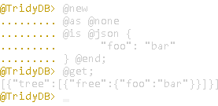
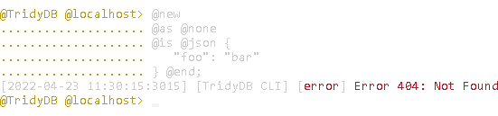
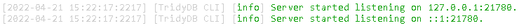

# DISCLAIMER

This version of Tridymake is being treated as **abandoned**, and as such, isn't where active work being done. The version being actively worked on, as an overhaul of this version, would be located here:

https://github.com/byzyworks/tridymake

<div id="tridy"/>

# **Tridy**

Tridy (pronounced "tree-dee") is an imperative/scripted data language and limited programming language that allows declarative data (defined using formats like JSON, YAML, XML, etc.) to be constructed dynamically and as non-redundantly (in terms of user input and DRY principles) as possible. It includes a powerful system of pathing and path expressions for hierarchical data using non-unique (or not required to be unique) tags, permitting composition with user-defined granularity, and includes places for user-generated input using "function modules" defineable in Tridy's parent language (JavaScript).

The language is similar to SQL following that it's imperative, but is designed for working with hierarchical as opposed to tabular or "reference-driven" data. Without references, this means it's slower and not the most memory-efficient, but this also makes it much more flexible when it comes to "cross-cutting" data, and makes the data easier to mentally grasp than reference or inheritance-based models that rely on a lot of internal coupling.

Tridymake is an interpreter for the Tridy language, and a transpiler for configuration data. It was built with the intent of helping to create procedurally-generated content for gamified cybersecurity without being too implementation-specific.

Tridymake is programmed in JavaScript ES6 and requires at least NodeJS v18.9.0 to run (due to using NodeJS's then-updated *readline* module).

<br>

## **Table of Contents**

---

1. [Tridy](#tridy)
    1. [Tridymake](#tridymake)
        1. [Usage](#tridymake-use)
        2. [Formats](#tridymake-form)
        3. [Security](#tridymake-sec)
    2. [Tridy (the Language)](#tridylang)
        1. [Modules](#modules)
        2. [Context](#context)
            1. [Empty Expressions](#context-empty)
            2. [Context Tag Terminals](#context-tag-terminals)
                1. [Tags](#context-tags)
                2. [@any](#context-any)
                3. [@all](#context-all)
                4. [Value Expressions](#context-value-expressions)
            3. [Context Tag Operators](#context-tag-operators)
                1.  [@not](#context-not)
                2.  [@and](#context-and)
                3.  [@xor](#context-xor)
                4.  [@or](#context-or)
                5.  [Ternary](#context-ternary)
                6.  [@parent](#context-parent)
                7.  [@ascend](#context-ascend)
                8.  [@child](#context-child)
                9.  [@descend](#context-descend)
                10. [@nonparent](#context-nonparent)
                11. [@nonascend](#context-nonascend)
                12. [@nonchild](#context-nonchild)
                13. [@nondescend](#context-nondescend)
                14. [@to](#context-to)
                15. [@toward](#context-toward)
                16. [@catchall](#context-catchall)
                17. [Parentheses](#context-parenth)
            4. [Context Value Terminals](#context-value-terminals)
                1.  [Tags](#context-tag-values)
                2.  [Numbers](#context-numbers)
                3.  [Null](#context-null)
                4.  [@depth](#context-depth)
                5.  [@children](#context-children)
                6.  [@index](#context-index)
                7.  [@siblings](#context-siblings)
                8.  [@shuffled](#context-shuffled)
                9.  [@random](#context-random)
                10. [@iterandom](#context-iterandom)
            5. [Context Value Operators](#context-value-operators)
                1. [@eq](#context-eq)
                2. [@ne](#context-ne)
                3. [@lt](#context-lt)
                4. [@le](#context-le)
                5. [@gt](#context-gt)
                6. [@ge](#context-ge)
            6. [Summary](#context-summary)
        3.  [Syntax](#syntax)
            1.  [Comments](#syntax-comments)
            2.  [Clauses](#syntax-clauses)
                1.  [@tridy](#syntax-tridy)
                2.  [@clear](#syntax-clear)
                3.  [@split](#syntax-split)
                4.  [@exit](#syntax-exit)
                5.  [@in](#syntax-in)
                6.  [@if](#syntax-if)
                7.  [@else](#syntax-else})
                8.  [@limit](#syntax-limit)
                9.  [@offset](#syntax-offset)
                10. [@repeat](#syntax-repeat)
                11. [@get](#syntax-get)
                12. [@new](#syntax-new)
                13. [@set](#syntax-set)
                14. [@del](#syntax-del)
                15. [@put](#syntax-put)
                16. [@cut](#syntax-cut)
                17. [@copy](#syntax-copy)
                18. [@tag](#syntax-tag)
                19. [@untag](#syntax-untag)
                20. [@stat](#syntax-stat)
                21. [Multi-Statements](#syntax-multi)
                22. [Explicit @of](#syntax-of)
                23. [Explicit @as](#syntax-as)
                24. [Implicit @of/@as](#syntax-implicit)
                25. [@uuid](#syntax-uuid)
                26. [@is](#syntax-is)
                27. [Strings](#syntax-string)
                28. [@json](#syntax-json)
                29. [@yaml](#syntax-yaml)
                30. [@xml](#syntax-xml)
                31. [@text](#syntax-text)
                33. [@has](#syntax-has)
                34. [@none](#syntax-none)
                35. [@raw](#syntax-raw)
                36. [@typeless](#syntax-typeless)
                37. [@tagless](#syntax-tagless)
                38. [@trimmed](#syntax-trimmed)
                39. [@merged](#syntax-merged)
                40. [@final](#syntax-final)
                41. [@simple](#syntax-simple)
                42. [@nested](#syntax-nested)
                43. [@function](#syntax-function)
                44. [@create](#syntax-create)
                45. [@append](#syntax-append)
                46. [@replace](#syntax-replace)
                47. [@file](#syntax-file)
                48. [@import](#syntax-import)
            3.  [Summary](#syntax-summary)
        4.  [Getting Started](#running)
            1.  [As a Package](#package)
            2.  [As a Terminal Application](#cli)
                1.  [Inline Mode](#cli-inline)
                2.  [Console Mode](#cli-console)
                3.  [Common Options: Input](#cli-common-input)
                4.  [Common Options: Client Mode](#cli-common-client)
                5.  [Common Options: Randomization](#cli-common-random)
                6.  [Common Options: Output](#cli-common-output)
                7.  [Common Options: Logging](#cli-common-logs)
            3.  [As a Server](#server)
                1.  [Verbatim Mode](#server-verb)
                2.  [Syntax Tree Mode](#server-astree)
                3.  [Common Options](#server-common)
    3.  [Glossary](#glossary)

<br>

<div id="tridymake"/>

## **Tridymake**

---

Tridy is a compiled data format, meaning that the data files aren't immediately useful for being read by an application. Instead, a Tridy **composer** needs to read the data files, parse the contained statements, and output in a common data format such as JSON first. This is because the output of a single statement in Tridy can appear in multiple places in the final output, relative to the output of previously-executed statements. To permit this, Tridy uses a system of *tagged modules* where a statement may be matched to an existing module so long as a boolean expression that a Tridy statement is addressed with is satisfied. In particular, the terminals of this expression are the tags themselves, and are either true if a tag is shared between both the expression and the given module, or false if not shared with the given module. This is explained in greater detail below where the Tridy language itself is.

<br>

<div id="tridymake-use"/>

### **Usage**

Tridymake is provided with three possible interaction paradigms that each provide for varying degrees of integration:

1. At the highest degree of integration, Tridymake is usable as a [**Node.js package**](#package). This means that at least if another application or script is written for Node as well, it can interface with Tridymake like it would any other NPM module and use that to its advantage for increased flexibility and performance. However, this makes it more the responsibility of the application to manage the database on its own, how it saves and interacts with it, etc. since Tridymake in this form doesn't provide any persistence, and neither exists as a separate application to begin with. Another obvious issue is that if the application isn't also a Node application on its own, then this isn't really an available option, and using a wrapper would be needed.
2. For applications interacting with Tridymake locally as a separate process, but without the need for networking, Tridymake can be utilized as a [**terminal application**](#cli). This is especially useful for compiling Tridy data files/scripts to another format where it only needs to be done once during the runtime of a particular program, as might often be the case with configuration files, where Tridymake is most strongly-suited. The other half of its usefulness comes from providing an interface for both applications and users alike to interact directly with Tridymake, considering a possible way to use Tridymake, when launched this way, is as an interactive console.
3. For applications interacting with Tridymake remotely, or where networking is a requirement, Tridymake (the application) can be launched as an [**REST-aware HTTP server**](#server). Commands can either be sent to a server directly (as a string of Tridy code) or pre-parsed (ideal for Tridy-parsing clients), though the former mode is by default disabled due to it being less than practical for a number of reasons. In addition, server mode is called *REST*-aware because commands sent to a server are analyzed to determine the appropriate *minimally-permissioned* method that would be allowed for the string of commands to execute, based on RESTful architecture principles.

<br>

<div id="tridymake-form"/>

### **Formats**

Being as Tridymake is natively a JavaScript application, JSON is its most well-supported storage format, and is always the one that is used by it internally. The other formats supported are converted to or from this internal storage.

Currently, Tridymake supports either YAML [import](#syntax-yaml), JSON [import](#syntax-json), or XML [import](#syntax-xml). In addition, [output](#cli-common-output) for all three formats is supported, with some limitations due to Tridymake's JSON-centric internal storage format.

Some special features that JSON lacks, like YAML's own so-called DRY-saving measure of anchors and aliases, might import without syntactical issues, but at the same time will be dereferenced and stripped out once they are stored. On the plus side, this at least keeps the data-input-to-storage mapping for YAML 1:1 with JSON. XML, on the other hand, has more basic features to retain that JSON doesn't have, like attributes and comments. Thus, as a price to pay for not losing this information when it's imported, XML's data-input-to-storage mapping is not 1:1, and is comparitively more verbose than either that of JSON or YAML.

In short, JSON import and export will provide the best support, and is preferred if possible since it is generally fastest for machines to parse JSON when much of the human-interfacing would be already be done with Tridy.

<br>

<div id="tridymake-sec"/>

### **Security**

Tridymake is a lightweight tool meant for the creation of *redundant* hierarchically-structured data. That makes it inherently un-ideal for storing sensitive data, though this is more due to relative performance costs than any inability to be built into a secure system.

That's because Tridymake, likewise, deals the least effectively with data that is lacking in repetition, and is in such high volume that it would not be ideal to re-compile its respective transactional data on a regular or near-regular basis (which less repitition causes there to be more of). Sensitive data meant to be unique and collision-resistant is rarely conducive to this.

While Tridymake does sport a server-based mode of operation, there is no built-in user system or manner of authentication either, which limits the safety of using such a server to more of just a localhost context. Regardless of whether there would be one or not, the port it uses should *never* be opened to the internet for the same reason that you shouldn't open MySQL port 3306 to the internet. All remote access to Tridymake, if there is any, should have to pass through another application that is able to confine Tridymake's usage to a secure context.

For any developers of applications that might intend to try and do that, be aware that the main exported method `Tridy.query(...)` (and arguably the other possible entryways as well) performs similarly as one might expect from other database systems that export a method of the same name. That means that this method is vulnerable to command injection if it used in a naive manner.

<br>

<div id="tridylang"/>

## **Tridy (The Language)**

---

To show how Tridy actually works, suppose we have a snippet of Tridy code like the following:

```
@new a;
@new b;
@new a b;

@in a @xor b
@new c
@is @json { "letter": true } @end;
```

Tridy contains keywords, or **clauses**, that all begin with an `@` symbol.

Similar to SQL, Tridy statements are also semicolon-delimited, where the semicolon is required at the end of the statement. This has at least the advantage of allowing the language to be whitespace-insensitive, allowing users to adopt their own indentation or presentation style.

The first statement, `@new a`, creates a new module tagged as *a*, and stores it at the root module inside a newly-created document. Since the document is likely stored as a JSON object, the root module would be whatever is *directly* under the opening `{` and closing `}` of the document. It also implicitly sets the module's type specifier to be `"a"`, since another, more explicit clause `@as` wasn't used, and `a` was the last and only tag there.

`@new` is considered as the **operation** of the Tridy statement, which defines the action taken by it. `@new`, as the name implies, creates a new module, while the three other *primary* operations `@set`, `@get`, and `@del` can be used to change an existing module, print an existing module, and delete an existing module respectively.

The second statement, `@new b`, acts similarly, creating a new module tagged as `b` under the root module. More specifically, the last two statements (respectively) stored the modules tagged `a` and `b` under a named array inside the root module, of which the name of this array is consistent for all modules. That would imply that `a` and `b` can also store their own sub-modules, so it's worth noting that modules are such that they can be placed recursively at any possible depth.

The third statement creates a new module tagged as both `a` and `b`. Tags are such that individual modules can have multiple tags, and they do not have to be unique. Thus, Tridymake places no restrictions on how a module is identified, and uniqueness constraints are not meant to be enforced except at a higher level.

Since the tags were provided implicitly, the type identifier is automatically-determined as well, which this time is `"b"`. The reason why the final tag is chosen is a result of natural language, where the noun or most-significant identifier usually follows its adjectives, or less-significant identifiers.

The fourth statement is meant to show some of where Tridy can be powerful. In any Tridy statement, `@in` is used to specify a **context**, which is the expression that any module is tested for before the statement can be applied to it. The operation always follows *after* the end of whatever the context expression is, so in this case, the context expression is `a @xor b`. Given this preceding expression, `@new c` will only be applied to an existing module if and only if it has the tags `a` or `b`, but never both at the same time. Only in the modules created by the first two statements would this evaluate as true, so only the first two modules are affected. However, they both receive a copy of the new module tagged as `c`, and the only change needed to make all three existing modules (under the root module) receive a copy would be to change `a @xor b` to `a @or b`.

Finally, the latter half of the statement contains an example bit of arbitrary data given in a JSON format, which is delimited by the `@json` and `@end` clauses, respectively. The `@is` clause to which those are given as arguments is part of the statement **definition**, and is used to define the **free** data structure of the module, given (always) through a common format such as JSON, YAML, or XML. There are three other clauses which pertain to the module's definition: `@of` for specifying the module's type identifier, `@as` for the module's tags, and finally, `@has` for recursively nesting Tridy statements, and setting the initial **tree** data structure of the module.

If the output format is a JSON object, then the statements above might have the following as its output:

```diff
{
    "tree": [
        {
            "type": "a",
            "tags": ["a"],
            "tree": [
+               {
+                   "type": "c",
+                   "tags": ["c"],
+                   "free": {
+                       "letter": true
+                   }
+               }
            ]
        },
        {
            "type": "b",
            "tags": ["b"],
            "tree": [
+               {
+                   "type": "c",
+                   "tags": ["c"],
+                   "free": {
+                       "letter": true
+                   }
+               }
            ]
        },
        {
            "type": "b",
            "tags": ["a", "b"]
        }
    ]
}
```

This is only a small part of what Tridy is capable of. Operations in Tridy can, in fact, become considerably more complex to suit different purposes. As an example of one of these operations, here is one expression which only affects the deepest modules inside a homogeneously-tagged tree:

```
root-level-module // tree-node & !(tree-node >> tree-node)
```

Here we also have an example of operators as punctuation, rather than clauses. In fact, there are various equivalences present for usability's sake.

In detail, the operation above searches for all modules tagged as `tree-node` that are nested inside of a module at the root tagged as `root-level-module`. The operator `//`, or `@toward`, applies to all modules inside another module (recursively) where the right-hand side of the expression evaluates as true. Understandably, this has a lower precedence than the other operations due to its effect of moving the entire context forward (everything to the right-hand side is determined relative to *everywhere* in the tree descending from `root-level-module` now as opposed to just the root), so it is determined last, while parentheses can be used to force a certain precedence alternatively.

The second half of the expression is true for all modules tagged as `tree-node` (and only modules tagged as `tree-node`, hence the `&`/`@and` in the middle there and the first `tree-node` immediately after `//`) so long as they are not descended by another module tagged as `tree-node`, at any level. The `>>`/`@ascend` operator searches modules similar to how `//` does, but backtracks when the right hand side becomes true such that the parenting module is affected as opposed to the child module(s). Additionally, the reason this is AND'ed with `tree-node` is because `>>`, like the other nested operators, does `a & b` under the surface (minus the level switching), meaning that inverting the final result make it return true also for `a & !b` as well as `!a & b`, and we limit that by giving `tree-node` again.

Tridy is designed especially for these high-power operations, in a sense creating something akin to a filesystem where the single-name barrier is removed, and allowing for pathing to expand to include boolean operations done over these multiple names ("tags").

<br>

<div id="modules"/>

## **Modules**

---

Tridymake expects a kind of schema to foster it's capabilities and make it useful in a way that is as generalized as possible, but not so generalized that it can't offer anything over directly working with JSON or a similar format. As part of this compromise, Tridy works with self-contained units of information that are collectively termed as **modules**. What actually makes a module a module is outlined in the list below:

1. At a minimum, every module should (but is not required to) have of an array of strings that each individually form the module's **tags**.
2. In reality, a module may also have a **free** data structure, a **tree** data structure, and a **type** specifier.
3. A module should contain no other data items at the root of the module, not even metadata.
4. All identification of the module by Tridymake for queries must be done using tags located inside the tags array. Tridymake will not consider anything else.
5. A module may have zero to many tags, as an array of strings.
6. Tags have no requirements to be unique, but they may be made unique by design.
7. Tags are strings that may *only* contain lowercase letters, uppercase letters, numbers, dashes, plus signs, underscores, or periods.
8. *All* data that is organized in an arbitrary fashion must be stored under the free data structure. This should include an application's usable data.
9. There are no rules for how the free data structure should be composed, and it can be a primitive type, an array type, a mapped type, or any combination of all three. It is an application's job to control the schema or format of it.
10. *All* modules which are nested under the current module must be stored under the tree data structure, which must itself be an array.
11. A module may have zero to many nested modules inside the tree data structure.
12. Modules may recursively nest other modules to no limit in depth or number of modules otherwise.
13. A module may use a type specifier to act solely as the key used by the module, in some circumstances, at a higher-level, as in the parent module.
14. A type specifier can be a string of any composition, but also *must* be a string.
15. The keys used as identifiers for these data structures may change depending on the application (Tridymake allows renaming these via. "alias" arguments).

Every module in an instance of Tridy is also a descendant of the **root module**, of which there is only one, and which is always used as a reference point for Tridy statements. Essentially, the root module is also equivalent to the entire database and its contents since nothing can exist outside of it. Thus, throughout this manual, what is referred to as the Tridy **database** is interchangable with the root module.

<br>

<div id="context"/>

## **Context**

---

In Tridy, **context** refers to the pathing situation of a module. In particular, it denotes what the tags of the module are, as well as the tags of its parent and all of its ascendents in order, also denoting where the module may be nested and how deeply it happens to also be nested. Assuming a database like the following:

```json
{
    "tree": [
        {
            "type": "b",
            "tags": ["a", "b"],
            "tree": [
                {
                    "type": "e",
                    "tags": ["e"],
                    "tree": [
                        {
                            "type": "i",
                            "tags": ["h", "i"]
                        }
                    ]
                }
            ]
        },
        {
            "type": "a",
            "tags": ["a"]
        },
        {
            "type": "d",
            "tags": ["c", "d"],
            "tree": [
                {
                    "type": "g",
                    "tags": ["f", "g"]
                }
            ]
        }
    ]
}
```

Then the context of the particular module above having the tag `e` would have the context `[[a, b], [e]]`, though notably as well, it may not be the only module with that context, as part of how Tridy is meant to work.

Tridymake uses the information contained in the context of existing modules and evaluates it against a **context expression**, a string of operators and operands in which the operands are other context expressions, which themselves are either terminal (as tags) or non-terminal. Terminals/tags evaluate to true if they're present in the module being evaluated, and evaluate to false if they are not. Non-terminals/expressions allow combining the results of terminals, which notably include the commonplace boolean operators `@not`/`!`, `@and`/`&`/(whitespace), `@or`/`|`/`,`, and `@xor`/`^`.

Note that beyond just the standard numeric and logical comparison operators, there are six different versions of the so-called *nested* operators, which are divided into lookahead, lookbehind, and transitive types. `@parent`/`>` and `@ascend`/`>>` are lookahead operators since they match a child on the right-hand side and affect the parent. `@child`/`<` and `@descend`/`<<` are lookbehind operators since they match a parent on the right-hand side and affect the child. Finally, `@to`/`/` and `@toward`/`//` are transitive operators since they match a child on the right-hand side and affect the same child, while parentheses also play a role in reversing the transitions they cause. In addition are various wildcard operands such as `@any`/`*`,
as well as shorthand operators such as the negated lookahead/lookbehind operators and the inclusive transitive operators (of which there is only one as `@catchall`/`&//`).

Tags can also be assigned number values that can be used to perform value comparison operations like `@eq`/`==` or `@lt`/`<` as well (of which there are the six standard kinds). However, these are not interchangable with tag-based operations, and can only be used inside of a numeric enclosure that begins with `$(` and ends with `)`. At least in this situation also, built-in variables like `@depth` or `@children` can be used in place of tags to make decisions based on a module's implicit attributes.

All is explained in greater detail below.

<br>

<div id="context-empty"/>

### **Empty Expressions**

Tridy allows users to forego giving context expressions at all, either by leaving out `@in`, or at least in the case of the affective operations `@get` and `@del`, proceeding it without a context expression. In other words, the following examples are all statements with empty expressions:

```
@del;
@set @json { "free": { "root": "true" } } @end;
@new @is @json { "child": "true" } @end;
@get;
```

```diff
[
-   { }
+   {
+       "free": { "root": "true" },
+       "tree": [
+           {
+               "free": { "child": "true" }
+           }
+       ]
+   }
]
```

If an expression is not given, then the operation is applied to the root/top-level module, whereby only it is affected.

<br>

<div id="context-tag-terminals"/>

## **Context Tag Terminals**

This section explains the concepts behind "tag terminals", which is Tridy's equivalent to both booleans and string operands simultaneously when pertaining to context expressions. Most expressions are built around these.

<br>

<div id="context-tags"/>

### **Operand: Tags**

In Tridy, tags are the alphanumeric identifiers used to identify a module. More specifically a tag is always a string composed of either lowercase letters, uppercase letter, numbers, dashes ( `-` ), plus symbols ( `+` ), underscores ( `_` ), or periods ( `.` ), and to which is case sensitive. They may additionally have number-formatted values assigned to them that always follow a single colon character ( `:` ), but this along with the colon is ignored when used in the context of operations that only care for the tag identifier.

Examples of (single) tag expressions include:

```
@get abc;
@get +X-Y.Z_123;
@get version-2.5.4;
@get 0.1;
```

As an example that is not read-only:

```
# Before
@new @as a;
@new @as a = 12;

# After
@in a @new @as b;
```

```diff
[
    {
        "tags": ["a"],
        "tree": [
+           {
+               "tags": ["b"]
+           }
        ]
    },
    {
        "tags": ["a:12"],
        "tree": [
+           {
+               "tags": ["b"]
+           }
        ]
    }
]
```

A stated previously, an individual tag evaluates to true if a module contains the same tag that a context expression expects, so long as it is at the nesting level expected, which can be controlled by the nested operators below. Otherwise, the tags are evaluated at the level of the root/top-level module.

Per why they're called tags, TribyDB places no restrictions on uniqueness or how many tags a module can have, and a module may even contain no tags at all where only wildcard operands can affect it. The only thing Tridymake does restrict are duplicate tags in the same module, but this is simply because including them multiple times in the same module has no effective purpose, and it's better to enforce this as a rule for best practice reasons.

<br>

<div id="context-any"/>

### **Wildcard Operand: `@any` / "`*`"**

The `@any` operand is used in a way that is analogous to a tautology in the Tridy language, meaning when `@any` is used, all sub-modules of a module are matched, though notably, this still applies only at the current nesting level unless a transitive nested operator is used with it. Combining this with `@descend` or `@toward` (both explained below) will do the job of matching all modules at all levels.

```
# Before
@new;
@new @as a;
@new @as b;
@new @as a b;

# After
@in * @new @as c;
```

```diff
[
    {
        "tree": [
            {
                "tags": [ ],
                "tree": [
+                   {
+                       "tags": ["c"]
+                   }
                ]
            },
            {
                "tags": ["a"],
                "tree": [
+                   {
+                       "tags": ["c"]
+                   }
                ]
            },
            {
                "tags": ["b"],
                "tree": [
+                   {
+                       "tags": ["c"]
+                   }
                ]
            },
            {
                "tags": ["a", "b"],
                "tree": [
+                   {
+                       "tags": ["c"]
+                   }
                ]
            }
        ]
    }
]
```

<br>

<div id="context-all"/>

### **Wildcard Operand: `@all` / "`**`"**

The `@all` operand is a shorthand equivalent for `(* &// *)` (long form: `(@any @catchall @any)`), and in fact, is translated directly to this as a macro when it is used. `@all` tries to match any modules at the current level and beyond, without behaving like another tag that stops at whatever level is controlled by the transitive operators (as is the case with `@any`).

```
# Before
@new;
@new @as a;
@in a @new @as b;
@new @as c;

# After
@in ** @new @as d;
```

```diff
[
    {
        "tree": [
            {
                "tree": [
+                   {
+                       "tags": [
+                           "d"
+                       ]
+                   }
                ]
            },
            {
                "tags": [
                    "a"
                ],
                "tree": [
                    {
                        "tags": [
                            "b"
                        ],
                        "tree": [
+                           {
+                               "tags": [
+                                   "d"
+                               ]
+                           }
                        ]
                    },
+                   {
+                       "tags": [
+                           "d"
+                       ]
+                   }
                ]
            },
            {
                "tags": [
                    "c"
                ],
                "tree": [
+                   {
+                       "tags": [
+                           "d"
+                       ]
+                   }
                ]
            }
        ]
    }
]
```

<br>

<div id="context-value-expressions"/>

### **Value Expressions / "`$(`" + "`)`"**

In Tridy, the only way that an expression can be useful is if the final result can be reduced to either 'true' or 'false', as the problem being solved is always binary: either perform an operation on a given module, or skip doing so altogether. This rule applies to number/value expressions just as well.

While not a terminal per-say, in Tridy, it is not possible to intermix purely tag-identifier-based expressions and tag-value-based expressions. However, number/value expressions (as being comparisons) always produce a boolean answer in the end, so such expressions can be treated as easily as if they were tag terminals on their own.

To produce a value expression, the expression needs to begin with a dollar symbol ( `$` ) followed by a left parentheses ( `(` ), and be finished off with a right paretheses ( `)` ). It is not possible to have one otherwise.

Within it, the expression is always a mere three-token, two-sided comparison operation, where there is no arithmetic or recursion, and the right-hand side of the expression is always a literal number. Likewise, the left-hand side is always either a tag or a variable (discussed [below](#context-value-terminals)).

```
# Before
@new @as apple;
@new @as apple, seeds = 0;
@new @as apple, seeds = 2;
@new @as apple, seeds = 5;

# After
@in apple $(seeds > 0) @new @as regrowable;
```

```diff
[
    {
        "tree": [
            {
                "tags": ["apple"]
            },
            {
                "tags": ["apple", "seeds:0"]
            },
            {
                "tags": ["apple", "seeds:2"],
                "tree": [
+                   {
+                       "tags": ["regrowable"]
+                   }
                ]
            },
            {
                "tags": ["apple", "seeds:5"],
                "tree": [
+                   {
+                       "tags": ["regrowable"]
+                   }
                ]
            }
        ]
    }
]
```

Since there aren't restrictions on how users can name tags, this is partly the reason why the syntax is pretty strict in that regard. Otherwise, something like `$(1 == 1)` becomes a rather ambiguous expression given the left-hand side can either refer to the actual number `1`, or a tag identifier that is exactly the string "`1`", and the result starts to become problematic when there isn't a tag named "`1`" or its value isn't the number `1`. Hence, the left-hand side is always read as a tag, and the right-hand side as a number to avoid that ambiguity without requiring more special syntax.

<br>

<div id="context-operators"/>

## **Context Tag Operators**

This section explains the concepts behind "tag operators", which are the way to combine sub-expressions built around tag terminals.

<div id="context-not"/>

### **Basic Operator: `@not` / "`!`"**

The `@not` operator forms the only unary operator in Tridy's expressional syntax, and either returns true if its operand is false, or false if its operand is true. If the operand is just a single tag, then only modules which lack the given tag will be affected.

```
# Before
@new;
@new @as a;
@new @as b;
@new @as a b;

# After
@in !a @new c;
```

```diff
[
    {
        "tree": [
            {
                "tags": [ ],
                "tree": [
+                   {
+                       "tags": ["c"]
+                   }
                ]
            },
            {
                "tags": ["a"]
            },
            {
                "tags": ["b"],
                "tree": [
+                   {
+                       "tags": ["c"]
+                   }
                ]
            },
            {
                "tags": ["a", "b"]
            }
        ]
    }
]
```

If not including parantheses, `@not` has the highest precedence out of all the operators given.

<br>

<div id="context-and"/>

### **Basic Operator: `@and` / "`&`" / " "**

The `@and` operator evaluates as true if and only if the operands on both sides of the operator are true. Otherwise, it evaluates as false. This can be used if you wish only for a module that has two or more particular tags at the same time to be affected.

Worth noting is that `@and` is also considered as the *implicit* operation, meaning that if two tags are separated only by whitespace characters without an explicit operator, such as `@in a b`, then this has the exact same effect as `@in a & b`.

```
# Before
@new;
@new @as a;
@new @as b;
@new @as a b;

# After
@in a & b @new @as c;
```

```diff
[
    {
        "tree": [
            {
                "tags": [ ]
            },
            {
                "tags": ["a"]
            },
            {
                "tags": ["b"]
            },
            {
                "tags": ["a", "b"],
                "tree": [
+                   {
+                       "tags": ["c"]
+                   }
                ]
            }
        ]
    }
]
```

`@and`'s precedence is higher than that of `@not` and lower than that of `@xor`.

<br>

<div id="context-xor"/>

### **Basic Operator: `@xor` / "`^`"**

The `@xor` operator evaluates as true if and only if an operand on one side of the operator or the other evaluates as true, but never both at the same time. It is one of the few operators that is effectively a shorthand for a more complex expression using other, more simplistic operators.

```
# Before
@new;
@new @as a;
@new @as b;
@new @as a b;

# After
@in a ^ b @new @as c;
```

```diff
[
    {
        "tree": [
            {
                "tags": [ ]
            },
            {
                "tags": ["a"],
                "tree": [
+                   {
+                       "tags": ["c"]
+                   }
                ]
            },
            {
                "tags": ["b"],
                "tree": [
+                   {
+                       "tags": ["c"]
+                   }
                ]
            },
            {
                "tags": ["a", "b"]
            }
        ]
    }
]
```

`@xor`'s precedence is higher than that of `@and` and lower than that of `@or`.

<br>

<div id="context-or"/>

### **Basic Operator: `@or` / "`|`" / "`,`"**

The `@or` operator evaluates as true if either side of the operator evaluates as true, and stopping at that. Use this to attach a module to another with tags that do not exclusively have to be together in the same module.

```
# Before
@new;
@new @as a;
@new @as b;
@new @as a b;

# After
@in a | b @new @as c;
```

```diff
[
    {
        "tree": [
            {
                "tags": [ ]
            },
            {
                "tags": ["a"],
                "tree": [
+                   {
+                       "tags": ["c"]
+                   }
                ]
            },
            {
                "tags": ["b"],
                "tree": [
+                   {
+                       "tags": ["c"]
+                   }
                ]
            },
            {
                "tags": ["a", "b"],
                "tree": [
+                   {
+                       "tags": ["c"]
+                   }
                ]
            }
        ]
    }
]
```

`@or`'s precedence is higher than that of `@xor` and lower than that of any of the non-transitive nested operators.

<br>

<div id="context-ternary"/>

### **Ternary Operator: `@then` + `@else` / "`?`" + "`:`"**

The ternary, or conditional operator in Tridy is a way to have if-else context expressions, effectively, and as the name suggests, this operator (or these operators?) requires 3 sub-expressions to be fed to it as operands, as opposed to only 2 or 1.

The condition is separated from the second operand by `@then` or a question mark ( `?` ), and the second operand is separated from the third operand by `@else` or a colon ( `:` ).

The first operand is used as the condition, whereby if it evaluates as true, then the second operand is evaluated against the module, and the third operand is ignored. If however, the condition evaluates as false, then the second operand is ignored, and the third operand is evaluated against the module.

Effectively, it works the same as `(a & b) | (!a & c)`, but without the need to re-state `a`, which comes in handy with some expressions.

```
# Before
@new @as a c;
@new @as a d;
@new @as b c;
@new @as b d;

# After
@in a ? c : d @new @as e;
```

```diff
[
    {
        "tree": [
            {
                "tags": ["a", "c"],
                "tree": [
+                   {
+                       "tags": ["e"]
+                   }
                ]
            },
            {
                "tags": ["a", "d"]
            },
            {
                "tags": ["b", "c"]
            },
            {
                "tags": ["b", "d"],
                "tree": [
+                   {
+                       "tags": ["e"]
+                   }
                ]
            }
        ]
    }
]
```

The ternary operator (both `@then` and `@else`) has the greatest precedence out of all of the operations, including the nested transitive operators `@to` and `@toward`.

<br>

<div id="context-parent"/>

### **Lookahead Nested Operator: `@parent` / "`>`"**

The `@parent` operator returns true only if the right side of the operator is true for a child of a module for which the left side of the operator is true. For instance, in the case where a module tagged as `apple` has one or more sub-modules with the `seed` tag, then the expression `apple > seed` will only apply to those `apple` modules that have at least one of these sub-modules tagged with `seed`. In essence, the parent module is thus affected as the result of a property that one or more of its child modules have.

```
# Before
@new @as apple;
@new @as apple;
@in apple @limit 1 @new @as seed;

# After
@in apple > seed @new @as reproductive;
```

```diff
[
    {
        "tree": [
            {
                "tags": ["apple"],
                "tree": [
                    {
                        "tags": ["seed"]
                    },
+                   {
+                       "tags": ["reproductive"]
+                   }
                ]
            },
            {
                "tags": ["apple"]
            }
        ]
    }
]
```

`@parent`'s precedence is the same as all of the non-transitive nested operators, being higher than that of `@or` and lower than the transitive nested operators.

<br>

<div id="context-ascend"/>

### **Recursive Lookahead Nested Operator: `@ascend` / "`>>`"**

The `@ascend` operator extends `@parent` to recursively look for sub-modules where the right side of the expression is true, such that if you had the expression `orchard >> seed` instead, then any `orchard` modules would be affected so long as they had modules tagged `seed` anywhere in its subtree, even if not directly under the affected module. Effectively, this would be same as indiscriminately looping `@parent` over and over again as `orchard > * > seed`, `orchard > * > * > seed`, and so forth until the deepest level of nesting is reached for a `seed` module.

```
# Before
@new @as orchard;
@new @as orchard;
@in orchard new @as apple;
@in orchard/apple @limit 1 @new @as seed;

# After
@in orchard >> seed @new @as regrowable;
```

```diff
[
    {
        "tree": [
            {
                "tags": ["orchard"],
                "tree": [
                    {
                        "tags": ["apple"],
                        "tree": [
                            {
                                "tags": ["seed"]
                            }
                        ]
                    },
+                   {
+                       "tags": ["regrowable"]
+                   }
                ]
            },
            {
                "tags": ["orchard"],
                "tree": [
                    {
                        "tags": ["apple"]
                    }
                ]
            }
        ]
    }
]
```

`@ascend`'s precedence is the same as all of the non-transitive nested operators, being higher than that of `@or` and lower than the transitive nested operators.

<br>

<div id="context-child"/>

### **Lookbehind Nested Operator: `@child` / "`<`"**

The `@child` operator returns true only if the left side of the operator is true for a child of a module for which the right side of the operator is true. While it effectively just reverses directions from `@parent` (and because the two sides are AND'ed together in the end, the final outcome would happen to be pretty much or nearly the same), it differs rather in the module that gets affected when the result is true. Since `@parent` affects the parent, obviously this would affect the child instead, i.e. still the left-hand side of the operator.

```
# Before
@new @as orchard;
@new @as trashcan;
@in orchard | trashcan @new @as apple;

# After
@in * / apple < orchard @new @as fresh;
```

```diff
[
    {
        "tree": [
            {
                "tags": ["orchard"],
                "tree": [
                    {
                        "tags": ["apple"],
                        "tree": [
+                           {
+                               "tags": ["fresh"]
+                           }
                        ]
                    }
                ]
            },
            {
                "tags": ["trashcan"],
                "tree": [
                    {
                        "tags": ["apple"]
                    }
                ]
            }
        ]
    }
]
```

`@child`'s precedence is the same as all of the non-transitive nested operators, being higher than that of `@or` and lower than the transitive nested operators.

<br>

<div id="context-descend"/>

### **Recursive Lookbehind Nested Operator: `@descend` / "`<<`"**

The `@descend` operator extends `@child` similar to the way `@ascend` extends `@parent` by recursively searching the child module's context to see if at any point the right side of the operator is true for any module that it is nested under. Thus, it works in a way like looping indiscriminately looping `@child` over and over again like `seed < orchard`, `seed < * < orchard`, and so forth until after the right-hand side has reached the root module.

```
# Before
@new @as year 1961 1960s;
@in 1961 @new @as month October;
@in 1961/October @new @as day 30;
@in 1961/October/30 @new @as event tsar-bomba-dropped;
@new @as year 1989 1980s;
@in 1989 @new @as month November;
@in 1989/November @new @as day 9;
@in 1989/November/9 @new @as event fall-of-berlin-wall;

# After
@in * // event << 1980s @new @as period late-soviet;
```

```diff
[
    {
        "tree": [
            {
                "tags": ["year", "1961", "1960s"],
                "tree": [
                    {
                        "tags": ["month", "October"],
                        "tree": [
                            {
                                "tags": ["day", "30"],
                                "tree": [
                                    {
                                        "tags": ["event", "tsar-bomba-dropped"]
                                    }
                                ]
                            }
                        ]
                    }
                ]
            },
            {
                "tags": ["year", "1989", "1980s"],
                "tree": [
                    {
                        "tags": ["month", "November"],
                        "tree": [
                            {
                                "tags": ["day", "9"],
                                "tree": [
                                    {
                                        "tags": ["event", "fall-of-berlin-wall"],
                                        "tree": [
+                                           {
+                                               "tags": ["period", "late-soviet"]
+                                           }
                                        ]
                                    }
                                ]
                            }
                        ]
                    }
                ]
            }
        ]
    }
]
```

`@descend`'s precedence is the same as all of the non-transitive nested operators, being higher than that of `@or` and lower than the transitive nested operators.

<br>

<div id="context-nonparent"/>

### **Negated Lookahead Nested Operator: `@nonparent` / "`!>`"**

WIP

<br>

<div id="context-nonascend"/>

### **Negated Recursive Lookahead Nested Operator: `@nonascend` / "`!>>`"**

WIP

<br>

<div id="context-nonchild"/>

### **Negated Lookbehind Nested Operator: `@nonchild` / "`!<`"**

WIP

<br>

<div id="context-nondescend"/>

### **Negated Recursive Lookbehind Nested Operator: `@nondescend` / "`!<<`"**

WIP

<br>

<div id="context-to"/>

### **Transitive Nested Operator: `@to` / "`/`"**

The `@to` operator has a behavior similar to that of `@child`, where it will return true only for a child of another module, though the ordering from left to right is from parent to child like with `@parent`, and unlike `@child`. That would not be enough reason alone to have a separate operator, however, `@to` has an important role by the fact that it is *transitive*, meaning that it both affects a child (as `@child` does), and shifts the context level forward while it's at it (as `@parent` does). In fact, `@to` (or `@toward` below) is a necessity to affect child modules at all, since `@child`/`@descend` only works at the current context level (`@child`/`@descend` without `@to`/`@toward` is just searching for parents of a root module, which always returns false), and `@parent`/`@ascend`, while they do shift the context level, rather end up affecting the parent, or in other words, at the original context. This is why this operator (likely as `/`), or `@toward` (likely as `//`) is one of the most frequently-used out of all of them.

```
# Before
@new @as apple;
@new @as apple;
@in apple @limit 1 @new @as seed;

# After
@in apple / seed @new @as sprout;
```

```diff
[
    {
        "tree": [
            {
                "tags": ["apple"],
                "tree": [
                    {
                        "tags": ["seed"],
                        "tree": [
+                           {
+                               "tags": ["sprout"]
+                           }
                        ]
                    }
                ]
            },
            {
                "tags": ["apple"]
            }
        ]
    }
]
```

`@to`'s precedence, as a transitive nested operator, has a lower precedence than any of the operators that are not transitive nested operators, and equal precedence with any that are, such as `@toward`.

<br>

<div id="context-toward"/>

### **Recursive Transitive Nested Operator: `@toward` / "`//`"**

The `@toward` operator does not just have an effect on the modules directly parented by the one on the left-hand side. `@toward` looks for through all modules at all levels of nesting, and affects those same modules when the left and right-hand side are both true. For obvious reasons, this can be quite powerful, especially if used with a wildcard operand like `@any`. For instance, an expression like `@any @toward @any` or `* // *` (they are equivalent) affects all modules throughout all levels of nesting, or in other words, every module in the entire database. Thus, it should also be used sparingly, and it usually only makes sense to use something like this where such a large scope is necessary in general (such that something should apply to all modules), or where it makes sense to have homogenous modules that are recursive and indefinitely-nestable within their application as well, as is in the case of many modules used to form graphs.

```
# Before
@new @as a;
@in a new @as b closest;
@in a/b @new @as b middle;
@in a/b/b @new @as b deepest;

# After
@in a // b @new @as c;
```

```diff
[
    {
        "tree": [
            {
                "tags": ["a"],
                "tree": [
                    {
                        "tags": ["b", "closest"],
                        "tree": [
                            {
                                "tags": ["b", "middle"],
                                "tree": [
                                    {
                                        "tags": ["b", "deepest"]
                                        "tree": [
+                                           {
+                                               "tags": ["c"]
+                                           }
                                        ]
                                    },
+                                   {
+                                       "tags": ["c"]
+                                   }
                                ]
                            },
+                           {
+                               "tags": ["c"]
+                           }
                        ]
                    }
                ]
            }
        ]
    }
]
```

`@towards`'s precedence, as a transitive nested operator, has a lower precedence than any of the operators that are not transitive nested operators (except for the ternary operator), and equal precedence with any that are, such as `@to`.

<br>

<div id="context-catchall"/>

### **Inclusive Recursive Transitive Nested Operator: `@catchall` / "`&//`"**

WIP

<br>

<div id="context-parenth"/>

### **Parentheses**

Naturally, to control the precedence of different operators in a context expression, the user can include parentheses to either raise or lower the precedence of some operations, and thus affect the final outcome of the expression, in most cases.

```
# Before
@new @as a b c;
@new @as a b;
@new @as a c;
@new @as a;
@new @as b c;
@new @as b;
@new @as c;
@in a & b | c @new @as d without-parentheses;

# After
@del a & b | c / d;
@in a & (b | c) @new @as d with-parentheses;
```

```diff
{
    "tree": [
        {
            "tags": ["a", "b", "c"],
            "tree": [
-               {
-                   "tags": ["d", "without-parentheses"]
-               }
+               {
+                   "tags": ["d", "with-parentheses"]
+               }
            ]
        },
        {
            "tags": ["a", "b"],
            "tree": [
-               {
-                   "tags": ["d", "without-parentheses"]
-               }
+               {
+                   "tags": ["d", "with-parentheses"]
+               }
            ]
        },
        {
            "tags": ["a", "c"],
            "tree": [
+               {
+                   "tags": ["d", "with-parentheses"]
+               }
            ]
        },
        {
            "tags": ["a"]
        },
        {
            "tags": ["b", "c"]
        },
        {
            "tags": ["b"]
        },
        {
            "tags": ["c"],
            "tree": [
-               {
-                   "tags": ["d", "without-parentheses"]
-               }
            ]
        }
    ]
}
```

Note that parentheses can also be used to reverse the transitions created by the transitive nested operators, meaning that in an expression like `a / b | c`, `c` can only address a module that is a child of `a`, whether the module is tagged `b` or `c`, meaning by default, the context level is raised permanently. However `(a / b) | c` encloses the `@to` in parentheses, meaning that the context goes one level back after the closing parentheses such that only `b` is expected as a child of `a`, and `c` is expected back at the root level.

```
# Before
@new @as a;
@in a @new @as b;
@in a @new @as c;
@new @as c;
@in a / b | c @new @as d without-parentheses;

# After
@del a / b | c / d;
@in (a / b) | c @new @as d with-parentheses;
```

```diff
{
    "tree": [
        {
            "tags": ["a"],
            "tree": [
                {
                    "tags": ["b"],
                    "tree": [
-                       {
-                           "tags": ["d", "without-parentheses"]
-                       },
+                       {
+                           "tags": ["d", "with-parentheses"]
+                       }
                    ]
                },
                {
                    "tags": ["c"],
                    "tree": [
-                       {
-                           "tags": ["d", "without-parentheses"]
-                       }
                    ]
                }
            ]
        },
        {
            "tags": ["c"],
            "tree": [
+               {
+                   "tags": ["d", "with-parentheses"]
+               }
            ]
        }
    ]
}
```

<br>

<div id="context-value-terminals"/>

## **Context Value Terminals**

This section explains the concepts behind "value terminals", which is Tridy's equivalent to numbers. These can be used for more complex operations that require different responses for more than two possibilities associated to a single tag.

See the [section](#context-value-expressions) on value expressions for an overview of how to use them.

<br>

<div id="context-tag-values"/>

### **Operand: Tags**

When used in the left-hand side of a value expression, stating a tag happens to be the same as stating what its assigned value is. For instance, the tag `age:40`, or the identifier `age` assigned a value of `40`, is resolved as just the number `40` when just the identifier `age` is used in a value expression.

```
@new Robert age = 40;

@get $(age == 40); # Returns Robert
@get $(age != 40); # Returns nothing...
@get $(age < 30);  # Returns nothing...
@get $(age <= 50); # Returns Robert
@get $(age > 30);  # Returns Robert
@get $(age >= 50); # Returns nothing...
```

If a tag is not assigned a value, then uniquely, that tag will only evaluate to true when used with `@ne` / `!=`. For all other value operators, it will evaluate as false.

```
@new Mike;

@get $(age == 40); # Returns nothing...
@get $(age != 40); # Returns Mike
@get $(age < 30);  # Returns nothing...
@get $(age <= 50); # Returns nothing...
@get $(age > 30);  # Returns nothing...
@get $(age >= 50); # Returns nothing...
```

<br>

<div id="context-numbers"/>

### **Operand: Numbers**

The token on the right-hand side of a value expression is always parsed as a literal number, which the left-hand side is compared against.

Unsurprisingly, the syntax for what is allowed on the right-hand side as a number is relatively strict compared to what it is for tags on the left-hand side. However, the following are all acceptable possible ways to specify numeric literals:

```
@new Robert age = 40;

@get $(age == 40);
@get $(age == +40);
@get $(age == 0x28);
@get $(age == 0o50);
@get $(age == 0b101000);
@get $(age == 4e+1);
@get $(age != 0.4);
@get $(age != -40);
@get $(age < Infinity);
```

Each statement happens to return the module tagged as `Robert` all the same, regardless of the format in which the value of `age` was originally stored.

<br>

<div id="context-null"/>

### **Operand: `null`**

`null` is a special string that can take the place of a number on the right-hand side of a value expression.

A tag is considered to have a value equivalent to `null` only when the tag is present within a module, but is without an assigned value. When compared through equality via. `==`, `<=`, or `>=`, comparing the tag to `null` will return true in these circumstances. These operations against `null` will, however, return false when either the tag is not present, or has been given any kind of assigned value.

```
@new @as item;
@new @as item cost;
@new @as item cost = 12.5;

@get item $(cost == null);
```

```
[
    {
        "tags": ["item", "cost"]
    }
]
```

<br>

<div id="context-depth"/>

### **Variable Operand: `@depth` / `@d`**

`@depth`, and its shorthand `@d`, is a built-in variable usable (and only usable) on the left-hand side of a value expression that can take the place of a tag.

This variable captures the depth of the current module, where a value of `0` indicates that a module is nested directly under the root module, a value of `1` indicates that it is nested directly under a module of depth `0`, and so on.

The usefulness of `@depth` is mostly limited to the recursive nested operators `@ascend`, `@descend`, and `@toward`, where a module being tested for the right-hand side wouldn't necessarily have a clear depth relative to the root module.

```
# Before
@new @as level-1;
@in level-1 @new @as level-2;
@in level-1/level-2 @new @as level-3;
@in level-1/level-2/level-3 @new @as level-4;

# After
@in * // $(@depth == 2) @new @as destination;
```

```diff
[
    {
        "tree": [
            {
                "tags": ["level-1"],
                "tree": [
                    {
                        "tags": ["level-2"],
                        "tree": [
                            {
                                "tags": ["level-3"],
                                "tree": [
                                    {
                                        "tags": ["level-4"]
                                    },
+                                   {
+                                       "tags": ["destination"]
+                                   }
                                ]
                            }
                        ]
                    }
                ]
            }
        ]
    }
]
```

<br>

<div id="context-children"/>

### **Variable Operand: `@children` / `@c`**

`@children`, and its shorthand `@c`, is a built-in variable usable (and only usable) on the left-hand side of a value expression that can take the place of a tag.

The variable captures the number of direct descendents to the module, or in other words, the number of sub-modules directly inside the module's tree. A value of `0` indicates the module has no sub-modules, and is effectively a leaf node, while any value like `10` indicates the module has 10 sub-modules directly under it.

```
# Before
@new @as folder;
@new @as folder;
@in folder @new @as file;
@new @as folder;
@new @as folder;

# After
@in folder !$(@children > 0) @tag empty;
```

```diff
[
    {
        "tree": [
            {
                "tags": ["folder"],
                "tree": [
                    {
                        "tags": ["file"]
                    }
                ]
            },
            {
                "tags": ["folder"],
                "tree": [
                    {
                        "tags": ["file"]
                    }
                ]
            },
            {
-               "tags": ["folder"]
+               "tags": ["folder", "empty"]
            },
            {
-               "tags": ["folder"]
+               "tags": ["folder", "empty"]
            }
        ]
    }
]
```

<br>

<div id="context-index"/>

### **Variable Operand: `@index` / `@i`**

`@index`, and its shorthand `@i`, is a built-in variable usable (and only usable) on the left-hand side of a value expression that can take the place of a tag.

This variable, as the name suggests, captures the position of the module within its parent module from inside its tree. If it returns a value of `0`, then that means that it is the first sub-module in the tree of its parent module. If it returns a value of `5`, that means it is the 5th module in its parent's tree, and so on.

```
# Before
@new @as first;
@new @as middle;
@new @as last;

# After
@del $(@index == 0);
```

```diff
[
    {
        "tree": [
-           {
-               "tags": ["first"]
-           },
            {
                "tags": ["middle"]
            },
            {
                "tags": ["last"]
            }
        ]
    }
]
```

If a negative number is used on the right-hand side instead of a positive number, then the value output by `@index` changes to be the respective of the parent tree's tail as opposed to its head, offset by 1. In other words, a value of `-1` matches the last sub-module of the parent's tree, `-2` matches the second-to-last sub-module, and so on.

```
# Before
@new @as first;
@new @as middle;
@new @as last;

# After
@del $(@index == -1);
```

```diff
[
    {
        "tree": [
            {
                "tags": ["first"]
            },
            {
                "tags": ["middle"]
            },
-           {
-               "tags": ["last"]
-           }
        ]
    }
]
```

<br>

<div id="context-siblings"/>

### **Variable Operand: `@siblings` / `@n`**

`@siblings`, and its shorthand `@n`, is a built-in variable usable (and only usable) on the left-hand side of a value expression that can take the place of a tag.

This variable looks at the size of the parent module's tree and attempts to determine the number of sub-modules that are placed alongside it in the same tree, while excluding itself from the count. A value of `0` indicates that the module is the only module in its parent's tree, while a value of `12` would indicate there are 12 other modules in the tree *besides itself*.

```
# Before
@new @as product product-1;
@in product-1 @new @as complaints;
@in product-1/complaints @new @as complaint;
@in product-1/complaints @new @as complaint;
@in product-1/complaints @new @as complaint;
@in product-1/complaints @new @as old complaint;
@new @as product product-2;
@in product-2 @new @as complaints;
@in product-2/complaints @new @as complaint;
@in product-2/complaints @new @as complaint;

# After
@in product / complaints {
    @del old;
    @in $(@siblings > 1) @tag review;
};
```

```diff
[
    {
        "tree": [
            {
                "tags": ["product", "product-1"],
                "tree": [
                    {
                        "tags": ["complaints"],
                        "tree": [
                            {
-                               "tags": ["complaint"]
+                               "tags": ["complaint", "review"]
                            },
                            {
-                               "tags": ["complaint"]
+                               "tags": ["complaint", "review"]
                            },
                            {
-                               "tags": ["complaint"]
+                               "tags": ["complaint", "review"]
                            },
-                           {
-                               "tags": ["complaint", "old"]
-                           }
                        ]
                    }
                ]
            },
            {
                "tags": ["product", "product-2"],
                "tree": [
                    {
                        "tags": ["complaints"],
                        "tree": [
                            {
                                "tags": ["complaint"]
                            },
                            {
                                "tags": ["complaint"]
                            }
                        ]
                    }
                ]
            }
        ]
    }
]
```

<br>

<div id="context-shuffled"/>

### **Variable Operand: `@shuffled` / `@s`**

`@shuffled`, and its shorthand `@s`, is a built-in variable usable (and only usable) on the left-hand side of a value expression that can take the place of a tag.

`@shuffled` resembles `@index` in that it captures the index of a module in the tree of its parent. However, it does not do so according to its effective position, but instead, only after executing a Knuth Fisher-Yates shuffle that uses the global random seed, a query-specific random number, and its parent's index, which is done recursively over the entire database so that the output is unique to that one particular parent module, and no other sub-module of the same parent receives the same shuffled index twice or forgets one completely.

The effect is that a shuffled index is 1-to-1 mapped with an actual index, which is randomly-selected, and never the same mapping as another shuffled index for a module within the same tree. As an example, if there are 3 modules inside a tree, then where the actual indeces would be `[0, 1, 2]`, the shuffled indeces might be `[1, 0, 2]`, whereby a value of `0` is returned for the second module, a value of `1` is returned for the first module, and a value of `2` is returned for the third.

```
@new @as a;
@new @as b;
@new @as c;
@new @as d;
@new @as e;
@new @as f;
@new @as g;
@new @as h;
@new @as i;
@new @as j;
@new @as k;
@new @as l;

@get $(@shuffled < 3);
```

Possible output:

```json
[
    {
        "tags": ["f"]
    },
    {
        "tags": ["j"]
    },
    {
        "tags": ["k"]
    }
]
```

Similar to `@index`, using a negative number on the right-hand side as opposed to a positive number causes the indeces of the modules (shuffled in this case) to be tested relative to the tail of the parent's tree offset by 1, rather than its head. As in the same 3-module example above, a value of `-1` is returned for the third module, a value of `-2` is returned for the first module, and a value of `-3` is returned for the second.

This is one possible way to do without-replacement random sampling in Tridymake.

<br>

<div id="context-random"/>

### **Variable Operand: `@random` / `@q`**

`@random`, and its shorthand `@q`, is a built-in variable usable (and only usable) on the left-hand side of a value expression that can take the place of a tag.

As the name would suggest, the `@random` variable returns a random number that is generated based off of the global random seed. This random number is always a floating point number somewhere between `0` and `1`. Randomness can thus be achieved here by comparing the value against a threshold.

`@random` returns the so-called "query-specific random number". This is a random number generated specifically for the given query, which is the same throughout all calls of the same variable over the course of a single query. As such, if it is called multiple times within the same query, then the same value is returned. That both refers to when it is called multiple times within the same statement, and when a different module is tested over the course of the same query.

```
@new @as heads;
@new @as tails;

@get $(@random > 0.5) & heads | $(@random < 0.5) tails;
```

Possible outputs:

```json
[
    {
        "tags": ["heads"]
    }
]
```

```json
[
    {
        "tags": ["tails"]
    }
]
```

This is one possible way to do with-replacement random sampling in Tridymake.

<br>

<div id="context-iterandom"/>

### **Variable Operand: `@iterandom` / `@r`**

`@iterandom`, and its shorthand `@r`, is a built-in variable usable (and only usable) on the left-hand side of a value expression that can take the place of a tag.

As the name would suggest, the `@iterandom` variable returns a random number that is generated based off of the global random seed. This random number is always a floating point number somewhere between `0` and `1`. Randomness can thus be achieved here by comparing the value against a threshold.

`@iterandom`, special to itself, generates a new random number every time it is called. This is unlike `@random`, which returns the same random number that was generated for the query every time it happens to be called within the same query. As a result, the value of `@iterandom` is different every time it is called more than once in the same statement, or for a different module being tested over the same query.

```
@new @as heads;
@new @as tails;

@get $(@iterandom > 0.5) & heads | $(@iterandom < 0.5) tails;
```

Possible outputs:

```json
[ ]
```

```json
[
    {
        "tags": ["heads"]
    }
]
```

```json
[
    {
        "tags": ["tails"]
    }
]
```

```json
[
    {
        "tags": ["heads"]
    },
    {
        "tags": ["tails"]
    }
]
```

This is one possible way to do with-replacement random sampling in Tridymake.

<br>

<div id="context-value-operators"/>

## **Context Value Operators**

This section explains the concepts behind "value operators". This is just a fancier way to term what only amount to the basic numeric comparison operators that obviously would not be unique to Tridy.

See the [section](#context-value-expressions) on value expressions for an overview of how to use them.

<br>

<div id="context-eq"/>

### **Value Operator: `@eq` / "`==`"**

`@eq`, or `==`, returns true for a module if and only if the left-hand side is of a value equal to the right-hand side.

If the left-hand side is referring to a tag identifier which, for the module, isn't present, then this operation will return false. If the tag identifier is present, but has no assigned value, then the operation will return false except when compared to `null`, where it will return true.

```
@new @as Bob, coins = 5;
@new @as Jen, coins = 1;
@new @as Wei, coins = 4;
@new @as Max, coins = 2;
@new @as Sam, coins = 3;

@get $(coins == 5);
```

```
[
    {
        "tree": [
            {
                "tags": ["Bob", "coins:5"]
            }
        ]
    }
]
```

<br>

<div id="context-ne"/>

### **Value Operator: `@ne` / "`!=`"**

`@ne`, or `!=`, returns true for a module if and only if the left-hand side is of a value not equal to the right-hand side.

If the left-hand side is referring to a tag identifier which, for the module, isn't present, then this operation will return true. If the tag identifier is present, but has no assigned value, then the operation will return true except when compared to `null`, where it will return false.

```
@new @as Bob, coins = 5;
@new @as Jen, coins = 1;
@new @as Wei, coins = 4;
@new @as Max, coins = 2;
@new @as Sam, coins = 3;

@get $(coins != 5);
```

```
[
    {
        "tree": [
            {
                "tags": ["Jen", "coins:1"]
            },
            {
                "tags": ["Wei", "coins:4"]
            },
            {
                "tags": ["Max", "coins:2"]
            },
            {
                "tags": ["Sam", "coins:3"]
            }
        ]
    }
]
```

<br>

<div id="context-lt"/>

### **Value Operator: `@lt` / "`<`"**

`@lt`, or `<`, returns true for a module if and only if the left-hand side is of a value less than the right-hand side.

If the left-hand side is referring to a tag identifier which, for the module, is either not present or has no assigned value, then this operation will return false.

```
@new @as Bob, coins = 5;
@new @as Jen, coins = 1;
@new @as Wei, coins = 4;
@new @as Max, coins = 2;
@new @as Sam, coins = 3;

@get $(coins < 3);
```

```
[
    {
        "tree": [
            {
                "tags": ["Jen", "coins:1"]
            },
            {
                "tags": ["Max", "coins:2"]
            }
        ]
    }
]
```

<br>

<div id="context-le"/>

### **Value Operator: `@le` / "`<=`"**

`@le`, or `<=`, returns true for a module if and only if the left-hand side is of a value less than or equal to the right-hand side.

If the left-hand side is referring to a tag identifier which, for the module, isn't present, then this operation will return false. If the tag identifier is present, but has no assigned value, then the operation will return false except when compared to `null`, where it will return true.

```
@new @as Bob, coins = 5;
@new @as Jen, coins = 1;
@new @as Wei, coins = 4;
@new @as Max, coins = 2;
@new @as Sam, coins = 3;

@get $(coins <= 3);
```

```
[
    {
        "tree": [
            {
                "tags": ["Jen", "coins:1"]
            },
            {
                "tags": ["Max", "coins:2"]
            },
            {
                "tags": ["Sam", "coins:3"]
            }
        ]
    }
]
```

<br>

<div id="context-gt"/>

### **Value Operator: `@gt` / "`>`"**

`@gt`, or `>`, returns true for a module if and only if the left-hand side is of a value greater than the right-hand side.

If the left-hand side is referring to a tag identifier which, for the module, is either not present or has no assigned value, then this operation will return false.

```
@new @as Bob, coins = 5;
@new @as Jen, coins = 1;
@new @as Wei, coins = 4;
@new @as Max, coins = 2;
@new @as Sam, coins = 3;

@get $(coins > 3);
```

```
[
    {
        "tree": [
            {
                "tags": ["Bob", "coins:5"]
            },
            {
                "tags": ["Wei", "coins:4"]
            }
        ]
    }
]
```

<br>

<div id="context-ge"/>

### **Value Operator: `@ge` / "`>=`"**

`@ge`, or `>=`, returns true for a module if and only if the left-hand side is of a value greater than or equal to the right-hand side.

If the left-hand side is referring to a tag identifier which, for the module, isn't present, then this operation will return false. If the tag identifier is present, but has no assigned value, then the operation will return false except when compared to `null`, where it will return true.

```
@new @as Bob, coins = 5;
@new @as Jen, coins = 1;
@new @as Wei, coins = 4;
@new @as Max, coins = 2;
@new @as Sam, coins = 3;

@get $(coins >= 3);
```

```
[
    {
        "tree": [
            {
                "tags": ["Bob", "coins:5"]
            },
            {
                "tags": ["Wei", "coins:4"]
            },
            {
                "tags": ["Sam", "coins:3"]
            }
        ]
    }
]
```

<br>

<div id="context-summary"/>

### **Summary**

| Precedence | Operation | Shorthands | Input | Output | Search Depth (RHS) | Effective Depth |
| --- | --- | --- | --- | --- | --- | --- |
| N/A | (terminal) | N/A | Unary | Logical Conjunction | LHS | LHS
| 0 | `@eq` | `==` | Binary | Numeric Comparison | LHS | LHS
| 0 | `@ne` | `!=` | Binary | Numeric Comparison | LHS | LHS
| 0 | `@lt` | `<` | Binary | Numeric Comparison | LHS | LHS
| 0 | `@le` | `<=` | Binary | Numeric Comparison | LHS | LHS
| 0 | `@gt` | `>` | Binary | Numeric Comparison | LHS | LHS
| 0 | `@ge` | `>=` | Binary | Numeric Comparison | LHS | LHS
| 1 | `@not` | `!` | Unary | Logical Negation | LHS | LHS
| 2 | `@and` | `&` whitespaces | Binary | Logical Conjunction | LHS | LHS
| 3 | `@xor` | `^` | Binary | Exclusive Disjunction | LHS | LHS
| 4 | `@or` | `\|` `,` | Binary | Logical Disjunction | LHS | LHS
| 5 | `@parent` | `>` | Binary | Logical Conjunction | LHS + 1 | LHS
| 5 | `@ascend` | `>>` | Binary | Logical Conjunction | LHS + *n* > 0 | LHS
| 5 | `@nonparent` | `!>` | Binary | Negative Logical Conjunction | LHS + 1 | LHS
| 5 | `@nonascend` | `!>>` | Binary | Negative Logical Conjunction | LHS + *n* > 0 | LHS
| 5 | `@child` | `<` | Binary | Logical Conjunction | LHS - 1 | LHS
| 5 | `@descend` | `<<` | Binary | Logical Conjunction | LHS - *n* > 0 | LHS
| 5 | `@nonchild` | `!<` | Binary | Negative Logical Conjunction | LHS - 1 | LHS
| 5 | `@nondescend` | `!<<` | Binary | Negative Logical Conjunction | LHS - *n* > 0 | LHS
| 6 | `@to` | `/` | Binary | Logical Conjunction | LHS + 1 | LHS + 1
| 6 | `@toward` | `//` | Binary | Logical Conjunction | LHS + *n* > 0 | LHS + *n* > 0
| 6 | `@catchall` | `&//` | Binary | Logical Conjunction | LHS + *n* >= 0 | LHS + *n* >= 0
| 7 | `@then @else` | `? :` | Ternary | Logical Conjunction | LHS | LHS

Note: if first in an expression, *LHS* = 0. Additionally, the *LHS*, unless both the *LHS* and the operator are inside parentheses, is relative to the current depth outside of them.

<br>

<div id="syntax"/>

## **Statements/Syntax**

---

Understanding how modules are addressed using context expressions, we now look into what actually composes a statement in the Tridy language, and what it actually means for a statement to "affect" a Tridy module.

Tridy is composed of **clauses**, which are keywords that are used to control the behavior of the Tridy interpreter. Every clause begins with the `@` symbol.

A Tridy statement, *at a minimum*, is composed of one and only ever one operation, as well as a single semicolon at the end of the statement.

In addition, a statement may be composed of **meta-operations**, which happen to control what modules are affected by a statement. As you might imagine, this includes clauses surrounding controlling context, but also some that might go beyond this and have more 'global' implications.

Finally, as with certain operations but not others, the statement might contain a couple of **definition** clauses. Definition clauses are Tridy's way of spelling out the contents of a module, though these are not to be confused with the **raw** clauses that do similarly, but in a Tridy-lite manner.

It's important to note that **order matters** and Tridy is not commutative, at least for the time being. That means that per the order in which this guide is written, most of the clauses are required to follow the given order, and would result in syntax errors if instead given out-of-order. With each of these clauses, their particular ordering should become clear from their explanations, but as an overview, one can refer to the [summary](#syntax-summary).

<br>

<div id="syntax-comments"/>

## **Comments**

In Tridy, it is possible to provide comments inside of scripts using the hashtag character `#`, which can be placed anywhere at the end of a line, and any text which follows it will be ignored by the Tridy interpreter until the next line.

```
@new a; # This is a comment.
```

On the other hand, Tridy does not have a multi-line comment syntax.

<br>

<div id="syntax-clauses"/>

## **Clauses**

<div id="syntax-tridy"/>

### **Definition / Control: `@tridy`**

The `@tridy` clause has a different effect depending on where it is placed.

In the first circumstance, `@tridy` is both the first and only clause in a statement, making it one of the few so-called "control" clauses that can only exist on their own. However, as a control clause, it has no effect on the statement itself, being essentially a no-op. As for its actual purpose, the clause can be used as a file signature for Tridy scripts, assuming `@tridy;` is placed at the very start of a script, though it's entirely optional to use, considering a shebang (that has almost the same purpose) may be placed at the beginning instead.

In the second circumstance, it can be placed between the operation clause and the definition clause `@as`. This will make `@as` a requirement for specifying tags, however, the purpose here is more just to explicitly exclude the use of raw input clauses like `@json`.

<br>

<div id="syntax-clear"/>

### **Control: `@clear`**

The `@clear` clause is meant as a control command for the Tridymake interactive terminal, in which the terminal moves the screen down to where the previous output is made invisible.

In reality, the effect it has is a little more pronounced. While this does clear the screen away when used inside a console, if it is sent in a string where multiple statements are present, then it will also flush the output of all statements that precede it. As a result, `@get a; @clear; @get b;` is equivalent to just `@get b;`.

As a control clause, `@clear` can only be given alone in a statement, disregarding the semicolon, and when used in a client-server environment only affects the client-side.

<br>

<div id="syntax-exit"/>

### **Control: `@exit`**

The `@exit` clause is meant as a control command for the Tridymake interactive terminal, causing the interactive terminal to close.

If it is sent in a string where multiple statements are present, then it will exit at the moment before the statements following it are processed. As a result, `@get a; @exit; @get b;` is equivalent to just `@get a;`.

As a control clause, `@exit` can only be given alone in a statement, disregarding the semicolon, and when used in a client-server environment only affects the client-side.

<br>

<div id="syntax-in"/>

### **Context Meta-Operation: `@in`**

`@in` is the clause normally used to read in a context expression for the statement, where its argument would be the context expression itself. This context expression is used to filter out the modules affected by the statements according to what the context expression contains, and to expand out from the root, which is normally the only module affected when a context expression is not present. More of this is explained in detail in the section on context.

Syntactically, `@in` is meant to precede one of the operation clauses, and thus also all other clauses in a statement. However, use of `@in` to provide a context expression is optional for `@get` and `@del`, and only required for `@new` and `@set`. This is because only `@new` and `@set` use the space to the right of them to allow defining module characteristics (via. the definition clauses), while `@get` and `@del` are specific only to the current state of the database. Thus, they can be shortcutted by avoiding `@in` and simply giving the context expression after the operation itself (`@in ... @get;` vs. `@get ...;`).

<br>

<div id="syntax-if"/>

### **Context Meta-Operation: `@if`**

WIP

<br>

<div id="syntax-else"/>

### **Context Meta-Operation: `@else`**

WIP

<br>

<div id="syntax-limit"/>

### **Context Meta-Operation: `@limit`**

`@limit` is put at the end of a context expression (required) to stop the composer from trying to test more modules after a certain number of successful matches have occurred. Following the clause, the user should provide a positive integer argument that states what this limit is.

The role that `@limit` has is when the exact number of modules that a context expression should match in a database already happens to be known beforehand, especially in the case of tags that would effectively be treated as unique like UUIDs. In such cases, using `@limit` with the right integer argument might not cause any modules to be missed, but would still save on performance by not testing more modules needlessly.

```
@new @as a;
@new @as b;
@new @as c;
@new @as d;
@new @as e;

@get * @limit 3;
```

```json
[
    {
        "tags": ["a"]
    },
    {
        "tags": ["b"]
    },
    {
        "tags": ["c"]
    }
]
```

<br>

<div id="syntax-offset"/>

### **Context Meta-Operation: `@offset`**

WIP

<br>

<div id="syntax-repeat"/>

### **Context Meta-Operation: `@repeat`**

WIP

<br>

<div id="syntax-get"/>

### **Operation: `@get`**

`@get` is a read-only operation that queries the database using a context expression (or none), and returns an array containing the modules that happen to match the query/expression. The reason why an array is returned is that if there happen to be multiple `@get` statements run in a single batch order or script, then the results of all of these get added to the same array.

`@get`'s equivalent in SQL is `SELECT` and in REST architecture is `GET`.

By default, the results of `@get` will be a JSON representation of the database in a condensed form. Enabling pretty-printing (via. arguments) can at least print an output in a more human-readable form, though this option isn't present when running TribyDB as a server (since the presentation, if any, is up to the browser).

`@get` may be used with `@in` to filter output based on a context expression, however, the context expression may also be given after `@get` without the use of `@in`. `@get` takes no definition arguments to its right-hand side.

```
@new @as a;
@new @as a;
@in a @new @as b;
@get;
@get a/b;

# Verbatim output shown below
```

```json
[
    {
        "tree": [
            {
                "tags": ["a"],
                "tree": [
                    {
                        "tags": ["b"]
                    }
                ]
            },
            {
                "tags": ["a"],
                "tree": [
                    {
                        "tags": ["b"]
                    }
                ]
            }
        ]
    },
    {
        "tags": ["b"]
    },
    {
        "tags": ["b"]
    }
]
```

<br>

<div id="syntax-new"/>

### **Operation: `@new`**

`@new` is the main operation used with Tridy, as without it, Tridy modules would not be composable to begin with. `@new` creates a new module where the definition clauses on its right-hand side are taken in as arguments (including the "raw" input clauses), and then copies this module to the tree data structure of all modules where the subsequent context expression given through `@in` becomes true. If there is no `@in`, it is placed only at the root module. Thus, a module created through `@new` becomes a sub-module of the context to which it is provided. Using `@new` is not an idempotent operation.

`@none` may be used in place of any arguments, though while having no effect over simply leaving the definition clause where `@none` would happen to be used as undefined.

`@new`'s equivalent in SQL is `CREATE`/`INSERT` and in REST architecture is `POST`.

```
# Before
@new @as a;

# After
@in a @new @as b;
```

```diff
{
    "tree": [
        {
            "tags": ["a"],
            "tree": [
+               {
+                   "tags": ["b"]
+               }
            ]
        }
    ]
}
```

<br>

<div id="syntax-set"/>

### **Operation: `@set`**

`@set` is an operation that is intended to apply changes to an existing module, and as the same module which is matched in a context expression. `@set` creates a new module where the definition clauses on its right-hand side are taken in as arguments (including the "raw" input clauses), and then overwrites all modules where the subsequent context expression given through `@in` becomes true. If there is no `@in`, then the root module is altered (in effect overwriting the entire database). Using `@set` is an idempotent operation.

Note that this command is generally not recommended for normal use, and Tridy scripts can be designed without ever needing to use `@set`. The main reason why this isn't recommended is because it is nearly equivalent to deleting a module and then placing a new one in the same spot or order that the deleted one was in before, making it particularly dangerous as with `@del`. However, also as a result of this, `@set` generally makes the most sense when used in combination with `@get` to acquire the original module and replace it's elements and/or apply soft operations defined by the application such that this operation is usable in such a way that isn't completely destructive. However, `@put` is usually better suited for this.

`@none` may be used in place of any arguments, though while having no effect over simply leaving the definition clause where `@none` would happen to be used as undefined.

`@set`'s equivalent in SQL is `ALTER`/`UPDATE` and in REST architecture is `PUT`.

```
# Before
@new @as a;
@in a @new @as b;

# After
@in a @set @as b;
```

```diff
{
    "tree": [
        {
-           "tags": ["a"],
-           "tree": [
-               {
-                   "tags": ["b"]
-               }
-           ]
+           "tags" ["b"]
        }
    ]
}
```

<br>

<div id="syntax-del"/>

### **Operation: `@del`**

`@del`, as its namesake probably suggests, is Tridy's way of deleting modules. This will match a context expression to an existing module, and then delete that same module. In effect, the module is removed from the tree of its parent module, and if there are no modules left in the tree data structure afterwards, so is the tree itself deleted. If no context expression is given, then the root module (aka. the database) is deleted.

The operation is not completely permanent, though, since modules can always be re-populated with the same modules they were given originally so long as the Tridy statements that led to them are re-given in the same order. Even if the tree data structure of a module or the root module itself is deleted, these are regenerated automatically (albeit as stubs, and not as what was deleted) whenever new statements that would affect them are applied after `@del` is given.

`@del`'s equivalent in SQL is `DROP`/`DELETE` and in REST architecture is `DELETE`.

`@del` may be used with `@in` to filter output based on a context expression, however, the context expression may also be given after `@del` without the use of `@in`. `@del` takes no definition arguments to its right-hand side.

```
# Before
@new @as a;
@in a @new @as b;

# After
@in a/b @del;
```

```diff
{
    "tree": [
        {
            "tags": ["a"],
            "tree": [
-               {
-                   "tags": ["b"]
-               }
            ]
        }
    ]
}
```

<br>

<div id="syntax-put"/>

### **Operation: `@put`**

`@put` is an operation that is intended to apply changes to an existing module, and as the same module which is matched in a context expression. `@put` is used to define the elements of a module on its right-hand side and then place the elements individually on top of an existing module where the subsequent context expression given through `@in` becomes true, replacing whatever already happens to be there in that module. If there is no `@in`, then the root module is altered.

`@put` has a less destructive role than `@set`, being that it does not overwrite the existing module with a new one. As such, if an element (for example, the tagset or free data structure) is left undefined in the statement, then the incumbent element definition is maintained. This is in contrast to `@set`, which is only granular with respect to the module, meaning that the undefined elements in the statement subsequently become undefined / get deleted in the matched module.

As partly an exception to this rule, using `@none` behaves different with `@put` than with other operations, as it happens to have different behavior than when simply leaving elements undefined in this case. Here, while leaving an element undefined will mean the existing module is kept intact, using `@none` with its element will cause the existing module to be deleted the same way that `@set` would cause it to be regardless.

```
# Before
@new
@as a
@is "before"
@has {
    @new @as c;
};

# After
@put
@as @none
@is "after";
```

```diff
{
    "tree": [
        {
-           "tags": ["a"],
-           "free": "before",
+           "free": "after",
            "tree": [
                {
                    "tags": ["c"]
                }
            ]
        }
    ]
}
```

The syntax around `@put` is notably stricter than with either `@set` or `@new`, since `@put` requires clearer delineation between the elements of a module. For one, it is not possible to use raw input with `@put` since raw input can be structured arbitrarily, and it would be less well-defined what should happen upon merging it with an existing module. Second, shortcuts like implicit `@of`/`@as` are not possible either. Thus, using `@of`, `@as`, `@is`, or `@has` are requirements in this case.

<br>

<div id="syntax-cut"/>

### **Operation: `@cut`**

WIP

<br>

<div id="syntax-copy"/>

### **Operation: `@copy`**

WIP

<br>

<div id="syntax-tag"/>

### **Operation: `@tag`**

`@tag` is an operation that allows appending tags to an existing module, and as the same module which is matched in a context expression. The right-hand side, as with `@as` or implicit `@of`/`@as`, is used to provide new tags to the module in a space-delimited fashion. Any new tags become part of the module's tagset after the operation, while duplicate tags are ignored.

```
# Before
@new @as foo bar;

# After
@in foo @tag bar baz
```

```diff
{
    "tree": [
        {
-           "tags": ["foo", "bar"]
+           "tags": ["foo", "bar", "baz"]
        }
    ]
}
```

The difference it has with using `@set` or `@put` to do the same is that this is an operation that is granular with respect to the tagset array, while any similar operation done using `@set` or `@put` would require saving the contents of the tagset externally since these operations both replace the full elements.

`@none` may be used in place of any arguments, though while having no effect over simply ommitting any tags.

<br>

<div id="syntax-untag"/>

### **Operation: `@untag`**

`@tag` is an operation that allows deleting tags from an existing module, and as the same module which is matched in a context expression. The right-hand side, similar to `@as` or implicit `@of`/`@as`, is used to name existing tags of the module to be removed in a space-delimited fashion.

```
# Before
@new @as foo bar;

# After
@in foo @untag bar baz
```

```diff
{
    "tree": [
        {
-           "tags": ["foo", "bar"]
+           "tags": ["foo"]
        }
    ]
}
```

Any tags not named with `@untag` are retained, while duplicate tags, if they exist in the module (only a possibility with raw input), would be removed as many times as they appear in the module. Non-existant tags named for removal are ignored.

`@none` may be used in place of any arguments, though while having no effect over simply ommitting any tags.

<br>

<div id="syntax-stat"/>

### **Operation: `@stat`**

WIP

<br>

<div id="syntax-multi"/>

### **Operation: Multi-Statements**

As a method to minimize restating common sub-contexts over and over again inside of context expressions shared by multiple statements, brackets can be used to tie multiple operations to a single context expression, whereby statements inside of the brackets will treat modules that match the outside expression as their root module. Since what's inside the brackets is yet more Tridy statements nested recursively, they can include their own localized context expressions or be multi-statements themselves, so long as the first statement follows an opening bracket ( `{` ) and a closing bracket ( `}` ) follows the last nested statement per degree of nesting.

```
# Before
@new @as a;

# After
@in a {
    @new @as b;

    @in b {
        @new @as c;
    };
};
```

```diff
{
    "tree": [
        {
            "tags": ["a"],
            "tree": [
+               {
+                   "tags": ["b"],
+                   "tree": [
+                       {
+                           "tags": ["c"]
+                       }
+                   ]
+               }
            ]
        }
    ]
}
```

<br>

<div id="syntax-of"/>

### **Definition: `@of`**

`@of` is used to directly state a type specifier for the module irrespective of what the module's tags are.

This also allows getting around the limitations of the more limited syntax around tags (implicit `@of`/`@as` re-uses the last tag as the type) so that any arbitrary string can be used as a type specifier. This does that with `@of`, quote marks are required to begin and end the type specifier.

A module's type specifier has a specific purpose, in that it is used as an associative key to the module in the case where output is desired in a compressed form. As an example, here is a Tridymake statement that creates three modules with `@of`.

```
@new @of "Type Example 1" @is "foo";
@new @of "Type Example 1" @is "bar";
@new @of "Type Example 2" @is "baz";
```

```json
{
    "tree": [
        {
            "type": "Type Example 1",
            "free": "foo"
        },
        {
            "type": "Type Example 1",
            "free": "bar"
        },
        {
            "type": "Type Example 2",
            "free": "baz"
        }
    ]
}
```

As a result of the type specifier's value, below is the output whenever `@get @final;` is used.

```json
{
    "Type Example 1": [
        "foo",
        "bar"
    ],
    "Type Example 2": "baz"
}
```

Using `@of` requires that one can only provide tags using `@as`. Just as `@of` allows setting a type specifier independent from tagging, `@as` allows setting tags independent of a type specifier.

`@of` along with its formatted argument is meant to be specified before `@as`.

<br>

<div id="syntax-as"/>

### **Definition: `@as`**

The right-hand side of `@as` is used to provide tags used in defining a new module with `@new`, or re-defining an existing module with `@set` or `@put`, whereby multiple tags are provided in a whitespace-delimited fashion. Any tags defined using `@as` do not affect the module's type specifier, in which `@of` would need to be paired with it.

Tags are one of the important features of Tridy used to identify how Tridymake can address the module. In contrast, the type specifier is meant to provide addressing at the application-level.

```
@new @as a b c d;
```

```json
{
    "tree": [
        {
            "tags": ["a", "b", "c", "d"]
        }
    ]
}
```

Tags can also be comma-delimited, which is interchangeable (even within the same statement) with plain space-delimiting and treated as valid all the same, but has no special effect of its own.

```
# Equivalent to the above.
@new @as a, b, c d;
```

Finally, tags can be assigned numeric (and only numeric) values through this clause by using the assignment operator, which is simply the equal sign ( `=` ). Commas are still optional, but not necessary in this case as well.

```
@new @as a, b = -20, c = 5e-2, d = 0.5, e = 0x1, f = 0o2 g = 0b10 h = 30 i = +40 j = Infinity;
```

```json
{
    "tree": [
        {
            "tags": ["a", "b:-20", "c:5e-2", "d:0.5", "e:0x1", "f:0o2", "g:0b10", "h:30", "i:+40", "j:Infinity"]
        }
    ]
}
```

`@as` is meant to come after the operation, after `@of`, but before `@is` or `@has`.

<br>

<div id="syntax-implicit"/>

### **Definition: Implicit `@of` / `@as`**

It is possible to directly state a list of tags after the operation clause without any other clauses between them, ultimately while having a unique effect. Like with `@as`, multiple tags given this way are separated by spaces. However, this also stands in for `@of` by selecting the last tag in the list to be the module's type specifier.

```
@new a b c;
```

```json
{
    "tree": [
        {
            "type": "c",
            "tags": ["a", "b", "c"]
        }
    ]
}
```

The reason why the last tag is selected is due to the pseudo-English syntax, where the last tag would normally be expected to be the most significant or noun-like.

This is generally not an option where the type specifier would be expected to contain special characters that would not fall within the range of allowable characters for a tag, but would be allowed if provided through `@of`.

As with `@as`, the tags can (optionally) be comma-delimited and/or assigned numeric values here as well by using the equal sign ( `=` ) as an assignment operator. In this particular case, if the last tag is assigned a value, then the value suffix is stripped out before being set as the type specifier.

```
@new a, b = -20, c = 5e-2, d = 0.5, e = 0x1, f = 0o2 g = 0b10 h = 30 i = +40 j = Infinity;
```

```json
{
    "tree": [
        {
            "type": "j",
            "tags": ["a", "b:-20", "c:5e-2", "d:0.5", "e:0x1", "f:0o2", "g:0b10", "h:30", "i:+40", "j:Infinity"]
        }
    ]
}
```

Note that providing tags implicitly also takes the place of both `@of` and `@as`, so neither of these can be inside the same statement separately anymore.

<br>

<div id="syntax-uuid"/>

### **Definition Operand: `@uuid`**

The `@uuid` clause is used in place of a tag right of `@as`, `@new`, `@set`, or `@tag`, and displays a unique behavior whereby in its place, a UUIDv4 string (as a tag) is generated. The UUID provides the module with a way to be identifiable by a totally-unique tag/identifier, and importantly, the UUID generation happens *after* the module is copied and placed, meaning that every copy of the module, if there are any, even get a completely-separate UUID of their own such that two or more modules placed from a single statement while having this clause are never identical with strong collision-resistance.

As a disadvantage of this, though, the UUID would not be known beforehand, making it necessary to `@get` the results of these statements afterwards in order to read and use the unique identifier in further Tridy statements, which wouldn't be possible in a Tridy script alone.

```
# After
@new @as a;
@new @as a;

# After
@in a @new @as @uuid;
```

```diff
{
    "tree": [
        {
            "tags": ["a"],
            "tree": [
+               {
+                   "tags": ["2c483f4f-04da-42a7-9dfb-a25e614f190b"]
+               }
            ]
        },
        {
            "tags": ["a"],
            "tree": [
+               {
+                   "tags": ["ee45339a-4d3c-4e27-80d8-76ea422cf8a7"]
+               }
            ]
        }
    ]
}
```

Despite being random in nature, `@uuid` is perhaps the only Tridy random primitive that is not backed by the global random seed. Thus, the results produced from `@uuid` will always be unknowable even with a known global seed.

<br>

<div id="syntax-is"/>

### **Definition: `@is`**

`@is` is used as a way to detail the contents of the free data structure, a subsection of each module that is allowed to have free or unrestricted contents. This lack of restriction means that, though the use of raw input is optional for giving the full definition of a module otherwise, it is required with `@is` since common, established data formats are better for the purpose of complex data not following the Tridy module paradigm.

Following `@is`, the user would specify a format clause, most commonly `@json`, and type in the full value of the free data structure using whatever format they gave. Once they give the format tag, their input is no longer validated according to Tridy rules, and instead becomes validated according to the format of their choosing. That is, until `@end` is given, which closes the formatted input and returns to Tridy mode. The backslash character ( `\` ) can be used as an escape meanwhile, which is needed especially in order to interpret `@` or `#` literally.

`@is` along with its formatted argument is meant to be specified after `@as` if given, but before `@has`.

```
@new @as file fsobj @is @json {
    "handle": "file",
    "path": "/usr/bin/node",
    "properties": {
        "type": "binary",
        "date": {
            "modified": "10/26/2021 11:46 AM"
        }
    }
} @end;
```

```json
{
    "tree": [
        {
            "tags": ["file", "fsobj"],
            "free": {
                "handle": "file",
                "path": "/usr/bin/node",
                "properties": {
                    "type": "binary",
                    "date": {
                        "modified": "10/26/2021 11:46 AM"
                    }
                }
            }
        }
    ]
}
```

<br>

<div id="syntax-string"/>

### **Raw Definition: `'` / `"` / `` ` ``**

For special reasons, this was included even though, without the beginning `@`, it technically isn't describing a clause.

For wherever it is possible for a user to enter raw input, while most of the formats use and need delimiting clauses, literal strings only need the same markings one would expect from working with any other language.

Either single-quotation, double-quotation, or grave accent marks can be used, with each having some unique behavior of their own, while all happen to have the ability to stretch input over multiple lines.

Double-quotation marks exhibit the simplest behavior, whereby the input from one quotation mark to the next is recorded, with all characters included, even special characters. After input, it is both stored internally and exported as a string.

```
@new @is "a";
@new @is "0";
@new @is "multi
line";
```

```json
{
    "tree": [
        {
            "free": "a"
        },
        {
            "free": "0"
        },
        {
            "free": "multi\nline"
        }
    ]
}
```

Single-quotation marks have a different effect when it comes to multi-line input. Single-quotation mark strings do not respect vertical tabulation control characters, including carriage returns, line feeds, form feeds, and vertical tabs, as these are cut out of the string immediately before it is stored.

```
@new @is 'a';
@new @is '0';
@new @is 'multi
line';
```

```json
{
    "tree": [
        {
            "free": "a"
        },
        {
            "free": "0"
        },
        {
            "free": "multiline"
        }
    ]
}
```

Grave accent marks can be used to for so called *dynamic* raw input, which automatically converts its input to a particular, more-restrictive type when it can be interpreted as being one of that type. Otherwise, it will simply output a string just as the others do.

Grave accent mark strings do not cut out vertical tabulation characters like single-quotation mark strings do. This is because it isn't useful to do so where dynamic raw input would be (most non-string primitive input is short-form), and would seem unintuitive to allow non-string primitives split over multiple lines (such as seen below) to be interpreted the same as one not.

```
@new @is `a`;
@new @is `0`;
@new @is `tr
ue`;
```

```json
{
    "tree": [
        {
            "free": "a"
        },
        {
            "free": 0
        }
        {
            "free": "tr\nue"
        }
    ]
}
```

Using dynamic raw input, the following values, if formatted correctly, are converted to their respective types: numbers (as integers, floating point, hexadecimal, octal, binary, scientific notation, etc.), booleans (`` `true` `` and `` `false` ``), and `` `null` ``. This makes it able to at fully represent at least JSON's particular collection of available types.

All three string input variants require `\` to use their respective characters as literals inside each string respectively.

<br>

<div id="syntax-json"/>

### **Raw Definition: `@json`**

The `@json` clause is used as a starting delimiter for JSON-formatted input wherever it is acceptable to provide raw input inside of a Tridy statement. When the `@json` clause is given, the input is no longer validated according to Tridy rules, and instead becomes validated as a JSON object. That is, until `@end` is given, which closes the formatted input and returns to Tridy mode. The backslash character ( `\` ) can be used as an escape meanwhile, which is needed especially in order to interpret `@` or `#` literally.

```
@set @none @is @json {
    "string": "This is a string.",
    "number": 10,
    "boolean": true,
    "array": ["apples", "oranges"],
    "map": {
        "a": "b",
        "c": "d",
        "nested": {
            "e": "f",
            "g": "h"
        }
    }
} @end;

@get;
```

```json
{
    "free": {
        "string": "This is a string.",
        "number": 10,
        "boolean": true,
        "array": ["apples", "oranges"],
        "map": {
            "a": "b",
            "c": "d",
            "nested": {
                "e": "f",
                "g": "h"
            }
        }
    }
}
```

<br>

<div id="syntax-yaml"/>

### **Raw Definition: `@yaml`**

The `@yaml` clause is used as a starting delimiter for YAML-formatted input wherever it is acceptable to provide raw input inside of a Tridy statement. When the `@json` clause is given, the input is no longer validated according to Tridy rules, and instead becomes validated as a YAML object. That is, until `@end` is given, which closes the formatted input and returns to Tridy mode. The backslash character ( `\` ) can be used as an escape meanwhile, which is needed especially in order to interpret `@` or `#` literally.

YAML, unlike JSON, is sensitive to whitespace. However, the rules as with YAML raw input are no different than with YAML input on its own in other circumstances, so as long as identation is consistent without the use of tab characters, then the input should run through the interpreter successfully.

```
@set @none @is @yaml
    ---
    string: This is a string.
    number: 10
    boolean: true
    array:
      - apples
      - oranges
    map:
        a: b
        c: d
        nested:
            e: f
            g: h
@end;

@get;
```

JSON-formatted output:

```json
{
    "free": {
        "string": "This is a string.",
        "number": 10,
        "boolean": true,
        "array": ["apples", "oranges"],
        "map": {
            "a": "b",
            "c": "d",
            "nested": {
                "e": "f",
                "g": "h"
            }
        }
    }
}
```

YAML-formatted output:

```yaml
---
- free:
    string: This is a string.
    number: 10
    boolean: true
    array:
    - apples
    - oranges
    map:
    a: b
    c: d
    nested:
        e: f
        g: h
```

Note that when importing YAML content, the information surrounding features that are superset to JSON are lost when they are imported. This is mostly referring to YAML's anchor, alias, and extension features that attempt to solve the Don't Repeat Yourself problem of markdown languages another way (by referencing). Use of these features inside of raw YAML import will not raise syntax errors. However, upon storing, they will have been dereferenced and stripped out to the effect that YAML import and YAML output are not necessarily one-to-one. Naturally, YAML comments will also be erased.

```
@set @none @is @yaml
---
- &status Good \# This is a YAML comment.
- review: &standard
    overall: *status
- extended:
    <<: *standard
    flexibility: *status
    ease-of-use: Fair
@end;

@get;
```

YAML-formatted output of the same raw input:

```yaml
---
- free:
    - Good
    - review:
        overall: Good
    - extended:
        overall: Good
        flexibility: Good
        ease-of-use: Fair
```

<br>

<div id="syntax-xml"/>

### **Raw Definition: `@xml`**

The `@xml` clause is used as a starting delimiter for XML-formatted input wherever it is acceptable to provide raw input inside of a Tridy statement. When the `@xml` clause is given, the input is no longer validated according to Tridy rules, and instead becomes validated as an XML object. That is, until `@end` is given, which closes the formatted input and returns to Tridy mode. The backslash character ( `\` ) can be used as an escape meanwhile, which is needed especially in order to interpret `@` or `#` literally.

Importing (and exporting) XML data is a bit more nuanced for Tridymake than it is for either JSON or YAML. For one, XML carries a breadth of additional features (the most notable being attributes and comments) that cannot excusably be erased or transformed into something else upon import, and in general is structured significantly differently compared to either of the aforementioned due to having no distinction between array and mapped data, and simply being made up of "elements".

As a result, imported XML data is stored in a comparatively-verbose format that, while still stored as a JSON, cannot be translated back to it such that any arbitrary JSON can be created from XML input. Thus, whereas YAML raw input sacrifices some of its information to have 1:1 correspondence with JSON output, XML raw input sacrifices 1:1 correspondence with JSON to retain as much information as possible.

```
@set @none @is @xml
    <root>
        <!-- This is a comment. -->
        <string>This is a string.</string>
        <number>10</number>
        <boolean>true</boolean>
        <nested attr="This is an attribute.">
            <apples/>
            <oranges/>
            <nested>
                <e>f</e>
                <g>h</g>
            </nested>
        </nested>
    </root>
@end;

@get;
```

JSON-formatted output:

```json
[
    {
        "free": {
            "elements": [
                {
                    "type": "element",
                    "name": "root",
                    "elements": [
                        {
                            "type": "element",
                            "name": "root",
                            "elements": [
                                {
                                    "type": "comment",
                                    "comment": " This is a comment. "
                                },
                                {
                                    "type": "element",
                                    "name": "string",
                                    "elements": [
                                        {
                                            "type": "text",
                                            "text": "This is a string."
                                        }
                                    ]
                                },
                                {
                                    "type": "element",
                                    "name": "number",
                                    "elements": [
                                        {
                                            "type": "text",
                                            "text": "10"
                                        }
                                    ]
                                },
                                {
                                    "type": "element",
                                    "name": "boolean",
                                    "elements": [
                                        {
                                            "type": "text",
                                            "text": "true"
                                        }
                                    ]
                                },
                                {
                                    "type": "element",
                                    "name": "nested",
                                    "attributes": {
                                        "attr": "This is an attribute."
                                    },
                                    "elements": [
                                        {
                                            "type": "element",
                                            "name": "apples"
                                        },
                                        {
                                            "type": "element",
                                            "name": "oranges"
                                        },
                                        {
                                            "type": "element",
                                            "name": "nested",
                                            "elements": [
                                                {
                                                    "type": "element",
                                                    "name": "e",
                                                    "elements": [
                                                        {
                                                            "type": "text",
                                                            "text": "f"
                                                        }
                                                    ]
                                                },
                                                {
                                                    "type": "element",
                                                    "name": "g",
                                                    "elements": [
                                                        {
                                                            "type": "text",
                                                            "text": "h"
                                                        }
                                                    ]
                                                }
                                            ]
                                        }
                                    ]
                                }
                            ]
                        }
                    ]
                }
            ],
            "_xml": true
        }
    }
]
```

XML-formatted output (note the "tree" and "tags" aliases have been altered for readability's sake):

```xml
<?xml version="1.0" encoding="utf8"?>
<root>
    <module>
        <free>
            <root>
                <!-- This is a comment. -->
                <string>This is a string.</string>
                <number>10</number>
                <boolean>true</boolean>
                <nested attr="This is an attribute.">
                    <apples/>
                    <oranges/>
                    <nested>
                        <e>f</e>
                        <g>h</g>
                    </nested>
                </nested>
            </root>
        </free>
    </module>
</root>
```

Note the name of the `root` element here is controlled by an alias unique to XML output. This can be modified as well.

Also, it is not required that the user nests multiple tags under a single root tag when entering XML raw input. Even if there is one that's user-provided, another one will be automatically generated and stripped out of the XML data upon output to XML.

```
@new @none @is @xml
    <a>
        <b>1</b>
    </a>
@end;

@new @none @is @xml
    <a>1</a>
    <b>2</b>
@end;

@get;
```

```xml
<?xml version="1.0" encoding="utf8"?>
<root>
    <module>
        <module>
            <free>
                <a>
                    <b>1</b>
                </a>
            </free>
        </module>
        <module>
            <free>
                <a>1</a>
                <b>2</b>
            </free>
        </module>
    </module>
</root>
```

<br>

<div id="syntax-text"/>

### **Raw Definition: `@text`**

WIP

<br>

<div id="syntax-end"/>

### **Raw Definition: `@end`**

Similar to an ending quotation mark, the `@end` clause is used as an ending delimiter for raw input clauses like `@json`, `@yaml`, and `@xml`. Whereby these would pass control over parsing the input to their respective interpreter, `@end` closes this input and passes control back to the Tridy interpreter.

`@end` always appears at the end of a raw input string, as it is required for the Tridy statement to be completed with a Tridy-parsed semicolon in any case. The raw input string enclosed by the beginning delimiter and `@end` can be one to several lines long if need be, where line feed characters will either be trimmed out or kept in accordance with the format used.

<br>

<div id="syntax-has"/>

### **Definition: `@has`**

`@has` is another way to nest modules inside of other modules. The main purpose of `@has` is to set the initial tree data structure of the module, which are defined in the format of recursively-nested Tridy statements. Of note is that every `@has` requires a following opening bracket ( `{` ) at the beginning and a closing bracket ( `}` ) at the end of the nested statements.

`@has` along with its bracketed statements is meant to be specified after `@is` if given.

```
@new @as orchard @has {
    @new @as apple @has {
        @new @as seed;
    };
    @new @as apple;
    @in apple @new @as seed;
};
```

```json
{
    "tree": [
        {
            "tags": ["orchard"],
            "tree": [
                {
                    "tags": ["apple"],
                    "tree": [
                        {
                            "tags": ["seed"]
                        },
                        {
                            "tags": ["seed"]
                        }
                    ]
                },
                {
                    "tags": ["apple"],
                    "tree": [
                        {
                            "tags": ["seed"]
                        }
                    ]
                }
            ]
        }
    ]
}
```

<br>

<div id="syntax-none"/>

### **Definition Operand: `@none`**

`@none` is used as a definition placeholder for all of the Tridy (non-raw) definition clauses where the clause's respective affected section is empty or unincluded, for instance, in the form "`@of @none`", "`@as @none`", "`@is @none`", or "`@has @none`". Once again, the purpose of using this is simply as an explicit way of stating the absence of either of these elements when simply leaving the clauses out fully would have the same effect. Likewise, it has no effect on the statement over this alternative, usually (with the exception of when used with `@put`).

```
# After
@new @of @none @as @none @is @none @has @none;
```

```diff
{
    "tree": [
+       { }
    ]
}
```

<br>

<div id="syntax-raw"/>

### **Compression Meta-Operation: `@raw`**

`@raw` is a parameter special to when `@get` is used, and is one of the compression level specifiers.

`@raw` specifies the default format in which the output of `@get` is printed with respect to the amount of compression used, which is none. No compression means that the output is printed exactly how it is stored, leaving Tridy "metadata" (the tagset and the type specifier, namely) intact.

"Raw" format or no compression is necessary for the output to be *two-way*, meaning that it would be possible to plug the output directly back into Tridymake and have it be immediately usable the way it is as a Tridymake database.

`@raw` conflicts with `@typeless`, `@tagless`, `@trimmed`, `@merged`, and `@final`.

<br>

<div id="syntax-typeless"/>

### **Compression Meta-Operation: `@typeless`**

`@typeless` is a parameter special to when `@get` is used, and is one of the compression level specifiers.

`@typeless` introduces some compression to the output, whereby specifically the type identifier, if it exists, is removed from the output.

```
# Before
@new a @is "foo";
@in a @new @of @none @as b @is "bar";

@get a @raw;

# After
@get a @typeless;
```

```diff
[
    {
        "type": "a",
        "tags": ["a"],
        "free": "foo",
        "tree": [
            {
                "tags": ["b"],
                "free": "bar"
            }
        ]
    },
+   {
+       "tags": ["a"],
+       "free": "foo",
+       "tree": [
+           {
+               "tags": ["b"],
+               "free": "bar"
+           }
+       ]
+   }
]
```

Typeless output represents what the output of what `@get` would normally be if `@merged` or `@final` compression was not implemented. As such, removing the type specifier in this respect does partly make it *one-way*, though only where `@merged` or `@final` may be used on the output, recursively, and is not a concern otherwise.

`@typeless` conflicts with `@raw`, `@tagless`, `@trimmed`, `@merged`, and `@final`.

<br>

<div id="syntax-tagless"/>

### **Compression Meta-Operation: `@tagless`**

`@tagless` is a parameter special to when `@get` is used, and is one of the compression level specifiers.

`@tagless` introduces some compression to the output, whereby specifically the tagset, if it exists, is removed from the output.

```
# Before
@new a @is "foo";
@in a @new @of @none @as b @is "bar";

@get a @raw;

# After
@get a @tagless;
```

```diff
[
    {
        "type": "a",
        "tags": ["a"],
        "free": "foo",
        "tree": [
            {
                "tags": ["b"],
                "free": "bar"
            }
        ]
    },
+   {
+       "type": "a",
+       "free": "foo",
+       "tree": [
+           {
+               "free": "bar"
+           }
+       ]
+   }
]
```

Notably, tagless output is *one-way*, meaning it cannot be plugged directly back into Tridymake as input, since no tags would prevent modules from being addressed like they were before.

`@tagless` conflicts with `@raw`, `@typeless`, `@trimmed`, `@merged`, and `@final`.

<br>

<div id="syntax-trimmed"/>

### **Compression Meta-Operation: `@trimmed`**

`@trimmed` is a parameter special to when `@get` is used, and is one of the compression level specifiers.

`@trimmed` introduces some compression to the output, whereby the tagset and the type identifier, if they exist, are removed from the output. As one would expect, `@trimmed` is simply the effects of `@typeless` and `@tagless` combined into one, such that only the free and tree data structures would remain.

```
# Before
@new a @is "foo";
@in a @new @of @none @as b @is "bar";

@get a @raw;

# After
@get a @trimmed;
```

```diff
[
    {
        "type": "a",
        "tags": ["a"],
        "free": "foo",
        "tree": [
            {
                "tags": ["b"],
                "free": "bar"
            }
        ]
    },
+   {
+       "free": "foo",
+       "tree": [
+           {
+               "free": "bar"
+           }
+       ]
+   }
]
```

Notably, trimmed output is *one-way*, meaning it cannot be plugged directly back into Tridymake as input, since no tags would prevent modules from being addressed like they were before.

`@trimmed` conflicts with `@raw`, `@typeless`, `@tagless`, `@merged`, and `@final`.

<br>

<div id="syntax-merged"/>

### **Compression Meta-Operation: `@merged`**

`@merged` is a parameter special to when `@get` is used, and is one of the compression level specifiers.

`@merged` does the same as `@trimmed` does by removing the tags and the type specifier from the output, but additionally performs a special operation where the free and tree data structures are merged into one singular data structure, and re-mapped to the module itself. Because the tree data structure is almost always (excluding the effect raw input can have) an array, and the free data structure can be nearly anything, merging is not trivial, and there are rules to keep in mind with it. However, `@merge` uses a stricter and arguably simpler form of merging than `@final` does.

With `@merge`, the value of the type specifier given to a module is used as the key of that module in the final output, or if no type specifier is present, then the final tag in the module's tagset is used. If no tags *or* type specifier is present, then starting with 0, the lowest-value currently-undefined integer index is used.

The type key will refer to an array with the also-compressed module inside of it, which is always a mapped type even if its indeces are entirely numeric.

```
# Before
@new a @is "foo";
@in a @new @of @none @as b @is "bar";

@get @raw;

# After
@get @merged;
```

```diff
[
    {
        "tree": [
            {
                "type": "a",
                "tags": ["a"],
                "free": "foo",
                "tree": [
                    {
                        "tags": ["b"],
                        "free": "bar"
                    }
                ]
            }
        ]
    },
+   {
+       "a": [
+           {
+               "0": "foo",
+               "1": {
+                   "0": "bar"
+               }
+           }
+       ]
+   }
]
```

As opposed to `@final`, `@merged` always uses the most flexible type of container that it *might* need to support the compressed data, so that the output uses consistent typing regardless of the state of the data being compressed or how it might change. This does mean the compression is somewhat weaker than `@final`'s, however.

Notably, merged output is *one-way*, meaning it cannot be plugged directly back into Tridymake as input, since no tags would prevent modules from being addressed like they were before.

`@merged` conflicts with `@raw`, `@typeless`, `@tagless`, `@trimmed`, and `@final`.

<br>

<div id="syntax-final"/>

### **Compression Meta-Operation: `@final`**

`@final` is a parameter special to when `@get` is used, and is one of the compression level specifiers.

`@final` places the highest degree of compression out of the available compression level specifiers. Like `@trimmed`, it removes the tag and type specifier from the output, and like `@merged`, it tries to merge the free and tree data structures together at the base of their respective modules. However, unlike `@merged`, `@final` assumes a set of equivalencies so that it can reduce the overall complexity of the data by representing it in the smallest possible 'form', at least as far as what Tridymake automatically generates.

These equivalencies are as follows:

1. If a map contains only integer keys that start at 0, increment by 1, are in numerical order, and exist without any gaps larger than 1 (in other words, the sequence 0, 1, 2, ..., *n*), then that map is transformed directly into an array.
2. If an array (including possibly the output of the above rule) contains only one element, then the array is replaced with the contained element.

These rules do not apply to data given through `@is`, since the free data structure is never automatically-generated by Tridymake. Therefore, if a map in which rule #1 applies, or an array in which rule #2 applies, is provided through `@is`, then the containers are left intact without being reduced further (where map > array > primitive). As with the other forms of compression, this does not apply in reverse, where for instance, if a string is provided through `@is`, and its module still has a bunch of a sub-modules, then an array would still be generated from it. Likewise, if the sub-modules exist (as they are stored, not as output) with tags or type specifiers, then having the associative index would still force the module to output as a map even if the free data structure is only an array or string.

```
# Before
@new a @is "foo";
@in a @new @of @none @as b @is "bar";

@get @raw;

# After
@get @final;
```

```diff
[
    {
        "tree": [
            {
                "type": "a",
                "tags": ["a"],
                "free": "foo",
                "tree": [
                    {
                        "tags": ["b"],
                        "free": "bar"
                    }
                ]
            }
        ]
    },
+   {
+       "a": [
+           "foo",
+           "bar"
+       ]
+   }
]
```

The namesake for this clause is because the amount of sense it makes to use this clause depends on the amount to which the data is expected to change. Since the typing in this case is dynamic/loose (where `@merged`'s typing is static/strict), using this option requires more work from the application developer to properly address the output or its individual pieces, since the difference between a 1-element and 2-element array here would be a primitive and an array, respectively, and "array[0]" wouldn't work in the former case. Therefore, it makes the most sense to use when either the data is well-managed from the application's perspective, or the database's schema is not subject to change with respective its overall state changing.

Notably, finalized output is *one-way*, meaning it cannot be plugged directly back into Tridymake as input, since no tags would prevent modules from being addressed like they were before.

`@final` conflicts with `@raw`, `@typeless`, `@tagless`, `@trimmed`, and `@merged`.

<br>

<div id="syntax-simple"/>

### **Textual Output Type: `@simple`**

WIP

<br>

<div id="syntax-nested"/>

### **Textual Output Type: `@nested`**

WIP

<br>

<div id="syntax-function"/>

### **Function Starter: `@function`**

WIP

<br>

<div id="syntax-create"/>

### **File Output Mode: `@create`**

WIP

<br>

<div id="syntax-append"/>

### **File Output Mode: `@append`**

WIP

<br>

<div id="syntax-replace"/>

### **File Output Mode: `@replace`**

WIP

<br>

<div id="syntax-file"/>

### **File Output Mode: `@file`**

WIP

<br>

<div id="syntax-import"/>

### **Operation: `@import`**

WIP

<br>

<div id="syntax-summary"/>

### **Summary**

The syntax rules are detailed below using Microsoft's command line syntax:

```
{
    @tridy
|
    {
        {
            {
                @get [<context expression>] [@limit <positive integer>]
                [{@raw | @typeless | @tagless | @trimmed | @merged | @final}]
            |
                @del [<context expression>]
            }
        |
            @in <context expression> [@limit <positive integer>]
            {
                @get
                [{@raw | @typeless | @tagless | @trimmed | @merged | @final}]
            |
                @del
            }
        }
    |
        [@in <context expression>]
        {
            {
                {@new | @set}
                {
                    {
                        [{<tags> | @none}]
                    |
                        [@tridy]
                        [@of {'<type identifier string>' | "<type identifier string>" | @none}]
                        [@as {<tags> | @none}]
                    }
                    [@is {{@json <json> | @yaml <yaml> | @xml <xml>} @end | '<string>' | "<string>" | `<string>` | @none}]
                    [@has {\{ <tridy statements> \} | @none}]
                |
                    {{@json <json> | @yaml <yaml> | @xml <xml>} @end | '<string>' | "<string>" | `<string>` | @none}
                }
            |
                @put
                [@of {'<type identifier string>' | "<type identifier string>" | @none}]
                [@as {<tags> | @none}]
                [@is {{@json <json> | @yaml <yaml> | @xml <xml>} @end | '<string>' | "<string>" | `<string>` | @none}]
                [@has {\{ <tridy statements> \} | @none}]
            |
                {@tag | @untag} [{<tags> | @none}]
            }
        |
            \{ <tridy statements> \}
        }
        
    }
|
    @clear
|
    @exit
}
;
```

<br>

<div id="running"/>

## **Getting Started**

---

Tridymake, at least in its current form, is a NodeJS application. Therefore, it requires NodeJS to be installed along with its package manager NPM. Additionally, there are a number of libraries expected with it, but this is, of course, easily managed using NPM. It is required that NodeJS and NPM are installed first before attempting to install or run Tridymake, however, NPM is responsible for the libraries surrounding Tridymake.

To install Tridymake as an application, install scripts are provided with Tridymake as "install.ps1" (PowerShell) and "install.sh", which are tested as functional on both Windows and Linux, respectively. Compatibility with MacOS is not yet guaranteed, and the install scripts do not have guaranteed intercompatibility either (using PowerShell for Linux or Bash for Windows via. WSL/Cygwin). The install scripts will automatically install the required libraries if needed.

These will also optionally add Tridymake to the system's PATH variable, making it callable from anywhere inside a terminal or command prompt with just `Tridymake`, though the user is expected to move or rename the directory beforehand as they see fit. An uninstall script is provided as a way to reverse the changes made by the install scripts.

<br>

<div id="package"/>

## **As a Package**

The easiest method of using Tridymake, and the most preferrable if the application using it is another Node application, is to import it as a package into your project.

So long as the package is installed into one's own inside `node_modules`, here is how one can import and use Tridymake in their own project.

```javascript
import { Tridy } from 'Tridymake-cli';

const db1 = new Tridy();
const db2 = new Tridy();

const input = '@set @as @none @is @json { "foo": "bar" } @end;';

db1.query(input);

db1.query('@get;');
// Returns [{"free":{"foo":"bar"}}] as an object.

db2.query('@get;');
// Returns [{}] as an object.
```

As can be seen, the user imports a class, and each new instance of this class represents a different database altogether. 

As can be seen, the `Tridy.query(...)` method is the entry point to working with the package. The first argument can be sent as any string of valid Tridy code. Meanwhile, the second argument is where the user can specify options according to their needs.

Another method called `Tridy.stringify(...)` can be used to convert the output of `Tridy.query(...)` to a string. Notably, NodeJS's native `JSON.stringify(...)` can be used in place of it, and in fact, `Tridy.stringify(...)` uses this method internally. However, using `JSON.stringify(...)` directly means potentially extra work to account for backslashes when `Tridy.stringify(...)`, along with its reverse `Tridy.objectify(...)`, were created as convenience methods to avoid this.

```javascript
import { Tridy } from 'Tridymake-cli';

const db = new Tridy();

const input = '@set @as @none @is @json { "foo": "bar" } @end; @get;';

Tridy.stringify(db.query(input));
// Returns [{"free":{"foo":"bar"}}] as a string.
```

`Tridy.stringify(...)` has one option named `pretty`. This will present the output in a way that's indented / more human-readable, though which is hard-coded to 4 spaces per indent.

```javascript
import { Tridy } from 'Tridymake-cli';

const db = new Tridy();

const input = '@set @as @none @is @json { "foo": "bar" } @end; @get;';

Tridy.stringify(db.query(input), { pretty: true });
// [
//     {
//         "free": {
//             "foo": "bar"
//         }
//     }
// ]
```

An important point about using `Tridy.query(...)` in general is that it is a *stateful* method. Therefore, where two or more calls to the method are issued in a sequence, the input of later calls will use the output of previous calls implicitly. Thus, *under some circumstances*, statements are factorable into multiple calls while having the same results. In other words, the state of the database after `Tridy.query('@get; @del;');` is the same as after `Tridy.query('@get;'); Tridy.query('@del;');`. However, just as it would matter elsewhere, Tridy commands are not commutative, and `Tridy.query('@get; @del;');` will have different results from `Tridy.query('@del; @get;');`.

Another available option to control the stateful of Tridy is `accept_carry`. If `accept_carry` is enabled, then statements can be provided to `Tridy.query()` in an incomplete form that is measured token-by-token rather than statement-by-statement.

```javascript
import { Tridy } from 'Tridymake-cli';

const db = new Tridy();

const input1 = '@set @as @none @is @json';
const input2 = '{ "foo": "bar" }';
const input3 = '@end;';
const input4 = '@get;';

db.query(input1, { accept_carry: false });
// Throws an error since input1 is an incomplete statement.

db.query(input1, { accept_carry: true });
db.query(input2, { accept_carry: true });
db.query(input3, { accept_carry: true });
db.query(input4, { accept_carry: true });
// Returns [{"free":{"foo":"bar"}}].
```

This behavior does not extend to incomplete tokens. For instance,

```javascript
const input1 = '@set @as @none @is @';
const input2 = 'json { "foo": "bar" }';
const input3 = '@e';
const input4 = 'nd; @get;';

db.query(input1);
```

... would still throw errors regardless.

It should be pointed out, however, that even though using Tridymake like this is *stateful*, it is not, at the same time, *persistent*. Whenever Tridy is used as a package, the first call to `Tridy.query(...)` is always one that is working with a fresh object/root module, or in other words, one that is totally empty. Generally speaking, Tridymake as a package is not meant to directly deal with persistent data; instead, the application should be built to handle that on its own, or should alternatively try to interface with Tridymake using one of the available methods more suited to work with persistent data. As detailed below, Tridy provides a separate CLI application/client and HTTP server, which both allow Tridymake to work independently as a separate process, and handle persistence to varying degrees.

Speaking of this, if `Tridy.query(...)` should attempt to contact a server for data storage and retrieval, it also has options for that. `host` controls the hostname to connect to (which is localhost by default), `port` controls the port number to connect to (21780 by default), and `timeout` controls the number of milliseconds to wait for the host to respond back when a request is sent to it (before assuming a 404). The default for this is 3 seconds. Last, `client_mode` controls whether to enable this network-based paradigm at all or not. If `client_mode` *isn't* enabled (as it is by default), then everything will be processed within the one method call, without trying to contact a server to perform the last step of executing and storing the results of the statements. More information surrounding client mode can be found [here](#cli-common-client).

The output of randomized clauses can also be controlled by the introduction of a random seed, which necessitates the use of a new function `Tridy.setRandomSeed(...)` after construction, but before `Tridy.query(...)`. If this isn't given, then Tridymake will generate one on its own.

```javascript
import { Tridy } from 'Tridymake-cli';

const db = new Tridy();

db.setRandomSeed('Forty-two');

db.query('@new @as @none; @in ? @new @as 1; @in ? @new @as 2; @get;');
// Always returns [{"tree":[{"tree":[{"tags":["1"]}]}]}].
```

Finally, `Tridy.query(...)` has options to alias the keys associated to the various data structures that Tridy uses, which is as well provided with the independent program versions.

```javascript
import { Tridy } from 'Tridymake-cli';

const db = new Tridy();

const input = '@set @as tag @is @json { "key": "value" } @end; @get;';

db.query(input, { tags_key: foo, free_key: bar });
// Returns [{"foo":["tag"],"bar":{"key":"value"}}].
```

<br>

<div id="cli"/>

## **As a Terminal Application**

The standard way to run Tridymake as an independent application is by running `src/app.js` from the project folder using NodeJS directly, or as `node src/app.js`, assuming your current working directory is the project folder. Clearly, this is unappealing, so just going into your favorite terminal and entering `Tridymake` should be enough if the installer was run and the option to create this shortcut was marked.

This isn't totally sufficient, however, as there are multiple sub-variants that the user is required to pick one of if and when they try to run Tridymake independently, given as the first positional argument to `Tridymake`. Otherwise, it will simply pop up with a help screen showing these options (the help screen is achievable also with `Tridymake help`).

<br>

<div id="cli-inline"/>

### **Inline Mode**

Inline mode is arguably the simplest, and the one that is most similar to using `Tridy.query(...)` directly, since it acts in many ways the same as this when paired with an `exec(...)` call (language-agnostic), but of course, as something that is allocated to a separate process, unlike when being used as a package.

Inline mode relies on and even requires the user to call either `--command` or `--file` (but not both) as arguments to the program when it is started, since it would have no other means of grabbing input. Of course, both `--command` and `--file` require inputs of their own, as either Tridy code passed in the form of a string, or inside of script files whose pathnames are given variadically to `--file`. More details about this specifically can be found under "**Common Options**" below.

Once the statements have executed, the output of them is generated and printed back to user where applicable (meaning where there are `@get` calls), to which Tridymake exits immediately after.

Usage:

```
Tridymake inline { --command <commands> | --file <files...> } [options]
```

Example:

```bash
$ tridymake inline --command '@set @as @none @is @json { "foo": "bar" } @end; @get;';
# [{"free":{"foo":"bar"}}].
```

<br>

<div id="cli-console"/>

### **Console Mode**

In console mode, the user is provided with an interactive terminal in which Tridy statements can be entered continually with immediate feedback.

Notably, console mode by default enables multi-line input with the mechanism of carry, whereby statements can be split across multiple lines such that Tridymake will retain previously-entered code and "carry" it until input is received that completes the statement.

Console mode also features a couple of other things normally taken for granted in interactive terminal applications. The keypress Ctrl + C, for instance, is caught by the program, and can be used as a way to cancel the current input and start over on a new line. Console mode also keeps track of history, allowing the user to use the up and down arrows to scroll through their previous inputs. All of this is to give it a better user experience.

Finally, though while `@clear` and `@exit` do not specifically affect the application when started in console mode (they can affect inline mode as well), they are of particular use here, and perform just as one would expect.

Usage:

```
Tridymake console [options]
```

Example:

```bash
$ tridymake console;
```



<br>

<div id="cli-common-input"/>

### **Common Options: `--command`, `--file`**

`--command` allows one to enter Tridy commands as a string, and pass that string as an argument to Tridymake. That argument to this is always that string of commands.

```bash
$ tridymake inline --command '@set @as @none @is @json { "foo": "bar" } @end; @get;';
# [{"free":{"foo":"bar"}}].
```

`--file`, on the other hand, uses file input instead to import Tridy code, whereby the user is expected to provide the paths of these files as its argument. Uniquely, `--file` can actually take in multiple files at a time as an array of paths, and from doing so, it will attempt to process them in the same order in which they were given.

`/path/to/example1.tri`
```
@tridy;

@set
@as @none
@is @json {
    "foo": "bar"
} @end;
```

`/path/to/example2.tri`
```
@tridy;

@in *
@new baz;

@get;
```

```bash
$ tridymake inline --file '/path/to/example1.tri' '/path/to/example2.tri';
# [{"free":{"foo":"bar"},"tree":[{"tags":["baz"]}]}].
```

As with both `--command` and `--file`, there are some additional properties that both share.

FIrst, they are mutually-exclusive. Thus, one cannot provide `--command` as an argument while also providing `--file`, and vice versa. Mostly, this is due to parsing limitations, and not wanting to arbitrarily decide which should have 'superiority' in terms of ordering.

Second, token carry is forbidden when providing input through `--command` or `--file`, effectively barring the user from issuing an incomplete statement through `--command`, or ending a script on one in the case of `--file`, since there is effectively no reason to allow this.

Third, though it's mentioned as a requirement for inline mode, it's also optional to have one for console or server mode, which allows one to effectively 'preset' what the database looks like at the start, before any commands are issued by other means. However, important to keep in mind is that, outside of inline mode, `@get;` statements will become ineffective when used inside `--command` or `--file`, as no initial output will be displayed.

<br>

<div id="cli-common-client"/>

### **Common Options: `--client`, `--remote-host`, `--remote-port`, `--remote-timeout`**

`--client` is an option that activates client mode, which as an option (as opposed to a subcommand) is significantly unlike the other modes in that it doesn't have to be exclusive to these other modes. In fact, even calling Tridymake with `Tridymake server --client` is allowed; it just creates what is effectively a proxy server. The behavior when combined with inline or console mode is more obvious.

An instance of Tridymake launched in client mode will perform the tokenization and parsing of entered statements on its own, but later will offload the execution of these statements and storage of the resulting database to the server specified by `--remote-host` (or localhost, if ommitted). This not only subtracts some load from the server (by leaving both tokenization and parsing to the client-side), but also allows the client to pick up on incomplete statements and syntactical issues where it would be at its most capable and also most reasonable to provide feedback. In fact, it would be necessary for multi-line input to detect incomplete statements, but impractical to manage this server-side, especially in a multi-user environment where a server might make more sense.

Unsurprisingly, client mode requires a Tridymake server in which to send its output, and the user should give the details of this server through the `--remote-host` and `--remote-port` arguments to the program whenever it is started. Leaving these blank will lead it to use the defaults, which suggest it connects to a server running on the same system (localhost) bound to the same default port 21780.

Additionally, `--remote-timeout` can be be used to give a maximum period in milliseconds that the client should be expected to wait for its server to respond, where Tridymake will respond with an error after this period if the server does not respond.

Giving an incorrect server, port number - meaning to one that doesn't exist, is down, or goes down - doesn't generate errors initially, due to it being that requests to the server are effectively stateless, and every new set of commands sent is a new connection. Errors are only sent back once the client attempts to send parsed statement output to the server.

Likewise, because the server can go up or down whenever, there are fewer exceptions that would cause the client to throw an error that might fatally force it to exit, as none of these errors can be sent back from the server. Hence, the client will try to stay up without regards to the state of the server.

Finally, as also the only mode that disables storing any database of its own, things which specifically only affect the user-interfacing application varaants, including control statements like `@exit`, or even simply exiting the program, wind up having no effect on the server, and the data remains persistent regardless of the state of the client. Thus, it's also the only mode in which you can close and restart the application, only for the database to remain as it was prior to closing.

```bash
$ tridymake console --client -h localhost -p 8080 -t 3000
```



<br>

<div id="cli-common-random"/>

### **Common Options: `--random-seed`**

The output of randomized clauses can be controlled by the introduction of a random seed through the `--random-seed` argument, which takes a seed in the form of a string or otherwise as input. Forcing a seed has the benefit of reproducability, since forcing the same seed multiple times means that randomized clauses, with only the exception of `@uuid`, when used in the same statements in the same order, will always produce the same output for that seed.

```bash
$ tridymake inline --command '@new @as @none; @in $(@random > 0.5) @new @as 1; @in $(@random > 0.5) @new @as 2; @get;' --pretty --random-seed 'Forty-two';
# [
#     {
#         "tree": [
#             {
#                 "tree": [
#                     {
#                         "tags": [
#                             "1"
#                         ]
#                     }
#                 ]
#             }
#         ]
#     }
# ]
```

<br>

<div id="cli-common-output"/>

### **Common Options: `--format`, `--pretty`**

Pretty-printing is provided as the option `--pretty` or `-p` in all cases. Like when the equivalent option is used with `Tridy.stringify(...)`, 4 spaces are used per indent.

```bash
$ tridymake inline --command '@set @as @none @is @json { "foo": "bar" } @end; @get;' --pretty;
# [
#     {
#         "free": {
#             "foo": "bar"
#         }
#     }
# ]
```

`--format` or `-F` changes the output of the program to be of a particular markdown format. The default is `json`, but `yaml` and `xml` are also available as options, though they each have some of their own limitations.

```bash
$ tridymake inline --command '@set @as @none @is @json { "foo": "bar" } @end; @get;' --pretty --format json;
# [
#     {
#         "free": {
#             "foo": "bar"
#         }
#     }
# ]
```

```bash
$ tridymake inline --command '@set @as @none @is @json { "foo": "bar" } @end; @get;' --pretty --format yaml;
# ---
# - free:
#     foo: bar
```

```bash
$ tridymake inline --command '@set @as @none @is @json { "foo": "bar" } @end; @get;' --pretty --format xml;
# <?xml version="1.0" encoding="utf8"?>
# <root>
#     <module>
#         <free>
#             <foo>bar</foo>
#         </free>
#     </module>
# </root>
```

Note that it is recommended always to set `--format` to `xml` if ever XML raw input is expected to be provided through [`@xml`](#syntax-xml), since the output otherwise will be flooded with XML-specific metadata.

<br>

<div id="cli-common-logs"/>

### **Common Options: `--log-level`**

`--log-level`, simply put, controls the logging level of Tridymake, though outside of server mode, Tridymake intentionally doesn't log very much to avoid polluting the standard output with output not generated by deliberate Tridy commands such as `@get`. Therefore, it purpose is knowfully limited.

Tridymake also logs to two text files, which are `logs/errors.log` and `logs/combined.log`, inside Tridymake's root folder.

`--log-level` notably is one of few options that expect one of only a couple possible string arguments (an enumeration, in other words). The possible values to give match NPM's own log levels, which are `error`, `warn`, `info`, `verbose`, `debug`, and `silly`, where each displays messages at its own level, along with that of all the levels before it. For instance, the default value, which is `info`, will display errors, warnings, and info-level notifications.

For logging from the console, `error`, `warn`, and `debug` are logged to standard error. `debug`-level message are and should only be used for error traces, hence why it is logged to standard error as well, while `verbose`-level messages should be used for anything that would go to standard output. `info`-level messages are intentionally unused outside of server mode to avoid polluting standard output since it is the default mode. `silly` is not used at all.

<br>

<div id="server"/>

## **As a Server**

Tridymake has the ability to be run like a server, which has a couple of its own advantages. The main detail is that running a server is what it takes to actually have at least some persistence automatically, though this is partly a misnomer. In reality, the server provides the illusion of persistence by making it possible to offload the database to some other host that may or may not be able to have greater uptime (as a server normally would). To put it another way, adopting a client-server model does well to keep the user interface and the database separate without one necessarily affecting the other, but keep in mind that this **doesn't** necessarily mean the database is written back to a persistent storage device in the end. Doing so will most likely be made a possibility in the future, though as stated once before, Tridymake is more akin to a scripting language interpreter than a general data storage solution.

To start Tridymake as a server is a process highly similar to starting it as a non-server application. In fact, it's still the same application, but the positional argument the user provides is specifically `server` this time.

```
Tridymake server [options]
```



As seen above, Tridymake, when started this way, starts as a daemon process. By default, this will bind the server to the host's outward-facing network interface, but in the instance above was bound to localhost instead by using the `--localhost` option. As stated above, if security is a concern, it's a good idea to look at exposing this port from the same perspective that one would have to exposing a port to any other database system directly, and possibly with even greater caution, as Tridymake is single-user and at least the server application does not have a built-in user system of its own yet. It is also currently possible to inject Tridy commands **even** if using the RESTful command variants.

<br>

<div id="server-verb"/>

### **Verbatim Mode**

Verbatim mode largely breaks the REST paradigm since it acts as a kind of 'passthrough' mode for passing Tridy code directly to the server. Since a multi-query string might contain any number of operations used, it's difficult to determine what HTTP method a query in verbatim mode should map to, since there are no clear demarcations anymore. Therefore, as a safety precaution, verbatim Tridy queries are required to be sent using `PUT`, which can at least on its own encompass all of the different Tridy operations.

While it is possible, verbatim mode is less recommended in most cases over syntax tree mode. The reason has to do with the fact that verbatim mode makes the server do *everything*, from tokenization and parsing of the Tridy code, to composition and storage of the output. This is not only needlessly expensive since it puts load on the server that isn't really necessary, but also limits feedback and token-carry as a result of making it especially the server's job to manage these, which usually precludes managing or permitting these concepts at all.

| Query | Value Type | Description |
| --- | --- | --- |
| `format` | { `verb` } | Enables verbatim mode for the query. |
| `data` | Tridy statements | Any verbatim queries to be sent to the server. |

<br>

<div id="server-astree"/>

### **Syntax Tree Mode**

Syntax tree mode has a lot in common with verbatim mode. Like verbatim mode, it is just as powerful by allowing Tridy code to be directly received by the server and, like it again, `PUT` is the only available method in this mode due to the abundance of possible operations that can be sent through a query in this mode.

The difference is that, whereby Tridy code is received in verbatim mode, the Tridy code sent in syntax tree mode is not what one would normally think of as Tridy "code". Rather, it is the JSON-formatted abstract syntax tree that is generated by Tridymake following the steps of tokenization and parsing, but prior to the process of composition that would create or affect any database.

While this tree is always 1:1 with any amount of (verbatim) Tridy code (considering all Tridy code gets turned to this before it actually executes), it also solves the problem that verbatim mode has, which is caused by it expecting the server to handle tokenization and parsing of Tridy code. Having the server receive the abstract syntax tree directly means that a client can continue performing the the tasks of tokenization and parsing to offload these tasks from the server, permit token carry, and permit feedback related to syntax errors. Meanwhile, the server would only have to deal with composition and storage of the results.

Note that this is the same paradigm that Tridymake in client mode uses to communicate with its server.

| Query | Value Type | Description |
| --- | --- | --- |
| `format` | { `astree` } | Enables syntax tree mode for the query. |
| `data` | Tridy syntax tree | Any query syntax trees to be sent to the server. |

<br>

<div id="server-common"/>

### **Common Options: `--localhost`, `--server-port`, `ipv4-only`, `ipv6-only`**

As one mentioned above, `--localhost` can be used to bind the server only to the localhost address of the machine, preventing it from being accessible outside the machine without something like SSH port-forwarding. Security-wise, it is a good idea to do this if it can be done.

Other options specific to the server variant include `--server-port`, `--ipv4-only`, and `--ipv6-only`.

`--server-port` is by default the number 21780, just like when (not) setting a client port, ensuring that at least two instances, a client and a server, will work directly with each other given no options at all when started up together on the same host.

`--ipv4-only` and `--ipv6-only` are rather self-obvious, seeing as they prevent the server from binding on one or the other protocol (IPv4 vs. IPv6), and can't both at the same time be given.

<br>

<div id="glossary"/>

## **Glossary**

---

### **Abstract Syntax Tree**
A special, intermediate format in which Tridy statements are translated into JSON objects after the statement has been tokenized and parsed, but before the statement is composed over an existing database.

### **Alias**
The name given to one of the different parts of a module internally within the database, used as a key with which to identify and modify it.

### **Ascendant Module**
The module in which another module (the subject) is nested under, either in which the subject module is a direct child of the ascendant, or that is recursively a child of the ascendant.

### **Carry**
See "**Token Carry**".

### **Child Module**
A module which is placed or located in the tree data structure of another module (the subject). In other words, that is "nested" under another module (the subject).

### **Clause**
Any word beginning with an `@` symbol in a Tridy statement; used as keywords to direct the behavior and syntax of the Tridy language.

### **Client Mode**
A non-exclusive mode of running the Tridymake application that, using syntax tree mode, offloads the task of composing Tridy input and storage of the database to a separate server.

### **Comment**
Strings starting with `#` and ending with a line feed, which are entirely ignored by the Tridy interpreter, and can be used for providing developer commentary.

### **Composition**
The process of evaluating context expressions against the contexts of different modules, and then executing specific operations of interpreted statements on the modules that are matched by the context expression.

### **Compression**
A multi-level parameter/feature of `@get` that reduces the verbosity of the output at the expense of ommitting Tridymake metadata that would allow the output to be automatically re-usable as input or another database.

### **Console Mode**
A mode of running the Tridymake application exclusive from inline or server mode, whereby the user is presented with an interactive terminal for giving and receiving input asynchronously.

### **Context**
The context of a module is a module's tagset, along with the tagset of all its ascendants in the order in which they are nested (from the root downward), acting as a location specifier for the module which the Tridy composer uses to evaluate against context expressions.

### **Context Expression**
A boolean-style expression that, when placed inside of a Tridy statement, uses context terminals and operators to determine whether a module should be affected or not by a statement, i.e. by evaluating the expression against the module's context.

### **Context Operand**
A context terminal or sub-expression.

### **Context Operator**
A boolean operation that is evaluated against one or more context operands, either being based on a common boolean operator like NOT or AND, or being used to control the flow of the expression with respect to Tridy's nested architecture and a module's multiple possible ascendants within its context.

### **Context Terminal**
Either a tag that is expected to be found in a module's context, or a context wildcard.

### **Context Wildcard**
A special context operand that evaluates as true for reasons other than being a tag present in a module's context, either arbitrarily or over additional, specific properties present in a module.

### **Control Clause**
A clause used only to control how Tridymake behaves depending on the manner in which it is used, and that does not have any particular effect on Tridy's interpretation engine.

### **Database**
see "**Root Module**".

### **Definition Clause**
A clause used to define one of the major characteristic sections of a module in relation to the module's contents.

### **Descendant Module**
The module which is nested under another module (the subject), either in which the subject module is a direct parent of the descendant, or that is recursively a parent of the descendant.

### **Dynamic Raw Input**
A string-only variant of raw input that auto-converts the contents of the string to whatever more restricted type is able to represent it internally; for instance, the string "true" being converted to a boolean.

### **Free Data Structure**
A module section for storing information about the module that is organized arbitrarily, usually for use in an application-specific context, and that is always provided as raw input.

### **Inline Mode**
A mode of running the Tridymake application exclusive from console or server mode, whereby the application presents the output of its argument(s) and immediately exits after that.

### **Meta-Operation Clause**
A clause controlling the behavior of the Tridy composer with respect to which modules a statement ends up being applied to.

### **Mode**
A manner of running or using the Tridymake application that affects its general behavior.

### **Module**
A self-contained unit of information that is individually-addressable by the Tridy composer, and organized in Tridy's particular format consisting of three sections: a tagset, a free data structure, and a tree data structure.

### **Multi-Statement**
A special type of Tridy statement where a common context expression is shared as though it were the root module, among which one or more nested statements surrounded by brackets are executed relative to.

### **Operation Clause**
A clause which determines the type of action taken by a Tridy statement towards a module when that module is identified with a context matching a particular context expression.

### **Parent Module**
A module in which another module (the subject) is placed or located in the tree data structure of. In other words, that is "nesting" another module (the subject).

### **Parsing**
The process of using tokens extracted from a Tridy statement to create an abstract syntax tree, and at the same time attempt to filter out Tridy code that is not syntactically-correct.

### **Raw Definition Clause**
A clause used as control flow for passing raw input through the Tridy interpreter.

### **Raw Input**
A string of data that is passed through the Tridy interpreter in a common, established data format that doesn't include Tridy itself, namely JSON, YAML, and/or XML, or as a literal string.

### **Root Module**
The module in which all other modules are nested under, that is not nested under any other modules itself, and that is addressed whenever a context expression is not provided in a statement.

### **Server Mode**
A mode of running the Tridymake application exclusive from inline or console mode, whereby the application launches as an HTTP server daemon to retrieve and interpret Tridy code given through the HTTP protocol in one of several possible ways (as other sub-modes).

### **Statement**
A string of Tridy code that is "complete" (according to the Tridy interpreter), part of which means being ended with a semicolon, and that can be interpreted individually separate from other statements.

### **Syntax Tree Mode**
A special way of sending input to a Tridymake server that involves sending a JSON syntax tree pre-generated by the client to the server, acting as a compromise between REST mode and verbatim mode.

### **Tag**
An unique or non-unique alphanumeric identifier that is used to identify a module, and form a part of its tagset/context.

### **Tagset**
The array/list of tags that a particular module has, not including the tags of modules that are nested under it, and of which all tags are unique within this same array.

### **Tag Identifier**
The string portion of a tag that is normally what is being referred to as the tag itself. This is treated as separate from any number value assigned to the same tag.

### **Tag Value**
An optional numeric value assigned to a tag that is associated to the tag's identifier inside of context expressions.

### **Token**
Any string of characters that is interpreted by Tridymake to have a special, non-divisable meaning. That can be a clause, a tag, or any number of characters tied to raw input.

### **Token Carry**
A mechanism invoked in some modes of interfacing with Tridymake, where the user enters a statement that is incomplete, or forms only part of a statement, often because it is being streamed in over multiple lines. With token carry, leftover tokens not part of a complete statement are continually "carried over" until the statement is finished, and can be further processed.

### **Tokenization**
The process of reading characters from a string of Tridy code, and extracting an ordered list of tokens from it.

### **Tree Data Structure**
A particular array that is sometimes present in modules as the place in which other modules nested under the given module are contained.

### **Tridy**
A "data programming" language with a syntax designed for creating modules of data that can be copied and composed in various ways using boolean expressions without necessitating re-definition of the same data.

### **Tridy Composer**
A sub-component of the Tridy interpreter that is tasked specifically with the process of composition.

### **Tridy Interpreter**
A sub-component of Tridymake that is tasked with reading in Tridy statements and performing the correct actions that those statements describe in accordance with the Tridy language specifications.

### **Tridymake**
This project; a Node-based implementation for a Tridy interpreter, consisting of an object storage engine (the database), an actual interpreter that reads and processes statements written in the Tridy language against the database, and on the user-interfacing side, a Node package/module with all of this, and a separate middleware application.

### **Tridymake Application**
A standalone installation of Tridymake that turns it into a userland terminal utility, and which can be run through various modes determining its general behavior.

### **Tridymake CLI**
See "**Tridymake Application**"

### **Type Specifier**
A special string token that identifies the key the module would be associated to inside its parent module in the case of output where some types of compression are enacted.

### **Verbatim Mode**
A special way of sending input to a Tridymake server that involves sending Tridy code to the server directly, where the server does everything from tokenization to composition.

### **Variable**
A special type of built-in context operand not associated to any particular tag that is only usable in numeric comparison operations. Used for making complex determinations based on module characteristics or metadata.

### **Wildcard**
A special type of built-in context operand not associated to any particular tag that is not usable in numeric comparison operations. Used for selecting based on qualities reducible to true/false statements, but that are more general than tags.
