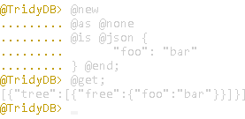
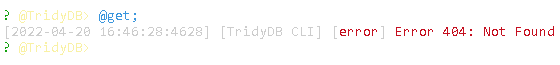
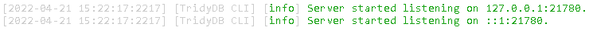

<div id="tridy"/>

# **Tridy**

Tridy (pronounced "tree-dee") was formed as a response to common generalized data storage formats such as XML, JSON, or YAML that normally represent data 'as-is', meaning where an object (as a subcollection of data) is to be represented multiple times, it must also exist and be copied to the same number of locations. This is likely to create considerable redundancy in a large number of situations where these common markdown formats would often be used, and while Tridy does not do away with it from the back-end (nor is it supposed to), it can at least do away with it from the front.

TridyDB provides a language and software solution for working with data that is hierarchically-structured without necessitating a great deal of separation between how the data is stored versus how it is used and presented. Notably, it is not intended to be as a replacement for SQL or even NoSQL as a general data storage solution, as while Tridy may solve some redundancies, it is not designed to be efficient. The data it manages is still duplicated redundantly in the back-end where it appears more than once, which is not the case with relational systems. That, of course, isn't mentioning the tons of other optimizations that so far exist in other SQL and NoSQL database systems.

As for what it *is* for, Tridy is designed to be a lightweight tool for lightweight, though-slightly-more-heavyweight-than-usual configuration data (usually because of redundancies) that happens to be organized in a tree-like/graph-like/hierarchical structure. This data can be processed into a markdown output that other applications are meant to interact with directly or, if needed with particular interest, through one of TridyDB's many interfaces. Thus, it would be appropriate also to refer to TridyDB as a "data composer" or "data compiler/transpiler", as it can act as much like a one-time standalone utility as it can a full database system. In addition, the fact that TridyDB coalesces particularly with markdown formats means that the advantages of these can still come naturally, whether it's their being lightweight, simplistic, easy to separate (modular), or easy to migrate.

To summarize, Tridy's aim is viewable, portable, modular, and acceptably-redundant, hierarchical data defined in an irredundant format.

<br>

## **Table of Contents**

---

1. [Tridy](#tridy)
    1. [TridyDB](#tridydb)
        1. [Format](#tridydb-form)
        2. [Schemas](#tridydb-schema)
        3. [Security](#tridydb-sec)
    2. [Tridy (the Language)](#tridylang)
        1. [Modules](#modules)
        2. [Context](#context)
            1. [Empty Expressions](#context-empty)
            2. [Context Terminals](#context-terminals)
                1. [Tags](#context-tags)
                2. [@any](#context-any)
                3. [@root](#context-root)
                4. [@leaf](#context-leaf)
                5. [@random](#context-random)
            3. [Context Operators](#context-operators)
                1. [@not](#context-not)
                2.  [@and](#context-and)
                3.  [@xor](#context-xor)
                4.  [@or](#context-or)
                5.  [@parent](#context-parent)
                6.  [@ascend](#context-ascend)
                7.  [@child](#context-child)
                8.  [@descend](#context-descend)
                9.  [@to](#context-to)
                10. [@toward](#context-toward)
                11. [Parentheses](#context-parenth)
            4. [Summary](#context-summary)
        3.  [Syntax](#syntax)
            1.  [Comments](#syntax-comments)
            2.  [Clauses](#syntax-clauses)
                1.  [@tridy](#syntax-tridy)
                2.  [@clear](#syntax-clear)
                3.  [@exit](#syntax-exit)
                4.  [@in](#syntax-in)
                5.  [@get](#syntax-get)
                6.  [@new](#syntax-new)
                7.  [@set](#syntax-set)
                8.  [@del](#syntax-del)
                9.  [Explicit @of](#syntax-of)
                10. [Explicit @as](#syntax-as)
                11. [Implicit @of/@as](#syntax-implicit)
                12. [@uuid](#syntax-uuid)
                13. [@is](#syntax-is)
                14. [Strings](#syntax-string)
                15. [@json](#syntax-json)
                16. [@yaml](#syntax-yaml)
                17. [@end](#syntax-end)
                18. [@has](#syntax-has)
                19. [@none](#syntax-none)
                20. [@once](#syntax-once)
                21. [@many](#syntax-many)
                22. [@raw](#syntax-raw)
                23. [@typeless](#syntax-typeless)
                24. [@tagless](#syntax-tagless)
                25. [@trimmed](#syntax-trimmed)
                26. [@merged](#syntax-merged)
                27. [@final](#syntax-final)
            3.  [Summary](#syntax-summary)
        4.  [Getting Started](#running)
            1.  [As a Package](#package)
            2.  [As a Terminal Application](#cli)
                1.  [Inline Mode](#cli-inline)
                2.  [Console Mode](#cli-console)
                3.  [Common Options: Input](#cli-common-input)
                4.  [Common Options: Client Mode](#cli-common-client)
                5.  [Common Options: Output](#cli-common-output)
                6.  [Common Options: Logging](#cli-common-logs)
            3.  [As a Server](#server)
                1.  [REST Mode](#server-rest)
                2.  [REST Mode: GET /](#server-rest-get-/)
                3.  [REST Mode: POST /](#server-rest-post-/)
                4.  [REST Mode: PUT /](#server-rest-put-/)
                5.  [REST Mode: DELETE /](#server-rest-delete-/)
                6.  [Verbatim Mode](#server-verb)
                7.  [Syntax Tree Mode](#server-astree)
                8.  [Common Options](#server-common)
    3.  [Glossary](#glossary)

<br>

<div id="tridydb"/>

## **TridyDB**

---

Tridy is a compiled data format, meaning that the data files aren't immediately useful for being read by an application. Instead, a Tridy **composer** needs to read the data files, parse the contained statements, and output in a common data format such as JSON first. This is because the output of a single statement in Tridy can appear in multiple places in the final output, relative to the output of previously-executed statements. To permit this, Tridy uses a system of *tagged modules* where a statement may be matched to an existing module so long as a boolean expression that a Tridy statement is addressed with is satisfied. In particular, the terminals of this expression are the tags themselves, and are either true if a tag is shared between both the expression and the given module, or false if not shared with the given module. This is explained in greater detail below where the Tridy language itself is.

By design, as there is no specialized output format or storage management, TridyDB is meant to be able to output to anywhere directly, whereby applications can read or write to the same storage files without ever touching TridyDB itself again more than once (albeit at a disadvantage). The database part of TridyDB is meant more as an option rather than a necessity, since despite the name, TridyDB is a scripting language interpreter first, and a general data storage solution second. The naming implies that it is, at least to some degree, a scripting language interpreter *for* managing data.

To support its use for that, though, TridyDB is provided with three possible interaction paradigms that each provide for varying degrees of integration.

1. At the highest degree of integration, TridyDB is useable as a [**Node.js package**](#package). This means that at least if another application or script is written for Node as well, it can interface with TridyDB like it would any other NPM module and use that to its advantage for increased flexibility and performance. However, this makes it more the responsibility of the application to manage the database on its own, how it saves and interacts with it, etc. since TridyDB in this form doesn't provide any persistence, and neither exists as a separate application to begin with. Another obvious issue is that if the application isn't also a Node application on its own, then this isn't really an available option.
2. For applications interacting with TridyDB locally as a separate process, but without the need for networking, TridyDB can be utilized as a [**terminal application**](#cli). This is especially useful for compiling Tridy data files/scripts to another format where it only needs to be done once during the runtime of a particular program, as is often done with configuration files, where TridyDB is most strongly-suited. The other half of its usefulness comes from providing an interface for both applications and users alike to interact directly with TridyDB, considering a possible way to use TridyDB, when launched this way, is as an interactive console.
3. For applications interacting with TridyDB remotely, or where networking is a requirement, TridyDB (the application) can be launched as a [**RESTful HTTP server**](#server), though it requires some additional knowledge to know how to work with. To summarize, however, commands can either be sent to a server directly (as a string of Tridy code), pre-parsed (ideal for Tridy-parsing clients), or in a special form that takes advantage of query parameters and HTTP methods (hence a RESTful architecture), though while having some limits of its own. Even in this form, the API is extremely basic if one happens to understand Tridy syntax at all, considering its just a single route (the root `/`) mapped to multiple HTTP methods. That is because Tridy's operational design is already highly analogous to the four commonly-used HTTP methods of RESTful APIs (GET, POST, PUT, and DELETE).

<br>

<div id="tridydb-form"/>

### **Format**

TridyDB supports importing JSON-formatted as well as YAML-formatted data. As output, export to JSON is supported, and support for exporting as XML is planned.

<br>

<div id="tridydb-schema"/>

### **Schemas**

TridyDB does not support the use of or creation or validation of schemas at this point in time.

<br>

<div id="tridydb-sec"/>

### **Security**

As far as security goes, it is not recommended to use TridyDB except locally right now. While a user system is planned for the future, and TridyDB's nested architecture and context system are ripe for having granularized access controls, TridyDB is currently single-user. In addition, the web-based API shouldn't be used in a secure context either, since it is at risk for command injection in the same manner that SQL or other database engines are. In addition, this port should *never* be opened to the internet for the same reason that you shouldn't open MySQL port 3306 to the internet, even once a user system is built-in. To that end, any accesses to TridyDB should be regulated through another application stacked between the user and the database.

<br>

<div id="tridylang"/>

## **Tridy (The Language)**

---

To show how Tridy actually works, suppose we have a snippet of Tridy code like the following:

```
@new a;
@new b;
@new a b;

@in a @xor b
@new c
@is @json { "letter":"true" } @end;
```

Tridy contains keywords, or **clauses**, that all begin with an `@` symbol.

Similar to SQL, Tridy statements are also semicolon-delimited, where the semicolon is required at the end of the statement. This has at least the advantage of allowing the language to be whitespace-insensitive, allowing users to adopt their own indentation or presentation style.

The first statement, `@new a`, creates a new module tagged as *a*, and stores it at the root module inside a newly-created document. Since the document is likely stored as a JSON object, the root module would be whatever is *directly* under the opening `{` and closing `}` of the document. It also implicitly sets the module's type specifier to be `"a"`, since another, more explicit clause `@as` wasn't used, and `a` was the last and only tag there.

`@new` is considered as the **operation** of the Tridy statement, which defines the action taken by it. `@new`, as the name implies, creates a new module, while the three other operations `@set`, `@get`, and `@del` can be used to change an existing module, print an existing module, and delete an existing module respectively.

The second statement, `@new b`, acts similarly, creating a new module tagged as `b` under the root module. More specifically, the last two statements (respectively) stored the modules tagged `a` and `b` under a named array inside the root module, of which the name of this array is consistent for all modules. That would imply that `a` and `b` can also store their own sub-modules, so it's worth noting that modules are such that they can be placed recursively at any possible depth.

The third statement creates a new module tagged as both `a` and `b`. Tags are such that individual modules can have multiple tags, and they do not have to be unique. Thus, TridyDB places no restrictions on how a module is identified, and uniqueness constraints are not meant to be enforced except at a higher level.

Since the tags were provided implicitly, the type identifier is automatically-determined as well, which this time is `"b"`. The reason why the final tag is chosen is a result of natural language, where the noun or most-significant identifier usually follows its adjectives, or less-significant identifiers.

The fourth statement is meant to show some of where Tridy can be powerful. In any Tridy statement, `@in` is used to specify a **context**, which is the expression that any module is tested for before the statement can be applied to it. The operation always follows *after* the end of whatever the context expression is, so in this case, the context expression is `a @xor b`. Given this preceding expression, `@new c` will only be applied to an existing module if and only if it has the tags `a` or `b`, but never both at the same time. Only in the modules created by the first two statements would this evaluate as true, so only the first two modules are affected. However, they both receive a copy of the new module tagged as `c`, and the only change needed to make all three existing modules (under the root module) receive a copy would be to change `a @xor b` to `a @or b`.

Finally, the latter half of the statement contains an example bit of arbitrary data given in a JSON format, which is delimited by the `@json` and `@end` clauses, respectively. The `@is` clause to which those are given as arguments is part of the statement **definition**, and is used to define the **free** data structure of the module, given (always) through a common format such as JSON or YAML. There are three other clauses which pertain to the module's definition: `@as`, which defines the module's tags (this is implicitly given after the operation if not stated directly such that tags can be given after the operation even without `@as`). Then there's `@has` for executing Tridy statements *inside* the tree of another module. Then finally, there's `@once`/`@many` for statement to be greedy (returning after only one module matches the context expression) or non-greedy, respectively (the default is non-greedy).

If the output format is a JSON object, then the statements above might have the following as its output:

```diff
{
    "tree": [
        {
            "type": "a",
            "tags": ["a"],
            "tree": [
+               {
+                   "tags": ["c"]
+               }
            ]
        },
        {
            "type": "b",
            "tags": ["b"],
            "tree": [
+               {
+                   "tags": ["c"]
+               }
            ]
        },
        {
            "type": "b",
            "tags": ["a", "b"]
        }
    ]
}
```

This is only a small part of what Tridy is capable of. Operations in Tridy can, in fact, become considerably more complex to suit different purposes. As an example of one of these operations, here is one expression which only affects the deepest modules inside a homogeneously-tagged tree:

```
root-level-module // tree-node & !(tree-node >> tree-node)
```

Here we also have an example of operators as punctuation, rather than clauses. In fact, there are various equivalences present for usability's sake.

In detail, the operation above searches for all modules tagged as `tree-node` that are nested inside of a module at the root tagged as `root-level-module`. The operator `//`, or `@toward`, applies to all modules inside another module (recursively) where the right-hand side of the expression evaluates as true. Understandably, this has a lower precedence than the other operations due to its effect of moving the entire context forward (everything to the right-hand side is determined relative to *everywhere* in the tree descending from `root-level-module` now as opposed to just the root), so it is determined last, while parentheses can be used to force a certain precedence alternatively.

The second half of the expression is true for all modules tagged as `tree-node` (and only modules tagged as `tree-node`, hence the `&`/`@and` in the middle there and the first `tree-node` immediately after `//`) so long as they are not descended by another module tagged as `tree-node`, at any level. The `>>`/`@ascend` operator searches modules similar to how `//` does, but backtracks when the right hand side becomes true such that the parenting module is affected as opposed to the child module(s). Additionally, the reason this is AND'ed with `tree-node` is because `>>`, like the other nested operators, does `a & b` under the surface (minus the level switching), meaning that inverting the final result make it return true also for `a & !b` as well as `!a & b`, and we limit that by giving `tree-node` again.

Tridy is designed especially for these high-power operations, in a sense creating something akin to a filesystem where the single-name barrier is removed, and allowing for pathing to expand to include boolean operations done over these multiple names ("tags").

<br>

<div id="modules"/>

## **Modules**

---

TridyDB expects a kind of schema to foster it's capabilities and make it useful in a way that is as generalized as possible, but not so generalized that it can't offer anything over directly working with JSON, YAML, or similar. As part of this compromise, Tridy works with self-contained units of information that are collectively termed as **modules**. What actually makes a module a module is outlined in the list below:

1. At a minimum, every module should (but is not required to) have of an array of strings that each individually form the module's **tags**.
2. In reality, a module may also have a **free** data structure, a **tree** data structure, and a **type** specifier.
3. A module should contain no other data items at the root of the module, not even metadata.
4. All identification of the module by TridyDB for queries must be done using tags located inside the tags array. TridyDB will not consider anything else.
5. A module may have zero to many tags, as an array of strings.
6. Tags have no requirements to be unique, but they may be made unique by design.
7. Tags are strings that may *only* contain lowercase letters, uppercase letters, numbers, dashes, underscores, or periods.
8. *All* data that is organized in an arbitrary fashion must be stored under the free data structure. This should include an application's usable data.
9. There are no rules for how the free data structure should be composed, and it can be a primitive type, an array type, a mapped type, or any combination of all three. It is an application's job to control the schema or format of it.
10. *All* modules which are nested under the current module must be stored under the tree data structure, which must itself be an array.
11. A module may have zero to many nested modules inside the tree data structure.
12. Modules may recursively nest other modules to no limit in depth or number of modules otherwise.
13. A module may use a type specifier to act solely as the key used by the module, in some circumstances, at a higher-level, as in the parent module.
14. A type specifier can be a string of any composition, but also *must* be a string.
15. The keys used as identifiers for these data structures may change depending on the application (TridyDB allows renaming these via. "alias" arguments).

Every module in an instance of Tridy is also a descendant of the **root module**, of which there is only one, and which is always used as a reference point for Tridy statements. Essentially, the root module is also equivalent to the entire database and its contents since nothing can exist outside of it. Thus, throughout this manual, what is referred to as the Tridy **database** is interchangable with the root module.

<br>

<div id="context"/>

## **Context**

---

In Tridy, **context** refers to the pathing situation of a module. In particular, it denotes what the tags of the module are, as well as the tags of its parent and all of its ascendents in order, also denoting where the module may be nested and how deeply it happens to also be nested. Assuming a database like the following:

```json
{
    "tree": [
        {
            "type": "b",
            "tags": ["a", "b"],
            "tree": [
                {
                    "type": "e",
                    "tags": ["e"],
                    "tree": [
                        {
                            "type": "i",
                            "tags": ["h", "i"]
                        }
                    ]
                }
            ]
        },
        {
            "type": "a",
            "tags": ["a"]
        },
        {
            "type": "d",
            "tags": ["c", "d"],
            "tree": [
                {
                    "type": "g",
                    "tags": ["f", "g"]
                }
            ]
        }
    ]
}
```

Then the context of the particular module above having the tag `e` would have the context `[[a, b], [e]]`, though notably as well, it may not be the only module with that context, as part of how Tridy is meant to work.

TridyDB uses the information contained in the context of existing modules and evaluates it against a **context expression**, a string of operators and operands in which the operands are other context expressions, which themselves are either terminal (as tags) or non-terminal. Terminals/tags evaluate to true if they're present in the module being evaluated, and evaluate to false if they are not. Non-terminals/expressions allow combining the results of terminals, which notably include the commonplace boolean operators `@not`/`!`, `@and`/`&`/(whitespace), `@or`/`|`/`,`, and `@xor`/`^`.

Note that beyond just the standard boolean operators, there are six different versions of the so-called *nested* operators, which are divided into lookahead, lookbehind, and transitive types. `@parent`/`>` and `@ascend`/`>>` are lookahead operators since they match a child on the right-hand side and affect the parent. `@child`/`<` and `@descend`/`<<` are lookbehind operators since they match a parent on the right-hand side and affect the child. Finally, `@to`/`/` and `@toward`/`//` are transitive operators since they match a child on the right-hand side and affect the same child, while parentheses also play a role in reversing the transitions they cause. In addition are various wildcard operands, including `@any`/`*`, `@root`/`~`, `@leaf`/`%`, and `@random`/`?`. These are all explained in greater detail below.

<br>

<div id="context-empty"/>

### **Empty Expressions**

Tridy allows users to forego giving context expressions at all, either by leaving out `@in`, or at least in the case of the affective operations `@get` and `@del`, proceeding it without a context expression. In other words, the following examples are all statements with empty expressions:

```
@del;
@set @json { "free": { "root": "true" } } @end;
@new @is @json { "child": "true" } @end;
@get;
```

```diff
[
-   { }
+   {
+       "free": { "root": "true" },
+       "tree": [
+           {
+               "free": { "child": "true" }
+           }
+       ]
+   }
]
```

If an expression is not given, then the operation is applied to the root/top-level module, whereby only it is affected.

<br>

<div id="context-terminals"/>

## **Context Terminals**

<div id="context-tags"/>

### **Operand: Tags**

In Tridy, tags are the alphanumeric identifiers used to identify a module. More specifically a tag is always a string composed of either lowercase letters, uppercase letter, numbers, dashes, or underscores, and to which is case sensitive. Additionally, a tag can also contain variable identifiers that begin with `$` and are enclosed with zero to one pairs of brackets to allow nesting, and which TridyDB automatically enforces the closure of. However, during composition, variables are treated much the same as other tags.

Examples of (single) tag expressions include:

```
@get abc;
@get X-Y-Z_123;
@get $d;
@get ${e${f}};
```

As an example that is not read-only:

```
# Before
@new @as a;

# After
@in a @new @as b;
```

```diff
[
    {
        "tags": ["a"],
        "tree": [
+           {
+               "tags": ["b"]
+           }
        ]
    }
]
```

A stated previously, an individual tag evaluates to true if a module contains the same tag that a context expression expects, so long as it is at the nesting level expected, which can be controlled by the nested operators below. Otherwise, the tags are evaluated at the level of the root/top-level module.

Per why they're called tags, TribyDB places no restrictions on uniqueness or how many tags a module can have, and a module may even contain no tags at all where only wildcard operands can affect it. The only thing TridyDB does restrict are duplicate tags in the same module, but this is simply because including them multiple times in the same module has no effective purpose, and it's better to enforce this as a rule for best practice reasons.

<br>

<div id="context-any"/>

### **Wildcard Operand: `@any` / "`*`"**

The `@any` operand is used in a way that is analogous to a tautology in the Tridy language, meaning when `@any` is used, all sub-modules of a module are matched, though notably, this still applies only at the current nesting level unless a transitive nested operator is used with it. Combining this with `@descend` or `@toward` (both explained below) will do the job of matching all modules at all levels.

```
# Before
@new;
@new @as a;
@new @as b;
@new @as a b;

# After
@in * @new @as c;
```

```diff
[
    {
        "tree": [
            {
                "tags": [ ],
                "tree": [
+                   {
+                       "tags": ["c"]
+                   }
                ]
            },
            {
                "tags": ["a"],
                "tree": [
+                   {
+                       "tags": ["c"]
+                   }
                ]
            },
            {
                "tags": ["b"],
                "tree": [
+                   {
+                       "tags": ["c"]
+                   }
                ]
            },
            {
                "tags": ["a", "b"],
                "tree": [
+                   {
+                       "tags": ["c"]
+                   }
                ]
            }
        ]
    }
]
```

<br>

<div id="context-root"/>

### **Wildcard Operand: `@root` / "`~`"**

The `@root` operand applies if and only if the module being evaluated is a direct descendant of the root module. This operator would have not much of a use (since expressions already starting from the root module anyway) if not for the introduction of `@child` and `@descend`, which are normally greedy and do not otherwise have a way to determine their absolute position in the database.

```
# Before
@new @as a;
@in a @new @as b;
@in a/b @new @as b;
@in a/b/b @new @as c;
@in a @new @as d;
@in a/d @new @as b;
@in a/d/b @new @as c;

# After
@in a // c << b < ~ @new @as e;
```

```diff
[
    {
        "tree": [
            {
                "tags": ["a"],
                "tree": [
                    {
                        "tags": ["b"],
                        "tree": [
                            {
                                "tags": ["b"],
                                "tree": [
                                    {
                                        "tags": ["c"]
                                        "tree": [
+                                           {
+                                               "tags": ["e"]
+                                           }
                                        ]
                                    }
                                ]
                            }
                        ]
                    },
                    {
                        "tags": ["d"],
                        "tree": [
                            {
                                "tags": ["b"],
                                "tree": [
                                    {
                                        "tags": ["c"]
                                    }
                                ]
                            }
                        ]
                    }
                ]
            }
        ]
    }
]
```

<br>

<div id="context-leaf"/>

### Wildcard Operand: `@leaf` / "`%`"

The `@leaf` operand applies if and only if the module being evaluated is a leaf, meaning that it contains no sub-modules of its own. In more detail, that either it has no nested tree data structure, or this structure is as an empty array. As is typical, the free data structure is not evaluated when making this decision.

```
# Before
@new @as a;
@in a @new @as b;
@in a/b @new @as b;
@in a @new @as b;

# After
@in a // % @new @as c;
```

```diff
[
    {
        "tree": [
            {
                "tags": ["a"],
                "tree": [
                    {
                        "tags": ["b"],
                        "tree": [
                            {
                                "tags": ["b"],
                                "tree": [
+                                   {
+                                       "tags": ["c"]
+                                   }
                                ]
                            }
                        ]
                    },
                    {
                        "tags": ["b"],
                        "tree": [
+                           {
+                               "tags": ["c"]
+                           }
                        ]
                    }
                ]
            }
        ]
    }
]
```

<br>

<div id="context-random"/>

### **Wildcard Operand: `@random` / "`?`"**

The `@random` operand forms one of the few non-deterministic operands included with the Tridy language. This operand effectively operates like a coin flip, where it has a 50% chance of evaluating to true, and a 50% chance of evaluating to false. The chances of the operand coming out as either can be raised or lowered by chaining multiple `@random` clauses together with either `@and` or `@or` (for instance, as `? & ?` or `? | ?`), respectively. That is, following statistic reasoning, the probability of success, and therefore, a module being affected, can then be controlled like that of a binomial distribution, allowing for a lot of interesting combinations of modules to be created.

<br>

<div id="context-operators"/>

## **Context Operators**

<div id="context-not"/>

### **Basic Operator: `@not` / "`!`"**

The `@not` operator forms the only unary operator in Tridy's expressional syntax, and either returns true if its operand is false, or false if its operand is true. If the operand is just a single tag, then only modules which lack the given tag will be affected.

```
# Before
@new;
@new @as a;
@new @as b;
@new @as a b;

# After
@in !a @new c;
```

```diff
[
    {
        "tree": [
            {
                "tags": [ ],
                "tree": [
+                   {
+                       "tags": ["c"]
+                   }
                ]
            },
            {
                "tags": ["a"]
            },
            {
                "tags": ["b"],
                "tree": [
+                   {
+                       "tags": ["c"]
+                   }
                ]
            },
            {
                "tags": ["a", "b"]
            }
        ]
    }
]
```

If not including parantheses, `@not` has the highest precedence out of all the operators given.

<br>

<div id="context-and"/>

### **Basic Operator: `@and` / "`&`" / " "**

The `@and` operator evaluates as true if and only if the operands on both sides of the operator are true. Otherwise, it evaluates as false. This can be used if you wish only for a module that has two or more particular tags at the same time to be affected.

Worth noting is that `@and` is also considered as the *implicit* operation, meaning that if two tags are separated only by whitespace characters without an explicit operator, such as `@in a b`, then this has the exact same effect as `@in a & b`.

```
# Before
@new;
@new @as a;
@new @as b;
@new @as a b;

# After
@in a & b @new @as c;
```

```diff
[
    {
        "tree": [
            {
                "tags": [ ]
            },
            {
                "tags": ["a"]
            },
            {
                "tags": ["b"]
            },
            {
                "tags": ["a", "b"],
                "tree": [
+                   {
+                       "tags": ["c"]
+                   }
                ]
            }
        ]
    }
]
```

`@and`'s precedence is higher than that of `@not` and lower than that of `@xor`.

<br>

<div id="context-xor"/>

### **Basic Operator: `@xor` / "`^`"**

The `@xor` operator evaluates as true if and only if an operand on one side of the operator or the other evaluates as true, but never both at the same time. It is one of the few operators that is effectively a shorthand for a more complex expression using other, more simplistic operators.

```
# Before
@new;
@new @as a;
@new @as b;
@new @as a b;

# After
@in a ^ b @new @as c;
```

```diff
[
    {
        "tree": [
            {
                "tags": [ ]
            },
            {
                "tags": ["a"],
                "tree": [
+                   {
+                       "tags": ["c"]
+                   }
                ]
            },
            {
                "tags": ["b"],
                "tree": [
+                   {
+                       "tags": ["c"]
+                   }
                ]
            },
            {
                "tags": ["a", "b"]
            }
        ]
    }
]
```

`@xor`'s precedence is higher than that of `@and` and lower than that of `@or`.

<br>

<div id="context-or"/>

### **Basic Operator: `@or` / "`|`" / "`,`"**

The `@or` operator evaluates as true if either side of the operator evaluates as true, and stopping at that. Use this to attach a module to another with tags that do not exclusively have to be together in the same module.

```
# Before
@new;
@new @as a;
@new @as b;
@new @as a b;

# After
@in a | b @new @as c;
```

```diff
[
    {
        "tree": [
            {
                "tags": [ ]
            },
            {
                "tags": ["a"],
                "tree": [
+                   {
+                       "tags": ["c"]
+                   }
                ]
            },
            {
                "tags": ["b"],
                "tree": [
+                   {
+                       "tags": ["c"]
+                   }
                ]
            },
            {
                "tags": ["a", "b"],
                "tree": [
+                   {
+                       "tags": ["c"]
+                   }
                ]
            }
        ]
    }
]
```

`@or`'s precedence is higher than that of `@xor` and lower than that of any of the non-transitive nested operators.

<br>

<div id="context-parent"/>

### **Lookahead Nested Operator: `@parent` / "`>`"**

The `@parent` operator returns true only if the right side of the operator is true for a child of a module for which the left side of the operator is true. For instance, in the case where a module tagged as `apple` has one or more sub-modules with the `seed` tag, then the expression `apple > seed` will only apply to those `apple` modules that have at least one of these sub-modules tagged with `seed`. In essence, the parent module is thus affected as the result of a property that one or more of its child modules have.

```
# Before
@new @as apple;
@new @as apple;
@in apple @new @as seed @once;

# After
@in apple > seed @new @as reproductive;
```

```diff
[
    {
        "tree": [
            {
                "tags": ["apple"],
                "tree": [
                    {
                        "tags": ["seed"]
                    },
+                   {
+                       "tags": ["reproductive"]
+                   }
                ]
            },
            {
                "tags": ["apple"]
            }
        ]
    }
]
```

`@parent`'s precedence is the same as all of the non-transitive nested operators, being higher than that of `@or` and lower than the transitive nested operators.

<br>

<div id="context-ascend"/>

### **Lookahead Nested Operator: `@ascend` / "`>>`"**

The `@ascend` operator extends `@parent` to recursively look for sub-modules where the right side of the expression is true, such if you had the expression `orchard >> seed` instead, then any `orchard` modules would be affected so long as they had modules tagged `seed` anywhere in its subtree, even if not directly under the affected module. Effectively, this would be same as indiscriminately looping `@parent` over and over again as `orchard > * > seed`, `orchard > * > * > seed`, and so forth until the deepest level of nesting is reached for a `seed` module.

```
# Before
@new @as orchard;
@new @as orchard;
@in orchard new @as apple;
@in orchard/apple @new @as seed @once;

# After
@in orchard >> seed @new @as regrowable;
```

```diff
[
    {
        "tree": [
            {
                "tags": ["orchard"],
                "tree": [
                    {
                        "tags": ["apple"],
                        "tree": [
                            {
                                "tags": ["seed"]
                            }
                        ]
                    },
+                   {
+                       "tags": ["regrowable"]
+                   }
                ]
            },
            {
                "tags": ["orchard"],
                "tree": [
                    {
                        "tags": ["apple"]
                    }
                ]
            }
        ]
    }
]
```

`@ascend`'s precedence is the same as all of the non-transitive nested operators, being higher than that of `@or` and lower than the transitive nested operators.

<br>

<div id="context-child"/>

### **Lookbehind Nested Operator: `@child` / "`<`"**

The `@child` operator returns true only if the left side of the operator is true for a child of a module for which the right side of the operator is true. While it effectively just reverses directions from `@parent` (and because the two sides are AND'ed together in the end, the final outcome would happen to be pretty much or nearly the same), it differs rather in the module that gets affected when the result is true. Since `@parent` affects the parent, obviously this would affect the child instead, i.e. still the left-hand side of the operator.

```
# Before
@new @as orchard;
@new @as trashcan;
@in orchard | trashcan @new @as apple;

# After
@in * / apple < orchard @new @as fresh;
```

```diff
[
    {
        "tree": [
            {
                "tags": ["orchard"],
                "tree": [
                    {
                        "tags": ["apple"],
                        "tree": [
+                           {
+                               "tags": ["fresh"]
+                           }
                        ]
                    }
                ]
            },
            {
                "tags": ["trashcan"],
                "tree": [
                    {
                        "tags": ["apple"]
                    }
                ]
            }
        ]
    }
]
```

`@child`'s precedence is the same as all of the non-transitive nested operators, being higher than that of `@or` and lower than the transitive nested operators.

<br>

<div id="context-descend"/>

### **Lookbehind Nested Operator: `@descend` / "`<<`"**

The `@descend` operator extends `@child` similar to the way `@ascend` extends `@parent` by recursively searching the child module's context to see if at any point the right side of the operator is true for any module that it is nested under. Thus, it works in a way like looping indiscriminately looping `@child` over and over again like `seed < orchard`, `seed < * < orchard`, and so forth until after the right-hand side has reached the root module.

```
# Before
@new @as year 1961 1960s;
@in 1961 @new @as month October;
@in 1961/October @new @as day 30;
@in 1961/October/30 @new @as event tsar-bomba-dropped;
@new @as year 1989 1980s;
@in 1989 @new @as month November;
@in 1989/November @new @as day 9;
@in 1989/November/9 @new @as event fall-of-berlin-wall;

# After
@in * // event << 1980s @new @as period late-soviet;
```

```diff
[
    {
        "tree": [
            {
                "tags": ["year", "1961", "1960s"],
                "tree": [
                    {
                        "tags": ["month", "October"],
                        "tree": [
                            {
                                "tags": ["day", "30"],
                                "tree": [
                                    {
                                        "tags": ["event", "tsar-bomba-dropped"]
                                    }
                                ]
                            }
                        ]
                    }
                ]
            },
            {
                "tags": ["year", "1989", "1980s"],
                "tree": [
                    {
                        "tags": ["month", "November"],
                        "tree": [
                            {
                                "tags": ["day", "9"],
                                "tree": [
                                    {
                                        "tags": ["event", "fall-of-berlin-wall"],
                                        "tree": [
+                                           {
+                                               "tags": ["period", "late-soviet"]
+                                           }
                                        ]
                                    }
                                ]
                            }
                        ]
                    }
                ]
            }
        ]
    }
]
```

`@descend`'s precedence is the same as all of the non-transitive nested operators, being higher than that of `@or` and lower than the transitive nested operators.

<br>

<div id="context-to"/>

### **Transitive Nested Operator: `@to` / "`/`"**

The `@to` operator has a behavior similar to that of `@child`, where it will return true only for a child of another module, though the ordering from left to right is from parent to child like with `@parent`, and unlike `@child`. That would not be enough reason alone to have a separate operator, however, yet `@to` has an important role by the fact that it is *transitive*, meaning that it both affects a child (as `@child` does), and shifts the context level forward while it's at it (as `@parent` does). In fact, `@to` (or `@toward` below) is a necessity to affect child modules at all, since `@child`/`@descend` only works at the current context level (`@child`/`@descend` without `@to`/`@toward` is just searching for parents of a root module, which always returns false), and `@parent`/`@ascend`, while they do shift the context level, rather end up affecting the parent, or in other words, at the original context. This is why this operator (likely as `/`), or `@toward` (likely as `//`) is so frequently used here.

```
# Before
@new @as apple;
@new @as apple;
@in apple @new @as seed @once;

# After
@in apple / seed @new @as sprout;
```

```diff
[
    {
        "tree": [
            {
                "tags": ["apple"],
                "tree": [
                    {
                        "tags": ["seed"],
                        "tree": [
+                           {
+                               "tags": ["sprout"]
+                           }
                        ]
                    }
                ]
            },
            {
                "tags": ["apple"]
            }
        ]
    }
]
```

`@to`'s precedence, as a transitive nested operator, has a lower precedence than any of the operators that are not transitive nested operators, and equal precedence with any that are, such as `@toward`.

<br>

<div id="context-toward"/>

### **Transitive Nested Operator: `@toward` / "`//`"**

The `@toward` operator does not just have an effect on the . `@toward` looks for through all modules at all levels of nesting, and affects those same modules when the right-hand side is true. For obvious reasons, this can be quite powerful, especially if used with a wildcard operand like `@any`. For instance, an expression like `@any @toward @any` or `* // *` (they are equivalent) affects all modules throughout all levels of nesting, or in other words, every module in the entire database. Thus, it should also be used sparingly, and it usually only makes sense to use something like this where such a large scope is necessary in general (such that something should apply to all modules), or where it makes sense to have homogenous modules that are recursive and indefinitely-nestable within their application as well, as is in the case of many modules used to form graphs.

```
# Before
@new @as a;
@in a new @as b closest;
@in a/b @new @as b middle;
@in a/b/b @new @as b deepest;

# After
@in a // b @new @as c;
```

```diff
[
    {
        "tree": [
            {
                "tags": ["a"],
                "tree": [
                    {
                        "tags": ["b", "closest"],
                        "tree": [
                            {
                                "tags": ["b", "middle"],
                                "tree": [
                                    {
                                        "tags": ["b", "deepest"]
                                        "tree": [
+                                           {
+                                               "tags": ["c"]
+                                           }
                                        ]
                                    },
+                                   {
+                                       "tags": ["c"]
+                                   }
                                ]
                            },
+                           {
+                               "tags": ["c"]
+                           }
                        ]
                    }
                ]
            }
        ]
    }
]
```

`@towards`'s precedence, as a transitive nested operator, has a lower precedence than any of the operators that are not transitive nested operators, and equal precedence with any that are, such as `@to`.

<br>

<div id="context-parenth"/>

### **Parentheses**

Naturally, to control the precedence of different operators in a context expression, the user can include parentheses to either raise or lower the precedence of some operations, and thus affect the final outcome of the expression, in most cases.

```
# Before
@new @as a b c;
@new @as a b;
@new @as a c;
@new @as a;
@new @as b c;
@new @as b;
@new @as c;
@in a & b | c @new @as d without-parentheses;

# After
@del a & b | c / d;
@in a & (b | c) @new @as d with-parentheses;
```

```diff
{
    "tree": [
        {
            "tags": ["a", "b", "c"],
            "tree": [
-               {
-                   "tags": ["d", "without-parentheses"]
-               }
+               {
+                   "tags": ["d", "with-parentheses"]
+               }
            ]
        },
        {
            "tags": ["a", "b"],
            "tree": [
-               {
-                   "tags": ["d", "without-parentheses"]
-               }
+               {
+                   "tags": ["d", "with-parentheses"]
+               }
            ]
        },
        {
            "tags": ["a", "c"],
            "tree": [
+               {
+                   "tags": ["d", "with-parentheses"]
+               }
            ]
        },
        {
            "tags": ["a"]
        },
        {
            "tags": ["b", "c"]
        },
        {
            "tags": ["b"]
        },
        {
            "tags": ["c"],
            "tree": [
-               {
-                   "tags": ["d", "without-parentheses"]
-               }
            ]
        }
    ]
}
```

Note that parentheses can also be used to reverse the transitions created by the transitive nested operators, meaning that in an expression like `a / b | c`, `c` can only address a module that is a child of `a`, whether the module is tagged `b` or `c`, meaning by default, the context level is raised permanently. However `(a / b) | c` encloses the `@to` in parentheses, meaning that the context goes one level back after the closing parentheses such that only `b` is expected as a child of `a`, and `c` is expected back at the root level.

```
# Before
@new @as a;
@in a @new @as b;
@in a @new @as c;
@new @as c;
@in a / b | c @new @as d without-parentheses;

# After
@del a / b | c / d;
@in (a / b) | c @new @as d with-parentheses;
```

```diff
{
    "tree": [
        {
            "tags": ["a"],
            "tree": [
                {
                    "tags": ["b"],
                    "tree": [
-                       {
-                           "tags": ["d", "without-parentheses"]
-                       },
+                       {
+                           "tags": ["d", "with-parentheses"]
+                       }
                    ]
                },
                {
                    "tags": ["c"],
                    "tree": [
-                       {
-                           "tags": ["d", "without-parentheses"]
-                       }
                    ]
                }
            ]
        },
        {
            "tags": ["c"],
            "tree": [
+               {
+                   "tags": ["d", "with-parentheses"]
+               }
            ]
        }
    ]
}
```

<br>

<div id="context-summary"/>

### **Summary**

| Precedence | Operation | Shorthands | Input | Output | Search Depth (RHS) | Effective Depth |
| --- | --- | --- | --- | --- | --- | --- |
| N/A | (terminal) | N/A | Unary | Logical Conjunction | LHS | LHS
| 0 | `@not` | `!` | Unary | Negation | LHS | LHS
| 1 | `@and` | `&` whitespaces | Binary | Logical Conjunction | LHS | LHS
| 2 | `@xor` | `^` | Binary | Exclusive Disjunction | LHS | LHS
| 3 | `@or` | `\|` `,` | Binary | Logical Disjunction | LHS | LHS
| 4 | `@parent` | `>` | Binary | Logical Conjunction | LHS + 1 | LHS
| 4 | `@ascend` | `>>` | Binary | Logical Conjunction | LHS + *n* | LHS
| 4 | `@child` | `<` | Binary | Logical Conjunction | LHS - 1 | LHS
| 4 | `@descend` | `<<` | Binary | Logical Conjunction | LHS - *n* | LHS
| 5 | `@to` | `/` | Binary | Logical Conjunction | LHS + 1 | LHS + 1
| 5 | `@toward` | `//` | Binary | Logical Conjunction | LHS + *n* | LHS + *n*

Note: if first in an expression, *LHS* = 0. Additionally, the *LHS*, unless both the *LHS* and the operator are inside parentheses, is relative to the outside of them.

<br>

<div id="syntax"/>

## **Statements/Syntax**

---

Understanding how modules are addressed using context expressions, we now look into what actually composes a statement in the Tridy language, and what it actually means for a statement to "affect" a Tridy module.

Tridy is composed of **clauses**, which are keywords that are used to control the behavior of the Tridy interpreter. Every clause begins with the `@` symbol.

A Tridy statement, *at a minimum*, is composed of one and only ever one operation, as well as a single semicolon at the end of the statement.

In addition, a statement may be composed of **meta-operations**, which happen to control what modules are affected by a statement. As you might imagine, this includes clauses surrounding controlling context, but also some that might go beyond this and have more 'global' implications.

Finally, as with certain operations but not others, the statement might contain a couple of **definition** clauses. Definition clauses are Tridy's way of spelling out the contents of a module, though these are not to be confused with the **raw** clauses that do similarly, but in a Tridy-lite manner.

It's important to note that **order matters** and Tridy is not commutative, at least for the time being. That means that per the order in which this guide is written, most of the clauses follow the given order, and would result in syntax errors if instead given out-of-order. With each of these clauses, their particular ordering should become clear from their explanations, but as an overview, one can refer to the [summary](#syntax-summary).

<br>

<div id="syntax-comments"/>

## **Comments**

In Tridy, it is possible to provide comments inside of scripts using the hashtag character `#`, which can be placed anywhere at the end of a line, and any text which follows it will be ignored by the Tridy interpreter until the next line.

On the other hand, Tridy does not have a multi-line comment syntax.

<br>

<div id="syntax-clauses"/>

## **Clauses**

<div id="syntax-tridy"/>

### **Definition / Control: `@tridy`**

The `@tridy` clause has a different effect depending on where it is placed.

In the first circumstance, `@tridy` is both the first and only clause in a statement, making it one of the few so-called "control" clauses that can only exist on their own. However, as a control clause, it has no effect on the statement itself, being essentially a no-op. As for its actual purpose, the clause can be used as a file signature for Tridy scripts, assuming `@tridy;` is placed at the very start of a script, though it's entirely optional to use, considering a shebang (that has almost the same purpose) may be placed at the beginning instead.

In the second circumstance, it can be placed between the operation clause and the definition clause `@as`. This will make `@as` a requirement for specifying tags, however, the purpose here is more just to explicitly exclude the use of raw input clauses like `@json`.

<br>

<div id="syntax-clear"/>

### **Control: `@clear`**

The `@clear` clause is meant as a control command for the TridyDB interactive terminal, in which the terminal moves the screen down to where the previous output is made invisible.

In reality, the effect it has is a little more pronounced. While this does clear the screen away when used inside a console, if it is sent in a string where multiple statements are present, then it will also flush the output of all statements that precede it. As a result, `@get a; @clear; @get b;` is equivalent to just `@get b;`.

As a control clause, `@clear` can only be given alone in a statement, disregarding the semicolon, and when used in a client-server environment only affects the client-side.

<br>

<div id="syntax-exit"/>

### **Control: `@exit`**

The `@exit` clause is meant as a control command for the TridyDB interactive terminal, causing the interactive terminal to close.

If it is sent in a string where multiple statements are present, then it will exit at the moment before the statements following it are processed. As a result, `@get a; @exit; @get b;` is equivalent to just `@get a;`.

As a control clause, `@exit` can only be given alone in a statement, disregarding the semicolon, and when used in a client-server environment only affects the client-side.

<br>

<div id="syntax-in"/>

### **Meta-Operation: `@in`**

`@in` is the clause normally used to read in a context expression for the statement, where its argument would be the context expression itself. This context expression is used to filter out the modules affected by the statements according to what the context expression contains, and to expand out from the root, which is normally the only module affected when a context expression is not present. More of this is explained in detail in the section on context.

Syntactically, `@in` is meant to precede one of the operation clauses, and thus also all other clauses in a statement. However, use of `@in` to provide a context expression is optional for `@get` and `@del`, and only required for `@new` and `@set`. This is because only `@new` and `@set` use the space to the right of them to allow defining module characteristics (via. the definition clauses), while `@get` and `@del` are specific to the current state of the database. Thus, they can be shortcutted by avoiding `@in` and simply giving the context expression after the operation itself (`@in ... @get;` vs. `@get ...;`).

<br>

<div id="syntax-get"/>

### **Operation: `@get`**

`@get` is a read-only operation that queries the database using a context expression (or none), and returns an array containing the modules that happen to match the query/expression. The reason why an array is returned is that if there happen to be multiple `@get` statements run in a single batch order or script, then the results of all of these get added to the same array.

`@get`'s equivalent in SQL is `SELECT` and in REST architecture is `GET`.

By default, the results of `@get` will be a JSON representation of the database in a condensed form. Enabling pretty-printing (via. arguments) can at least print an output in a more human-readable form, though this option isn't present when running TribyDB as a server (since the presentation, if any, is up to the browser).

`@get` may be used with `@in` to filter output based on a context expression, however, the context expression may also be given after `@get` without the use of `@in`. `@get` takes no definition arguments to its right-hand side.

```
@new @as a;
@new @as a;
@in a @new @as b;
@get;
@get a/b;

# Verbatim output shown below
```

```json
[
    {
        "tree": [
            {
                "tags": ["a"],
                "tree": [
                    {
                        "tags": ["b"]
                    }
                ]
            },
            {
                "tags": ["a"],
                "tree": [
                    {
                        "tags": ["b"]
                    }
                ]
            }
        ]
    },
    {
        "tags": ["b"]
    },
    {
        "tags": ["b"]
    }
]
```

<br>

<div id="syntax-new"/>

### **Operation: `@new`**

`@new` is the main operation used with Tridy, as without it, Tridy modules would not be composable to begin with. `@new` creates a new module where the definition clauses on its right-hand side are taken in as arguments (including the "raw" input clauses), and then copies this module to the tree data structure of all modules where the subsequent context expression given through `@in` becomes true. If there is no `@in`, it is placed only at the root module. Thus, a module created through `@new` becomes a sub-module of the context to which it is provided. Using `@new` is never an idempotent operation.

`@new`'s equivalent in SQL is `CREATE`/`INSERT` and in REST architecture is `POST`.

```
# Before
@new @as a;

# After
@in a @new @as b;
```

```diff
{
    "tree": [
        {
            "tags": ["a"],
            "tree": [
+               {
+                   "tags": ["b"]
+               }
            ]
        }
    ]
}
```

<br>

<div id="syntax-set"/>

### **Operation: `@set`**

`@set` is an operation that is intended to apply changes to an existing module, and as the same module which is matched through `@in` as a context expression. `@set` creates a new module where the definition clauses on its right-hand side are taken in as arguments (including the "raw" input clauses), and then overwrites all modules where the subsequent context expression given through `@in` becomes true. If there is no `@in`, then the root module is altered (in effect overwriting the entire database). Using `@set` is sometimes an idempotent operation.

Note that this command is generally not recommended for normal use, and Tridy scripts can be designed without ever needing to use `@set`. The main reason why this isn't recommended is because it is nearly equivalent to deleting a module and then placing a new one in the same spot or order that the deleted one was in before, making it particularly dangerous as with `@del`. However, also as a result of this, `@set` generally makes the most sense when used in combination with `@get` to acquire the original module and replace it's elements and/or apply soft operations defined by the application such that this operation is usable in such a way that isn't completely destructive.

`@set`'s equivalent in SQL is `ALTER`/`UPDATE` and in REST architecture is `PUT`.

```
# Before
@new @as a;
@in a @new @as b;

# After
@in a @set @as b;
```

```diff
{
    "tree": [
        {
-           "tags": ["a"],
-           "tree": [
-               {
-                   "tags": ["b"]
-               }
-           ]
+           "tags" ["b"]
        }
    ]
}
```

<br>

<div id="syntax-del"/>

### **Operation: `@del`**

`@del`, as its namesake probably suggests, is Tridy's way of deleting modules. This will match a context expression to an existing module, and then delete that same module. In effect, the module is removed from the tree of its parent module, and if there are no modules left in the tree data structure afterwards, so is the tree itself deleted. If no context expression is given, then the root module (aka. the database) is deleted.

The operation is not completely permanent, though, since modules can always be re-populated with the same modules they were given originally so long as the Tridy statements that led to them are re-given in the same order. Even if the tree data structure of a module or the root module itself is deleted, these are regenerated automatically (albeit as stubs, and not as what was deleted) whenever new statements that would affect them are applied after `@del` is given.

`@del`'s equivalent in SQL is `DROP`/`DELETE` and in REST architecture is `DELETE`.

`@del` may be used with `@in` to filter output based on a context expression, however, the context expression may also be given after `@del` without the use of `@in`. `@del` takes no definition arguments to its right-hand side.

```
# Before
@new @as a;
@in a @new @as b;

# After
@in a/b @del;
```

```diff
{
    "tree": [
        {
            "tags": ["a"],
            "tree": [
-               {
-                   "tags": ["b"]
-               }
            ]
        }
    ]
}
```

<br>

<div id="syntax-of"/>

### **Definition: `@of`**

`@of` is used to directly state a type specifier for the module irrespective of what the module's tags are.

This also allows getting around the limitations of the more limited syntax around tags (implicit `@of`/`@as` re-uses the last tag as the type) so that any arbitrary string can be used as a type specifier. This does that with `@of`, quote marks are required to begin and end the type specifier.

A module's type specifier has a specific purpose, in that it is used as an associative key to the module in the case where output is desired in a compressed form. As an example, here is a TridyDB statement that creates three modules with `@of`.

```
@new @of "Type Example 1" @is "foo";
@new @of "Type Example 1" @is "bar";
@new @of "Type Example 2" @is "baz";
```

```json
{
    "tree": [
        {
            "type": "Type Example 1",
            "free": "foo"
        },
        {
            "type": "Type Example 1",
            "free": "bar"
        },
        {
            "type": "Type Example 2",
            "free": "baz"
        }
    ]
}
```

As a result of the type specifier's value, below is the output whenever `@get @final;` is used.

```json
{
    "Type Example 1": [
        "foo",
        "bar"
    ],
    "Type Example 2": "baz"
}
```

Using `@of` requires that one can only provide tags using `@as`. Just as `@of` allows setting a type specifier independent from tagging, `@as` allows setting tags independent of a type specifier.

`@of` along with its formatted argument is meant to be specified before `@as`.

<br>

<div id="syntax-as"/>

### **Definition: `@as`**

The right-hand side of `@as` is used to provide tags used in defining a new module with `@new`, or re-defining an existing module with `@set`, whereby multiple tags are provided in a whitespace-delimited fashion. Any tags defined using `@as` do not affect the module's type specifier, in which `@of` would need to be paired with it.

Tags are one of the important features of Tridy used to identify how TridyDB can address the module. In contrast, the type specifier is meant to provide addressing at the application-level.

`@as` is meant to come after the operation, after `@of`, but before `@is` or `@has`.

```
@new @as a b c;
```

```json
{
    "tree": [
        {
            "tags": ["a", "b", "c"]
        }
    ]
}
```

<br>

<div id="syntax-implicit"/>

### **Definition: Implicit `@of` / `@as`**

It is possible to directly state a list of tags after the operation clause without any other clauses between them, ultimately while having a unique effect. Like with `@as`, multiple tags given this way are separated by spaces. However, this also stands in for `@of` by selecting the last tag in the list to be the module's type specifier.

```
@new a b c;
```

```json
{
    "tree": [
        {
            "type": "c",
            "tags": ["a", "b", "c"]
        }
    ]
}
```

The reason why the last tag is selected is due to the pseudo-English syntax, where the last tag would normally be expected to be the most significant or noun-like.

This is also not an option where the type specifier should contain special characters that would not be allowed inside a tag, for which one must be provided through `@of`.

Note that providing tags implicitly also takes the place of both `@of` and `@as`, so neither of these can be inside the same statement separately anymore.

<br>

<div id="syntax-uuid"/>

### **Definition Operand: `@uuid`**

The `@uuid` clause is used in place of a tag right of `@as`, `@new`, or `@set`, and displays a unique behavior whereby in its place, a UUIDv4 string (as a tag) is generated. The UUID provides the module with a way to be identifiable by a totally-unique tag/identifier, and importantly, the UUID generation happens *after* the module is copied and placed, meaning that every copy of the module, if there are any, even get a completely-separate UUID of their own such that two or more modules placed from a single statement while having this clause are never identical with strong collision-resistance.

As a disadvantage of this, though, the UUID would not be known beforehand, making it necessary to `@get` the results of these statements afterwards in order to read and use the unique identifier in further Tridy statements, which wouldn't be possible in a Tridy script alone.

```
# After
@new @as a;
@new @as a;

# After
@in a @new @as @uuid;
```

```diff
{
    "tree": [
        {
            "tags": ["a"],
            "tree": [
+               {
+                   "tags": ["2c483f4f-04da-42a7-9dfb-a25e614f190b"]
+               }
            ]
        },
        {
            "tags": ["a"],
            "tree": [
+               {
+                   "tags": ["ee45339a-4d3c-4e27-80d8-76ea422cf8a7"]
+               }
            ]
        }
    ]
}
```

<br>

<div id="syntax-is"/>

### **Definition: `@is`**

`@is` is used as a way to detail the contents of the free data structure, a subsection of each module that is allowed to have free or unrestricted contents. This lack of restriction means that, though the use of raw input is optional for giving the full definition of a module otherwise, it is required with `@is` since common, established data formats are better for the purpose of complex data not following the Tridy module paradigm.

Following `@is`, the user would specify a format clause, most commonly `@json`, and type in the full value of the free data structure using whatever format they gave. Once they give the format tag, their input is no longer validated according to Tridy rules, and instead becomes validated according to the format of their choosing. That is, until `@end` is given, which closes the formatted input and returns to Tridy mode. The backslash character (`\`) can be used as an escape meanwhile, which is needed especially in order to interpret `@` or `#` literally.

`@is` along with its formatted argument is meant to be specified after `@as` if given, but before `@has`.

```
@new @as file fsobj @is @json {
    "handle": "file",
    "path": "/usr/bin/node",
    "properties": {
        "type": "binary",
        "date": {
            "modified": "10/26/2021 11:46 AM"
        }
    }
} @end;
```

```json
{
    "tree": [
        {
            "tags": ["file", "fsobj"],
            "free": {
                "handle": "file",
                "path": "/usr/bin/node",
                "properties": {
                    "type": "binary",
                    "date": {
                        "modified": "10/26/2021 11:46 AM"
                    }
                }
            }
        }
    ]
}
```

<br>

<div id="syntax-string"/>

### **Raw Definition: `'` / `"` / `` ` ``**

For special reasons, this was included even though, without the beginning `@`, it technically isn't a clause.

For wherever it is possible for a user to enter raw input, while most of the formats use and need delimiting clauses, literal strings only need the markings one would expect from working with any other language.

Either single-quotation, double-quotation, or grave accent marks can be used. 

There are no advantages to using either of the three over one another, except that the delimiting character needs to be escaped with `\` to be used as a literal, and having multiple options provides some flexibility with that (no need to escape double-quotes in a single-quoted string, for instance). All three will even accept a string over multiple lines, so they behave identically for the most part.

```
```

```json
```

WIP

<br>

<div id="syntax-json"/>

### **Raw Definition: `@json`**

The `@json` clause is used as a starting delimiter for JSON-formatted input wherever it is acceptable to provide raw input inside of a Tridy statement. When the `@json` clause is given, the input is no longer validated according to Tridy rules, and instead becomes validated as a JSON object. That is, until `@end` is given, which closes the formatted input and returns to Tridy mode. The backslash character (`\`) can be used as an escape meanwhile, which is needed especially in order to interpret `@` or `#` literally.

```
# Before
@new @as a;

# After
@in a @new @json {
    "string": "This is a string.",
    "number": 10,
    "boolean": true,
    "array": ["apples", "oranges"],
    "map": {
        "a": "b",
        "c": "d",
        "nested": {
            "e": "f",
            "g": "h"
        }
    }
} @end;
```

```diff
{
    "tree": [
        {
            "tags": ["a"],
            "tree": [
+               {
+                   "string": "This is a string.",
+                   "number": 10,
+                   "boolean": true,
+                   "array": ["apples", "oranges"],
+                   "map": {
+                       "a": "b",
+                       "c": "d",
+                       "nested": {
+                           "e": "f",
+                           "g": "h"
+                       }
+                   }
+               }
            ]
        }
    ]
}
```

For obvious reasons that it bypasses Tridy's requirements for modules, using this or other raw definition tags is recommended against under normal circumstances where the module definition is not enforced by the application interfacing with Tridy.

<br>

<div id="syntax-yaml"/>

### **Raw Definition: `@yaml`**

The `@yaml` clause is used as a starting delimiter for YAML-formatted input wherever it is acceptable to provide raw input inside of a Tridy statement. When the `@json` clause is given, the input is no longer validated according to Tridy rules, and instead becomes validated as a YAML object. That is, until `@end` is given, which closes the formatted input and returns to Tridy mode. The backslash character (`\`) can be used as an escape meanwhile, which is needed especially in order to interpret `@` or `#` literally.

YAML, unlike JSON, is sensitive to whitespace. However, the rules as with YAML raw input are no different than with YAML input on its own in other circumstances, so as long as identation is consistent without the use of tab characters, then the input should run through the interpreter successfully. 

```
# Before
@new @as a;

# After
@in a @new @yaml
    ---
    string: This is a string.
    number: 10
    boolean: true
    array:
      - apples
      - oranges
    map:
        a: b
        c: d
        nested:
            e: f
            g: h
@end;
```

```diff
{
    "tree": [
        {
            "tags": ["a"],
            "tree": [
+               {
+                   "string": "This is a string.",
+                   "number": 10,
+                   "boolean": true,
+                   "array": ["apples", "oranges"],
+                   "map": {
+                       "a": "b",
+                       "c": "d",
+                       "nested": {
+                           "e": "f",
+                           "g": "h"
+                       }
+                   }
+               }
            ]
        }
    ]
}
```

For obvious reasons that it bypasses Tridy's requirements for modules, using this or other raw definition tags is recommended against under normal circumstances where the module definition is not enforced by the application interfacing with Tridy.

<br>

<div id="syntax-end"/>

### **Raw Definition: `@end`**

The `@end` clause is used as an ending delimiter for raw input clauses like `@json` and `@yaml`. Whereby these would pass control over parsing the input to their respective interpreter, `@end` closes this input and passes control back to the Tridy interpreter.

`@end` always appears at the end of a raw input string, as it is required for the Tridy statement to be completed with a Tridy-parsed semicolon in any case. The raw input string enclosed by the beginning delimiter and `@end` can be one to several lines long if need be, where line feed characters will either be trimmed out or kept in accordance with the format used.

<br>

<div id="syntax-has"/>

### **Definition: `@has`**

`@has` is another way to nest modules inside of other modules. The main purpose of `@has` is to set the initial tree data structure of the module, which are defined in the format of recursively-nested Tridy statements. Of note is that every `@has` requires a following opening bracket (`{`) at the beginning and a closing bracket (`}`) at the end of the nested statements.

As another important aspect of `@has`, the nested Tridy statements provided using it are created *prior* to the (top) module's duplication and placement. What this means, inevitably, is that statements provided through `@has` exhibit a unique property whereby they are **context-locked**, meaning that context expressions inside of these nested statements have no view of the database outside the modules until the full, unnested statement has already been executed, and yet, nested statements are executed prior to their parent statement being executed.

Thus, relative to a nested statement, the module represented by the parent statement is the root module, and context operators like `@child` and `@descend` have no ability to extend outside of it (nor would any context operation). The function of this is similar to a `chroot` directive that is found in many Unix-based systems, and which is most often used to provide security by completely restricting access outside of the directory masquerading as a root. Likewise, it can do the same here around context, providing a limited scope in which any number of Tridy statements can exist without affecting the wider database.

`@has` along with its bracketed statements is meant to be specified after `@is` if given, but before `@once` or `@many`.

```
@new @as orchard @has {
    @new @as apple @has {
        @new @as seed;
    };
    @new @as apple;
    @in apple @new @as seed;
};
```

```json
{
    "tree": [
        {
            "tags": ["orchard"],
            "tree": [
                {
                    "tags": ["apple"],
                    "tree": [
                        {
                            "tags": ["seed"]
                        },
                        {
                            "tags": ["seed"]
                        }
                    ]
                },
                {
                    "tags": ["apple"],
                    "tree": [
                        {
                            "tags": ["seed"]
                        }
                    ]
                }
            ]
        }
    ]
}
```

<br>

<div id="syntax-none"/>

### **Definition Operand: `@none`**

`@none` is used as a definition placeholder for all of the Tridy (non-raw) definition clauses where the clause's respective affected section is empty or unincluded, for instance, in the form "`@as @none`", "`@is @none`", or "`@has @none`". Once again, the purpose of using this is simply as an explicit way of stating the absence of either of these elements when simply leaving the clauses out fully would have the same effect. Likewise, it has no effect on the statement over this alternative.

```
# After
@new @of @none @as @none @is @none @has @none;
```

```diff
{
    "tree": [
+       { }
    ]
}
```

<br>

<div id="syntax-once"/>

### **Meta-Operation: `@once`**

`@once` is a special parameter that is used to make a Tridy statement (and in fact, any Tridy statement regardless of operation) "greedy". Effectively, a greedy Tridy statement is one which is limited to affecting a single module, whereby it will stop searching for new modules once at least one module returns true according to the context expression. This means it will not only retract from searching through sub-modules, but through co-modules as well, meaning modules in the same tree of a parent module that each may or may not have a matching context as well. It is not possible otherwise to ignore co-modules.

There is a particular use case for this, namely where context expressions are addressing a module which is unique, perhaps because it has a unique identifier or tag, and it is known beforehand to be as such. Using this in such a way would at least have the effect of speeding up such statements since the composer won't needlessly search further after the point the uniquely-matching module is found.

`@once` is meant to be specified last in a Tridy statement, after the definition clauses, and cannot be used together with `@many`.

```
# Before
@new @as a;
@new @as a;
@new @as a;

# After
@in a @new @as b @once;
```

```diff
{
    "tree": [
        {
            "tags": ["a"],
            "tree": [
+               {
+                   "tags": ["b"],
+               }
            ]
        },
        {
            "tags": ["a"]
        },
        {
            "tags": ["a"]
        }
    ]
}
```

<br>

<div id="syntax-many"/>

### **Meta-Operation: `@many`**

As an alternative to `@once`, `@many` is an explicit way to specify the default behavior Tridy exhibits when selecting modules, which is to test all existing modules where a context expression evaluates as true and apply an operation therein. It is not necessary to include.

`@many` is meant to be specified last in a Tridy statement, after the definition clauses, and cannot be used together with `@once`.

```
# Before
@new @as a;
@new @as a;
@new @as a;

# After
@in a @new @as b @many;
```

```diff
{
    "tree": [
        {
            "tags": ["a"],
            "tree": [
+               {
+                   "tags": ["b"],
+               }
            ]
        },
        {
            "tags": ["a"],
            "tree": [
+               {
+                   "tags": ["b"],
+               }
            ]
        },
        {
            "tags": ["a"],
            "tree": [
+               {
+                   "tags": ["b"],
+               }
            ]
        }
    ]
}
```

<br>

<div id="syntax-raw"/>

### **Meta-Operation: `@raw`**

`@raw` is a parameter special to when `@get` is used, and is one of the compression level specifiers.

`@raw` specifies the default format in which the output of `@get` is printed with respect to the amount of compression used, which is none. No compression means that the output is printed exactly how it is stored, leaving Tridy "metadata" (the tagset and the type specifier, namely) intact.

"Raw" format or no compression is necessary for the output to be *two-way*, meaning that it would be possible to plug the output directly back into TridyDB and have it be immediately useable the way it is as a TridyDB database.

`@raw` conflicts with `@trimmed`, `@merged`, and `@final`.

WIP

<br>

<div id="syntax-typeless"/>

### **Meta-Operation: `@typeless`**

WIP

<br>

<div id="syntax-tagless"/>

### **Meta-Operation: `@tagless`**

WIP

<br>

<div id="syntax-trimmed"/>

### **Meta-Operation: `@trimmed`**

`@trimmed` is a parameter special to when `@get` is used, and is one of the compression level specifiers.

`@trimmed` introduces some compression to the output, whereby the tagset and the type identifier, if they exist, are removed from the output.

```
@new a @is "foo";
@in a @new @of @none @as b @is "bar";

@get @raw;
@get @trimmed;
```

```json
[
    {
        "tree": [
            {
                "tags": ["a"],
                "free": "foo",
                "tree": [
                    {
                        "type": null,
                        "tags": ["b"],
                        "free": "bar"
                    }
                ]
            }
        ]
    },
    {
        "tree": [
            {
                "free": "foo",
                "tree": [
                    {
                        "free": "bar"
                    }
                ]
            }
        ]
    }
]
```

Notably, trimmed output is *one-way*, meaning it cannot be plugged directly back into TridyDB as input, since no tags would prevent modules from being addressed like they were before.

`@trimmed` conflicts with `@raw`, `@merged`, and `@final`.

WIP

<br>

<div id="syntax-merged"/>

### **Meta-Operation: `@merged`**

`@merged` is a parameter special to when `@get` is used, and is one of the compression level specifiers.

`@merged` does the same as `@trimmed` does by removing the tags and the type specifier from the output, but additionally performs a special operation where the free and tree data structures are merged into one singular data structure, and re-mapped to the module itself. Because the tree data structure is almost always (excluding the effect raw input can have) an array, and the free data structure can either be a string, an array, or a map, merging is not trivial, and there are rules to keep in mind with it. However, `@merge` uses a stricter and arguably simpler form of merging than `@final` does.

With `@merge`, the value of the type specifier given to a module is used as the key of that module in the final output, or if no type specifier is present, then the final tag in the module's tagset is used. If no tags *or* type specifier is present, then starting with 0, the lowest-value currently-undefined integer index is used.

The type key will refer to an array with the also-compressed module inside of it, which is always a mapped type even if its indeces are entirely numeric.

```
@new a @is "foo";
@in a @new @of @none @as b @is "bar";

@get @raw;
@get @merged;
```

```json
[
    {
        "tree": [
            {
                "tags": ["a"],
                "free": "foo",
                "tree": [
                    {
                        "type": null,
                        "tags": ["b"],
                        "free": "bar"
                    }
                ]
            }
        ]
    },
    {
        "a": [
            {
                "0": "foo",
                "1": {
                    "0": "bar"
                }
            }
        ]
    }
]
```

As opposed to `@final`, `@merged` always uses the most flexible type of container that it *might* need to support the compressed data, so that the output uses consistent typing regardless of the state of the data being compressed or how it might change. This does mean the compression is somewhat weaker than `@final`'s, however.

Notably, merged output is *one-way*, meaning it cannot be plugged directly back into TridyDB as input, since no tags would prevent modules from being addressed like they were before.

`@merged` conflicts with `@raw`, `@trimmed`, and `@final`.

WIP

<br>

<div id="syntax-final"/>

### **Meta-Operation: `@final`**

`@final` is a parameter special to when `@get` is used, and is one of the compression level specifiers.

`@final` places the highest degree of compression out of the available compression level specifiers. Like `@trimmed`, it removes the tag and type specifier from the output, and like `@merged`, it tries to merge the free and tree data structures together at the base of their respective modules. However, unlike `@merged`, `@final` assumes a set of equivalencies so that it can reduce the overall complexity of the data by choosing the smallest available form, at least as far as what TridyDB automatically generates.

These equivalencies are as follows:

1. If a map contains only integer keys that start at 0, increment by 1, are in numerical order, and exist without any gaps larger than 1, then that map is transformed directly into an array.
2. If an array (including possibly the output of the above rule) contains only one element, then the array is replaced with its one singular element.

These rules do not apply to data given through `@is`, since the free data structure is never automatically-generated by TridyDB. Therefore, if a map in which rule #1 applies, or an array in which rule #2 applies, is provided through `@is`, then the containers are left intact without being reducible further (where map > array > primitive). As with the other forms of compression, this does not apply in reverse, where for instance, if a string is provided through `@is`, and its module still has a bunch of a sub-modules, then an array would still be generated from it. Likewise, if the sub-modules exist (as they are stored, not as output) with tags or type specifiers, then having the associative index would still force the module to output as a map even if the free data structure is only an array or string.

```
@new a @is "foo";
@in a @new @of @none @as b @is "bar";

@get @raw;
@get @final;
```

```json
[
    {
        "tree": [
            {
                "tags": ["a"],
                "free": "foo",
                "tree": [
                    {
                        "type": null,
                        "tags": ["b"],
                        "free": "bar"
                    }
                ]
            }
        ]
    },
    {
        "a": [
            "foo",
            "bar"
        ]
    }
]
```

The namesake for this clause is because the amount of sense it makes to use this clause depends on the amount to which the data is expected to change. Since the typing in this case is dynamic/loose (where `@merged`'s typing is static/strict), using this option requires more work from the application developer to properly address the output or its individual pieces, since the difference between a 1-element and 2-element array here would be a primitive and an array, respectively, and "array[0]" wouldn't work in the former case. Therefore, it makes the most sense to use when either the data is well-managed from the application's perspective, or the database's schema is not subject to change with respective its overall state changing.

Notably, finalized output is *one-way*, meaning it cannot be plugged directly back into TridyDB as input, since no tags would prevent modules from being addressed like they were before.

`@final` conflicts with `@raw`, `@trimmed`, and `@merged`.

WIP

<br>

<div id="syntax-summary"/>

### **Summary**

The syntax rules are detailed below using Microsoft's command line syntax:

```
{
    @tridy
|
    {
        {
            {
                @get [<context expression>]
                [{@raw | @typeless | @tagless | @trimmed | @merged | @final}]
            |
                @del [<context expression>]
            }
        |
            @in <context expression>
            {
                @get
                [{@raw | @typeless | @tagless | @trimmed | @merged | @final}]
            |
                @del
            }
        }
    |
        [@in <context expression>]
        {@new | @set}
        [
            {
                {
                    [{<tags> | @none}]
                |
                    [@tridy]
                    [@of "<type identifier string>"]
                    [@as {<tags> | @none}]
                }
                [@is {{@json <json> | @yaml <yaml>} @end | "<string>" | @none}]
                [@has {\{ <tridy statements> \} | @none}]
            |
                {{@json <json> | @yaml <yaml>} @end | "<string>"}
            }
        ]
    }
    [{@once | @many}]
|
    @clear
|
    @exit
}
;
```

<br>

<div id="running"/>

## **Getting Started**

---

TridyDB, at least in its current form, is a NodeJS application. Therefore, it requires NodeJS to be installed along with its package manager NPM. Additionally, there are a number of libraries expected with it, but this is, of course, easily managed using NPM. It is required that NodeJS and NPM are installed first before attempting to install or run TridyDB, however, NPM is responsible for the libraries surrounding TridyDB.

To install TridyDB as an application, install scripts are provided with TridyDB as "install.ps1" (PowerShell) and "install.sh", which are tested as functional on both Windows and Linux, respectively. Compatibility with MacOS is not yet guaranteed, and the install scripts do not have guaranteed intercompatibility either (using PowerShell for Linux or Bash for Windows via. WSL/Cygwin). The install scripts will automatically install the required libraries if needed.

These will also optionally add TridyDB to the system's PATH variable, making it callable from anywhere inside a terminal or command prompt with just `tridydb`, though the user is expected to move or rename the directory beforehand as they see fit. An uninstall script is provided as a way to reverse the changes made by the install scripts.

<br>

<div id="package"/>

## **As a Package**

The easiest method of using TridyDB, and the most preferrable if the application using it is another Node application, is to import it as a package into your project.

So long as the package is installed into one's own inside `node_modules`, here is how one can import and use TridyDB in their own project.

```javascript
import { tridy } from 'tridydb-cli';

const input = '@set @as @none @is @json { "foo": "bar" } @end; @get;';

tridy.query(input);
// Returns [{"free":{"foo":"bar"}}] as an object.
```

As can be seen, the `tridy.query(...)` method is the entry point to working with the package. The first argument can be sent as any string of valid Tridy code. Meanwhile, the second argument is where the user can specify options according to their needs.

Another method, `tridy.stringify(...)`, can be used to convert the output of `tridy.query(...)` to a string. Notably, NodeJS's native `JSON.stringify(...)` can be used in place of it, and in fact, `tridy.stringify(...)` uses this method internally. However, using `JSON.stringify(...)` directly means potentially extra work to account for backslashes when `tridy.stringify(...)`, along with its reverse `tridy.objectify(...)`, were created as convenience methods to avoid this.

```javascript
import { tridy } from 'tridydb-cli';

const input = '@set @as @none @is @json { "foo": "bar" } @end; @get;';

tridy.stringify(tridy.query(input));
// Returns [{"free":{"foo":"bar"}}] as a string.
```

`tridy.stringify(...)` has one option named `pretty`. This will present the output in a way that's indented / more human-readable, though which is hard-coded to 4 spaces per indent.

```javascript
import { tridy } from 'tridydb-cli';

const input = '@set @as @none @is @json { "foo": "bar" } @end; @get;';

tridy.stringify(tridy.query(input), { pretty: true });
// [
//     {
//         "free": {
//             "foo": "bar"
//         }
//     }
// ]
```

An important point about using `tridy.query(...)` in general is that it is a *stateful* method. Therefore, where two or more calls to the method are issued in a sequence, the input of later calls will use the output of previous calls implicitly. Thus, *under some circumstances*, statements are factorable into multiple calls while having the same results. In other words, the state of the database after `tridy.query('@get; @del;');` is the same as after `tridy.query('@get;'); tridy.query('@del;');`. However, just as it would matter elsewhere, Tridy commands are not commutative, and `tridy.query('@get; @del;');` will have different results from `tridy.query('@del; @get;');`.

Another available option to control the stateful of Tridy is `accept_carry`. If `accept_carry` is enabled, then statements can be provided to `tridy.query()` in an incomplete form that is measured token-by-token rather than statement-by-statement.

```javascript
import { tridy } from 'tridydb-cli';

const input1 = '@set @as @none @is @json';
const input2 = '{ "foo": "bar" }';
const input3 = '@end;';
const input4 = '@get;';

tridy.query(input1, { accept_carry: false });
// Throws an error since input1 is an incomplete statement.

tridy.query(input1, { accept_carry: true });
tridy.query(input2, { accept_carry: true });
tridy.query(input3, { accept_carry: true });
tridy.query(input4, { accept_carry: true });
// Returns [{"free":{"foo":"bar"}}].
```

This behavior does not extend to incomplete tokens. For instance,

```javascript
const input1 = '@set @as @none @is @';
const input2 = 'json { "foo": "bar" }';
const input3 = '@e';
const input4 = 'nd; @get;';

tridy.query(input1);
```

... would still throw errors regardless.

It should be pointed out, however, that even though using TridyDB like this is *stateful*, it is not, at the same time, *persistent*. Whenever Tridy is used as a package, the first call to `tridy.query(...)` is always one that is working with a fresh object/root module, or in other words, one that is totally empty. Generally speaking, TridyDB as a package is not meant to directly deal with persistent data; instead, the application should be built to handle that on its own, or should alternatively try to interface with TridyDB using one of the available methods more suited to work with persistent data. As detailed below, Tridy provides a separate CLI application/client and HTTP server, which both allow TridyDB to work independently as a separate process, and handle persistence to varying degrees.

Speaking of this, if `tridy.query(...)` should attempt to contact a server for data storage and retrieval, it also has options for that. `host` controls the hostname to connect to (which is localhost by default), `port` controls the port number to connect to (21780 by default), and `timeout` controls the number of milliseconds to wait for the host to respond back when a request is sent to it (before assuming a 404). The default for this is 3 seconds. Last, `client_mode` controls whether to enable this network-based paradigm at all or not. If `client_mode` *isn't* enabled (as it is by default), then everything will be processed within the one method call, without trying to contact a server to perform the last step of executing and storing the results of the statements. More information surrounding client mode can be found [here](#cli-common-client).

Finally, `tridy.query(...)` has options to alias the keys associated to the various data structures that Tridy uses, which is as well provided with the independent program versions.

```javascript
import { tridy } from 'tridydb-cli';

const input = '@set @as tag @is @json { "key": "value" } @end; @get;';

tridy.query(input1, { tags_key: foo, free_key: bar } });
// Returns [{"foo":["tag"],"bar":{"key":"value"}}].
```

<br>

<div id="cli"/>

## **As a Terminal Application**

The standard way to run TridyDB as an independent application is by running `src/app.js` from the project folder using NodeJS directly, or as `node src/app.js`, assuming your current working directory is the project folder. Clearly, this is unappealing, so just going into your favorite terminal and entering `tridydb` should be enough if the installer was run and the option to create this shortcut was marked.

This isn't totally sufficient, however, as there are multiple sub-variants that the user is required to pick one of if and when they try to run TridyDB independently, given as the first positional argument to `tridydb`. Otherwise, it will simply pop up with a help screen showing these options (the help screen is achievable also with `tridydb help`).

<br>

<div id="cli-inline"/>

### **Inline Mode**

Inline mode is arguably the simplest, and the one that is most similar to using `tridy.query(...)` directly, since it acts in many ways the same as this when paired with an `exec(...)` call (language-agnostic), but of course, as something that is allocated to a separate process, unlike when being used as a package.

Inline mode relies on and even requires the user to call either `--command` or `--file` (but not both) as arguments to the program when it is started, since it would have no other means of grabbing input. Of course, both `--command` and `--file` require inputs of their own, as either Tridy code passed in the form of a string, or inside of script files whose pathnames are given variadically to `--file`. More details about this specifically can be found under "**Common Options**" below.

Once the statements have executed, the output of them is generated and printed back to user where applicable (meaning where there are `@get` calls), to which TridyDB exits immediately after.

Usage:

```
tridydb inline { --command <commands> | --file <files...> } [options]
```

Example:

```bash
$ tridydb inline --command '@set @as @none @is @json { "foo": "bar" } @end; @get;';
# [{"free":{"foo":"bar"}}].
```

<br>

<div id="cli-console"/>

### **Console Mode**

In console mode, the user is provided with an interactive terminal in which Tridy statements can be entered continually with immediate feedback.

Notably, console mode by default enables multi-line input with the mechanism of carry, whereby statements can be split across multiple lines such that TridyDB will retain previously-entered code and "carry" it until input is received that completes the statement.

Console mode also features a couple of other things normally taken for granted in interactive terminal applications. The keypress Ctrl + C, for instance, is caught by the program, and can be used as a way to cancel the current input and start over on a new line. Console mode also keeps track of history, allowing the user to use the up and down arrows to scroll through their previous inputs. All of this is to give it a better user experience.

Finally, though while `@clear` and `@exit` do not specifically affect the application when started in console mode (they can affect inline mode as well), they are of particular use here, and perform just as one would expect.

Usage:

```
tridydb console [options]
```

Example:

```bash
$ tridydb console;
```



<br>

<div id="cli-common-input"/>

### **Common Options: `--command`, `--file`**

`--command` allows one to enter Tridy commands as a string, and pass that string as an argument to TridyDB. That argument to this is always that string of commands.

```bash
$ tridydb inline --command '@set @as @none @is @json { "foo": "bar" } @end; @get;';
# [{"free":{"foo":"bar"}}].
```

`--file`, on the other hand, uses file input instead to import Tridy code, whereby the user is expected to provide the paths of these files as its argument. Uniquely, `--file` can actually take in multiple files at a time as an array of paths, and from doing so, it will attempt to process them in the same order in which they were given.

`/path/to/example1.tri`
```
@tridy;

@set
@as @none
@is @json {
    "foo": "bar"
} @end;
```

`/path/to/example2.tri`
```
@tridy;

@in *
@new baz;

@get;
```

```bash
$ tridydb inline --file '/path/to/example1.tri' '/path/to/example2.tri';
# [{"free":{"foo":"bar"},"tree":[{"tags":["baz"]}]}].
```

As with both `--command` and `--file`, there are some additional properties that both share.

FIrst, they are mutually-exclusive. Thus, one cannot provide `--command` as an argument while also providing `--file`, and vice versa. Mostly, this is due to parsing limitations, and not wanting to arbitrarily decide which should have 'superiority' in terms of ordering.

Second, token carry is forbidden when providing input through `--command` or `--file`, effectively barring the user from issuing an incomplete statement through `--command`, or ending a script on one in the case of `--file`, since there is effectively no reason to allow this.

Third, though it's mentioned as a requirement for inline mode, it's also optional to have one for console or server mode, which allows one to effectively 'preset' what the database looks like at the start, before any commands are issued by other means. However, important to keep in mind is that, outside of inline mode, `@get;` statements will become ineffective when used inside `--command` or `--file`, as no initial output will be displayed.

<br>

<div id="cli-common-client"/>

### **Common Options: `--client`, `--remote-host`, `--remote-port`, `--remote-timeout`**

`--client` is an option that activates client mode, which as an option (as opposed to a subcommand) is significantly unlike the other modes in that it doesn't have to be exclusive to these other modes. In fact, even calling TridyDB with `tridydb server --client` is allowed; it just creates what is effectively a proxy server. The behavior when combined with inline or console mode is more obvious.

An instance of TridyDB launched in client mode will perform the tokenization and parsing of entered statements on its own, but later will offload the execution of these statements and storage of the resulting database to the server specified by `--remote-host` (or localhost, if ommitted). This not only subtracts some load from the server (by leaving both tokenization and parsing to the client-side), but also allows the client to pick up on incomplete statements and syntactical issues where it would be at its most capable and also most reasonable to provide feedback. In fact, it would be necessary for multi-line input to detect incomplete statements, but impractical to manage this server-side, especially in a multi-user environment where a server might make more sense.

Unsurprisingly, client mode requires a TridyDB server in which to send its output, and the user should give the details of this server through the `--remote-host` and `--remote-port` arguments to the program whenever it is started. Leaving these blank will lead it to use the defaults, which suggest it connects to a server running on the same system (localhost) bound to the same default port 21780.

Additionally, `--remote-timeout` can be be used to give a maximum period in milliseconds that the client should be expected to wait for its server to respond, where TridyDB will respond with an error after this period if the server does not respond.

Giving an incorrect server, port number - meaning to one that doesn't exist, is down, or goes down - doesn't generate errors initially, due to it being that requests to the server are effectively stateless, and every new set of commands sent is a new connection. Errors are only sent back once the client attempts to send parsed statement output to the server.

Likewise, because the server can go up or down whenever, there are fewer exceptions that would cause the client to throw an error that might fatally force it to exit, as none of these errors can be sent back from the server. Hence, the client will try to stay up without regards to the state of the server.

Finally, as also the only mode that disables storing any database of its own, things which specifically only affect the user-interfacing application varaants, including control statements like `@exit`, or even simply exiting the program, wind up having no effect on the server, and the data remains persistent regardless of the state of the client. Thus, it's also the only mode in which you can close and restart the application, only for the database to remain as it was prior to closing.

```bash
$ tridydb console --client -h localhost -p 8080 -t 3000
```



<br>

<div id="cli-common-output"/>

### **Common Options: `--pretty`**

Pretty-printing is provided as the option `--pretty` or `-p` in all cases. Like when the equivalent option is used with `tridy.stringify(...)`, 4 spaces are used per indent.

```bash
$ tridydb inline --command '@set @as @none @is @json { "foo": "bar" } @end; @get;' --pretty;
# [
#     {
#         "free": {
#             "foo": "bar"
#         }
#     }
# ]
```

<br>

<div id="cli-common-logs"/>

### **Common Options: `--log-level`**

`--log-level`, simply put, controls the logging level of TridyDB, though outside of server mode, TridyDB intentionally doesn't log very much to avoid polluting the standard output with output not generated by deliberate Tridy commands such as `@get`. Therefore, it purpose is knowfully limited.

TridyDB also logs to two text files, which are `logs/errors.log` and `logs/combined.log`, inside TridyDB's root folder.

`--log-level` notably is one of few options that expect one of only a couple possible string arguments (an enumeration, in other words). The possible values to give match NPM's own log levels, which are `error`, `warn`, `info`, `verbose`, `debug`, and `silly`, where each displays messages at its own level, along with that of all the levels before it. For instance, the default value, which is `info`, will display errors, warnings, and info-level notifications.

For logging from the console, `error`, `warn`, and `debug` are logged to standard error. `debug`-level message are and should only be used for error traces, hence why it is logged to standard error as well, while `verbose`-level messages should be used for anything that would go to standard output. `info`-level messages are intentionally unused outside of server mode to avoid polluting standard output since it is the default mode. `silly` is not used at all.

<br>

<div id="server"/>

## **As a Server**

TridyDB has the ability to be run like a server, which has a couple of its own advantages. The main detail is that running a server is what it takes to actually have at least some persistence automatically, though this is partly a misnomer. In reality, the server provides the illusion of persistence by making it possible to offload the database to some other host that may or may not be able to have greater uptime (as a server normally would). To put it another way, adopting a client-server model does well to keep the user interface and the database separate without one necessarily affecting the other, but keep in mind that this **doesn't** necessarily mean the database is written back to a persistent storage device in the end. Doing so will most likely be made a possibility in the future, though as stated once before, TridyDB is more akin to a scripting language interpreter than a general data storage solution.

To start TridyDB as a server is a process highly similar to starting it as a non-server application. In fact, it's still the same application, but the positional argument the user provides is specifically `server` this time.

```
tridydb server [options]
```



As seen above, TridyDB, when started this way, starts as a daemon process. By default, this will bind the server to the host's outward-facing network interface, but in the instance above was bound to localhost instead by using the `--localhost` option. As stated above, if security is a concern, it's a good idea to look at exposing this port from the same perspective that one would have to exposing a port to any other database system directly, and possibly with even greater caution, as TridyDB is single-user and at least the server application does not have a built-in user system of its own yet. It is also currently possible to inject Tridy commands **even** if using the RESTful command variants.

<br>

<div id="server-rest"/>

### **REST Mode**

REST mode is used to describe the server when utilized in a way that makes particular use of HTTP methods and query parameters. Like the other server "modes", it is not anything needing to be entered that causes this mode, or that causes it to be exited from, as it isn't a state, and merely a style of sending Tridy data to the TridyDB server.

In REST mode, each of the four HTTP methods `GET`, `POST`, `PUT`, and `DELETE` are mapped to the four Tridy operations `@get`, `@new`, `@set`, and `@del` respectively. Meanwhile, most of the other clauses are mapped as query parameters respective of the method used. As a result, just as some of these operations don't use some of the clauses, neither are all of the query parameters that match them applicable to every HTTP method. Definition clauses only get mapped to query parameters where the method creates a new module, and so on. Most of this is explained with the Tridy language itself.

The only clause with a unique effect on the data that doesn't have a mapped equivalent in any of the methods is the definition clause `@has`, used to create nested statements. There's a special reason for this, since it is difficult to map something that is infinitely-nestable to a query parameter where the syntax for the nested statements are all themselves managed using query parameters, given as there are going to be conflicting keys in this circumstance. Alternatively, if such a query parameter existed, one could pass Tridy code to a `@has` query parameter directly, but it would be especially awkward to do this while the root statement still has to abide by the conventions of REST mode (thus using query parameters in the first place). Luckily, `@has` is not necessary in most cases, and can almost always be factored into multiple statements where `@has` can be removed, so at least with REST mode (not with verbatim or syntax tree mode), it can be left out.

<br>

<div id="server-rest-get-/"/>

### **REST Mode Endpoint: `GET /`**

In REST mode, the `GET` HTTP method is synonymous with `@get` in Tridy.

Both are read-only, as one should expect, and are useful for printing out parts of the database when no other method/operation does.

Just like `@get` on its own, `GET` retrieves the data and sends it back in a JSON format similar to how it's already stored.

As it only affects existing modules, the possible query parameters (like clauses relevant to `@get` and `@del`) are few.

| Query | Value Type | Description | Equivalent to |
| --- | --- | --- | --- |
| `context` | context expression | The modules to acquire. | `@in <?context>` |
| `compression` | `0` | Output compression level (no compression). | `@raw` |
| `compression` | `1` | Output compression level. | `@typeless` |
| `compression` | `2` | Output compression level. | `@tagless` |
| `compression` | `3` | Output compression level. | `@trimmed` |
| `compression` | `4` | Output compression level. | `@merged` |
| `compression` | `5` | Output compression level (full compression). | `@final` |
| `greedy` | `true` | Enables greedy context expression evaluation. | `@once` |
| `greedy` | `false` | Disables greedy context expression evaluation. | `@many` |

<br>

<div id="server-rest-post-/"/>

### **REST Mode Endpoint: `POST /`**

In REST mode, the `POST` HTTP method is synonymous with `@new` in Tridy.

As opposed to `PUT`, `@new` was chosen as equivalent to `POST` since like it, `@new` is a non-idempotent operation, meaning it always creates something new and doesn't attempt to alter a module that's already placed (besides by appending its tree). In addition, `@new` is more essential to Tridy than `@set` is, making it easier to block `PUT`, which is generally considered an unsafe method.

| Query | Value Type | Description | Equivalent to |
| --- | --- | --- | --- |
| `format` | { `json`, `yaml`, `string`, `dynamic` } | The new module's import data type. | `@new <?format> <?data> @end` |
| `data` | pre-formatted data | The new module's import data. | `@new <?format> <?data> @end` |
| `context` | context expression | The modules to append. | `@in <?context>` |
| `type` | string | The new module's type specifier. | `@of <?type>` |
| `tags` | tags (comma-delimited) | Tags of the new module. | `@as <?tags>` |
| `freeformat` | { `json`, `yaml`, `string`, `dynamic` } | The new module's free data structure import data type. | `@is <?freeformat> <?free> @end` |
| `free` | pre-formatted data | The new module's free data structure import data. | `@is <?freeformat> <?free> @end` |
| `greedy` | `true` | Enables greedy context expression evaluation. | `@once` |
| `greedy` | `false` | Disables greedy context expression evaluation. | `@many` |

<br>

<div id="server-rest-put-/"/>

### **REST Mode Endpoint: `PUT /`**

In REST mode, the `PUT` HTTP method is synonymous with `@set` in Tridy.

As opposed to `POST`, `@set` was chosen as equivalent to `PUT` since like it, `@set` is an idempotent operation, meaning it attempts to change something that might already exist, and can wind up causing no changes if the sent module data is the same as that which is already there. Despite the sound of this, it's more powerful than `@new` since, with the given context, the scope of modification extends from the tail of the module's tree to the entire body of the module. Likewise, as the most powerful operation, it makes the most sense to allocate `PUT` to it.

| Query | Value Type | Description | Equivalent to |
| --- | --- | --- | --- |
| `format` | { `json`, `yaml`, `string`, `dynamic` } | The new module's import data type. | `@set <?format> <?data> @end` |
| `data` | pre-formatted data | The new module's import data. | `@set <?format> <?data> @end` |
| `context` | context expression | The modules to modify. | `@in <?context>` |
| `type` | string | The new module's type specifier. | `@of <?type>` |
| `tags` | tags (comma-delimited) | Tags of the new module. | `@as <?tags>` |
| `freeformat` | { `json`, `yaml`, `string`, `dynamic` } | The new module's free data structure import data type. | `@is <?freeformat> <?free> @end` |
| `free` | pre-formatted data | The new module's free data structure import data. | `@is <?freeformat> <?free> @end` |
| `greedy` | `true` | Enables greedy context expression evaluation. | `@once` |
| `greedy` | `false` | Disables greedy context expression evaluation. | `@many` |

<br>

<div id="server-rest-delete-/"/>

### **REST Mode Endpoint: `DELETE /`**

In REST mode, the `DELETE` HTTP method is synonymous with `@del` in Tridy.

As it only affects existing modules, the possible query parameters (like clauses relevant to `@get` and `@del`) are few.

| Query | Value Type | Description | Equivalent to |
| --- | --- | --- | --- |
| `context` | context expression | The modules to delete. | `@in <?context>` |
| `greedy` | `true` | Enables greedy context expression evaluation. | `@once` |
| `greedy` | `false` | Disables greedy context expression evaluation. | `@many` |

<br>

<div id="server-verb"/>

### **Verbatim Mode Endpoint: `PUT /`**

Verbatim mode largely breaks the REST paradigm since it acts as a kind of 'passthrough' mode for passing Tridy code directly to the server. Since a multi-query string might contain any number of operations used, it's difficult to determine what HTTP method a query in verbatim mode should map to, since there are no clear demarcations anymore. Therefore, as a safety precaution, verbatim Tridy queries are required to be sent using `PUT`, which can at least on its own encompass all of the different Tridy operations.

While it is possible, verbatim mode is less recommended in most cases over syntax tree mode. The reason has to do with the fact that verbatim mode makes the server do *everything*, from tokenization and parsing of the Tridy code, to composition and storage of the output. This is not only needlessly expensive since it puts load on the server that isn't really necessary, but also limits feedback and token-carry as a result of making it especially the server's job to manage these, which usually precludes managing or permitting these concepts at all.

| Query | Value Type | Description |
| --- | --- | --- |
| `format` | { `verb` } | Enables verbatim mode for the query. |
| `data` | Tridy statements | Any verbatim queries to be sent to the server. |

<br>

<div id="server-astree"/>

### **Syntax Tree Mode Endpoint: `PUT /`**

Syntax tree mode has a lot in common with verbatim mode. Like verbatim mode, it is just as powerful by allowing Tridy code to be directly received by the server and, like it again, `PUT` is the only available method in this mode due to the abundance of possible operations that can be sent through a query in this mode.

The difference is that, whereby Tridy code is received in verbatim mode, the Tridy code sent in syntax tree mode is not what one would normally think of as Tridy "code". Rather, it is the JSON-formatted abstract syntax tree that is generated by TridyDB following the steps of tokenization and parsing, but prior to the process of composition that would create or affect any database.

While this tree is always 1:1 with any amount of (verbatim) Tridy code (considering all Tridy code gets turned to this before it actually executes), it also solves the problem that verbatim mode has, which is caused by it expecting the server to handle tokenization and parsing of Tridy code. Having the server receive the abstract syntax tree directly means that a client can continue performing the the tasks of tokenization and parsing to offload these tasks from the server, permit token carry, and permit feedback related to syntax errors. Meanwhile, the server would only have to deal with composition and storage of the results.

Note that this is the same paradigm that TridyDB in client mode uses to communicate with its server.

| Query | Value Type | Description |
| --- | --- | --- |
| `format` | { `astree` } | Enables syntax tree mode for the query. |
| `data` | Tridy syntax tree | Any query syntax trees to be sent to the server. |

<br>

<div id="server-common"/>

### **Common Options: `--localhost`, `--server-port`, `ipv4-only`, `ipv6-only`**

As one mentioned above, `--localhost` can be used to bind the server only to the localhost address of the machine, preventing it from being accessible outside the machine without something like SSH port-forwarding. Security-wise, it is a good idea to do this if it can be done.

Other options specific to the server variant include `--server-port`, `--ipv4-only`, and `--ipv6-only`.

`--server-port` is by default the number 21780, just like when (not) setting a client port, ensuring that at least two instances, a client and a server, will work directly with each other given no options at all when started up together on the same host.

`--ipv4-only` and `--ipv6-only` are rather self-obvious, seeing as they prevent the server from binding on one or the other protocol (IPv4 vs. IPv6), and can't both at the same time be given.

<br>

<div id="glossary"/>

## **Glossary**

---

### **Abstract Syntax Tree**
A special, intermediate format in which Tridy statements are translated into JSON objects after the statement has been tokenized and parsed, but before the statement is composed over an existing database.

### **Alias**
The name given to one of the different parts of a module internally within the database, used as a key with which to identify and modify it.

### **Ascendant Module**
The module in which another module (the subject) is nested under, either in which the subject module is a direct child of the ascendant, or that is recursively a child of the ascendant.

### **Carry**
See "**Token Carry**".

### **Child Module**
A module which is placed or located in the tree data structure of another module (the subject). In other words, that is "nested" under another module (the subject).

### **Clause**
Any word beginning with an `@` symbol in a Tridy statement; used as keywords to direct the behavior and syntax of the Tridy language.

### **Client Mode**
A non-exclusive mode of running the TridyDB application that, using syntax tree mode, offloads the task of composing Tridy input and storage of the database to a separate server.

### **Comment**
Strings starting with `#` and ending with a line feed, which are entirely ignored by the Tridy interpreter, and can be used for providing developer commentary.

### **Composition**
The process of evaluating context expressions against the contexts of different modules, and then executing specific operations of interpreted statements on the modules that are matched by the context expression.

### **Compression**
A multi-level parameter/feature of `@get` that reduces the verbosity of the output at the expense of ommitting TridyDB metadata that would allow the output to be automatically re-usable as input or another database.

### **Console Mode**
A mode of running the TridyDB application exclusive from inline or server mode, whereby the user is presented with an interactive terminal for giving and receiving input asynchronously.

### **Context**
The context of a module is a module's tagset, along with the tagset of all its ascendants in the order in which they are nested (from the root downward), acting as a location specifier for the module which the Tridy composer uses to evaluate against context expressions.

### **Context Expression**
A boolean-style expression that, when placed inside of a Tridy statement, uses context terminals and operators to determine whether a module should be affected or not by a statement, i.e. by evaluating the expression against the module's context.

### **Context-Locking**
A property specific to the `@has` definition clause whereby a statement nested under another statement via. this clause is prevented from having access outside the module created by the statement it is nested under, since it is seen by the nested statement as the root module.

### **Context Operand**
A context terminal or sub-expression.

### **Context Operator**
A boolean operation that is evaluated against one or more context operands, either being based on a common boolean operator like NOT or AND, or being used to control the flow of the expression with respect to Tridy's nested architecture and a module's multiple possible ascendants within its context.

### **Context Terminal**
Either a tag that is expected to be found in a module's context, or a context wildcard.

### **Context Wildcard**
A special context operand that evaluates as true for reasons other than being a tag present in a module's context, either arbitrarily or over additional, specific properties present in a module.

### **Control Clause**
A clause used only to control how TridyDB behaves depending on the manner in which it is used, and that does not have any particular effect on Tridy's interpretation engine.

### **Database**
see "**Root Module**".

### **Definition Clause**
A clause used to define one of the major characteristic sections of a module in relation to the module's contents.

### **Descendant Module**
The module which is nested under another module (the subject), either in which the subject module is a direct parent of the descendant, or that is recursively a parent of the descendant.

### **Free Data Structure**
A module section for storing information about the module that is organized arbitrarily, usually for use in an application-specific context, and that is always provided as raw input.

### **Inline Mode**
A mode of running the TridyDB application exclusive from console or server mode, whereby the application presents the output of its argument(s) and immediately exits after that.

### **Meta-Operation Clause**
A clause controlling the behavior of the Tridy composer with respect to which modules a statement ends up being applied to.

### **Mode**
A manner of running or using the TridyDB application that affects its general behavior.

### **Module**
A self-contained unit of information that is individually-addressable by the Tridy composer, and organized in Tridy's particular format consisting of three sections: a tagset, a free data structure, and a tree data structure.

### **Operation Clause**
A clause which determines the type of action taken by a Tridy statement towards a module when that module is identified with a context matching a particular context expression.

### **Parent Module**
A module in which another module (the subject) is placed or located in the tree data structure of. In other words, that is "nesting" another module (the subject).

### **Parsing**
The process of using tokens extracted from a Tridy statement to create an abstract syntax tree, and at the same time attempt to filter out Tridy code that is not syntactically-correct.

### **Raw Definition Clause**
A clause used as control flow for passing raw input through the Tridy interpreter.

### **Raw Input**
A string of data that is passed through the Tridy interpreter in a common, established data format that doesn't include Tridy itself, namely JSON and/or YAML, or as a literal string.

### **Root Module**
The module in which all other modules are nested under, that is not nested under any other modules itself, and that is addressed whenever a context expression is not provided in a statement.

### **REST Mode**
A special way of sending input to a TridyDB server where Tridy's operation clauses are mapped to the different HTTP methods used in RESTful architectures, and Tridy's other clauses that have a particular use, namely meta-operation and definition clauses, are mapped as query parameters.

### **Server Mode**
A mode of running the TridyDB application exclusive from inline or console mode, whereby the application launches as an HTTP server daemon to retrieve and interpret Tridy code given through the HTTP protocol in one of several possible ways (as other sub-modes).

### **Statement**
A string of Tridy code that is "complete" (according to the Tridy interpreter), part of which means being ended with a semicolon, and that can be interpreted individually separate from other statements.

### **Syntax Tree Mode**
A special way of sending input to a TridyDB server that involves sending a JSON syntax tree pre-generated by the client to the server through the `PUT` method, acting as a compromise between REST mode and verbatim mode.

### **Tag**
An unique or non-unique alphanumeric identifier that is used to identify a module, and form a part of its tagset/context.

### **Tagset**
The array/list of tags that a particular module has, not including the tags of modules that are nested under it, and of which all tags are unique within this same array.

### **Token**
Any string of characters that is interpreted by TridyDB to have a special, non-divisable meaning. That can be a clause, a tag, or any number of characters tied to raw input.

### **Token Carry**
A mechanism invoked in some modes of interfacing with TridyDB, where the user enters a statement that is incomplete, or forms only part of a statement, often because it is being streamed in over multiple lines. With token carry, leftover tokens not part of a complete statement are continually "carried over" until the statement is finished, and can be further processed.

### **Tokenization**
The process of reading characters from a string of Tridy code, and extracting an ordered list of tokens from it.

### **Tree Data Structure**
A particular array that is sometimes present in modules as the place in which other modules nested under the given module are contained.

### **Tridy**
A "data programming" language with a syntax designed for creating modules of data that can be copied and composed in various ways using boolean expressions without necessitating re-definition of the same data.

### **Tridy Composer**
A sub-component of the Tridy interpreter that is tasked specifically with the process of composition.

### **Tridy Interpreter**
A sub-component of TridyDB that is tasked with reading in Tridy statements and performing the correct actions that those statements describe in accordance with the Tridy language specifications.

### **TridyDB**
This project; a Node-based implementation for a Tridy interpreter, consisting of an object storage engine (the database), an actual interpreter that reads and processes statements written in the Tridy language against the database, and on the user-interfacing side, a Node package/module with all of this, and a separate middleware application.

### **TridyDB Application**
A standalone installation of TridyDB that turns it into a userland terminal utility, and which can be run through various modes determining its general behavior.

### **TridyDB CLI**
See "**TridyDB Application**"

### **Type Specifier**
A special string token that identifies the key the module would be associated to inside its parent module in the case of output where some types of compression are enacted.

### **Verbatim Mode**
A special way of sending input to a TridyDB server that involves sending Tridy code to the server directly through the `PUT` method, where the server does everything from tokenization to composition.

### **Variable**
Special tags or parts of tags starting with `$` that are used to associate the tag as a key to a corresponding value that be called by this key to result in the value of the key being placed with the final output.
